# Video Downloader

> **Generated file: do not edit by hand.** Full visible text of the tab as it renders by default, produced by `node tools/export-docs.js`, which GitHub runs after every push.
> Live page: https://zaeem-ahmad-growth.github.io/All-Video-Downloader-App/tabs/01-video-downloader/ · Source: [tabs/01-video-downloader/index.html](../../tabs/01-video-downloader/index.html) · Where each section comes from: [code map](../code-map.md#01-video-downloader)
> Controls on the page (market pickers, version switches, filters, "show more") change the view; this snapshot shows their default state. The data behind every state is in [assets/data.js](../../assets/data.js), described in the [data dictionary](../data-dictionary.md).

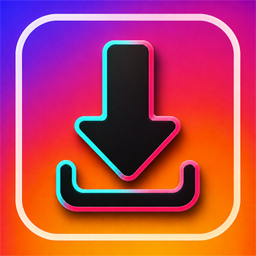

Android app · Product dossier · com.video.downloader.instagram.videosaver

# All Video Downloader

Fast · Simple · Secure. Paste or share a link from a social app, save the video, then cut, crop, merge or watermark it without leaving the app.

QA score · 16 Sep 2026 · **95** / 100 · Started at 72 in the 19-category audit · Target line at 90

Version · **2.4 (6)** · Runs on · **Android 8.0+** · Languages · **9** · Editing tools · **9** · Debug APK · **35.6 MB**

### Download

- Paste link, share into the app, or Quick Platforms
- Parallel downloads with pause, resume, retry
- Foreground service keeps big files alive

### Edit

- Trim, split, crop, merge, aspect ratio
- Add audio, extract audio, filters & effects, watermark
- Built on Media3 Transformer, no FFmpeg

### Protect

- Vault with 4-digit PIN and biometrics
- Security question to reset the PIN
- Hide and restore videos, pictures, audio

### Manage

- Rename, share, delete, favourite
- WhatsApp and Business status saver
- 9 languages, including Urdu and Arabic (RTL)

### Platforms checked on a real phone

14–15 Sep 2026 · Infinix X6728B

TikTok · Facebook · Instagram · LinkedIn · X · Dailymotion · Vimeo · Pinterest · API key rejected

supportedweb.txt lists 102 sites; only the ones above were downloaded end to end.

Spec

## What ships inside the APK

An existing Views-based codebase, adopted in place. Numbers come from app/build.gradle and the manifest on branch production/prod_2.4(6).

Identity

- **App name**: All Video Downloader
- **Package**: com.video.downloader.instagram.videosaver
- **Namespace**: com.video.downloader
- **Version**: versionName 2.4 · versionCode 6
- **Play category**: Productivity (live listing)

Platform

- **minSdk**: 26 · Android 8.0
- **target / compile**: 37 / 37
- **ABI**: arm64-v8a only
- **UI**: Android Views + ViewBinding
- **Modules**: Single :app

Toolchain & code

- **Build**: AGP 9.1.1 · Gradle 9.3.1
- **Languages**: Kotlin 2.2.10 · Java 17
- **Source files**: 347 Java · 278 Kotlin
- **Annotations**: kapt (Glide)

Key libraries

- **Editing**: Media3 Transformer + Effect 1.10.1
- **Ads**: Play Services Ads 25.4.0 · Meta mediation
- **Billing**: Play Billing 9.1.0
- **Firebase**: BoM 34.18.0 · Remote Config, Analytics, Crashlytics, Messaging, Performance
- **Other**: OkHttp 5.5.0 · Glide 5.0.9

Permissions · 14

INTERNET

ACCESS_NETWORK_STATE

ACCESS_WIFI_STATE

READ_MEDIA_VIDEO

READ_MEDIA_IMAGES

READ_MEDIA_AUDIO

READ_MEDIA_VISUAL_USER_SELECTED

POST_NOTIFICATIONS

FOREGROUND_SERVICE

FOREGROUND_SERVICE_DATA_SYNC

WAKE_LOCK

USE_BIOMETRIC

BILLING

AD_ID

REQUEST_IGNORE_BATTERY_OPTIMIZATIONS was removed in September. Play restricts it.

Languages · 9

English · اردو · Urdu · العربية · Arabic · हिन्दी · Hindi · Türkçe · Deutsch · Français · Português (BR) · 中文

Urdu and Arabic mirror the layout. Video timelines stay left-to-right, as in every player.

Market research

## A crowded shelf, an unusual toolkit

Seven competitors from Google Play, checked on 15 Sep 2026. Six of them are the APKs already in docs/competitors apk; InShot is the category leader.

| App | Developer | Installs (log scale) | Rating | Leads with |
| --- | --- | --- | --- | --- |
| [Video Downloader](https://play.google.com/store/apps/details?id=video.downloader.videodownloader) | InShot Inc. | 100M+ | 4.72 2,718,938 ratings | Browser with auto-detect, parallel downloads, password folder |
| [Video Downloader HD · Vidow](https://play.google.com/store/apps/details?id=com.hdvideodownloader.downloaderapp) | VIDOXE Ltd | 100M+ | 3.97 335,113 ratings | Resolution picker, batch, cast to TV |
| [Video Downloader and 4k Player](https://play.google.com/store/apps/details?id=free.video.downloader.freevideodownloader2021.video.saver.videosaverlite) | Vidpal Apps Studio | 50M+ | 4.26 401,387 ratings | Paste link, 4K player, private folder |
| [All Video Downloader & Saver](https://play.google.com/store/apps/details?id=com.allvideodownloader.hdvideodownloader.savevideos) | Sky Vision Apps Lab | 10M+ | 4.05 24,211 ratings | Story saver, 4K, private downloads |
| [All video downloader and saver](https://play.google.com/store/apps/details?id=allinone.videodownloader.savevideos) | Attractive Apps Valley | 10M+ | 3.99 23,231 ratings | Resolution choice, story saver |
| [Video Downloader & Save Video](https://play.google.com/store/apps/details?id=com.videosaver.savevideos.story.saverapp) | Markhoor Studio | 10M+ | 4.00 9,511 ratings | Auto-detect, background, MP3 |
| [Video Downloader · Player](https://play.google.com/store/apps/details?id=com.videodownloder.alldownloadvideos) | Mobile Notepad Apps | 5M+ | 3.83 7,457 ratings | Browser, resume, music downloader |
| [**All Video Downloader & Saver**](https://play.google.com/store/apps/details?id=com.video.downloader.instagram.videosaver) our live listing | Cell Cave | 5+ | — not enough ratings | 9-tool editor, vault, status saver, 9 languages |

All seven competitors show "Contains ads" and "In-app purchases". Their subscription prices could not be matched to each app, so they are left out.

Where we are stronger

- No competitor listing mentions a video editor, a status saver and a PIN vault together. The listing should lead with them.
- Urdu, Arabic and Hindi fit the target markets better than English-first competitors.
- Downloads survive backgrounding and network drops (foreground service, retry, resume).

Where we are weaker

- 5+ installs against 7K–2.7M ratings: no social proof yet.
- Our title matches Sky Vision's 10M+ app, which hurts search and invites confusion.
- A rewarded ad before every download works against the "one-click" promise competitors make.
- The package id contains "instagram". Keep platform logos and "official" wording out of the listing.

Play policy that applies to a downloader

- [Intellectual Property](https://support.google.com/googleplay/android-developer/answer/9888072) bans apps that let users download copyrighted content without authorization, and bans confusing use of other brands.
- YouTube's [Terms of Service](https://www.youtube.com/static?template=terms) forbid downloading. Vidow and Markhoor say in their listings that YouTube is not supported.
- [Misleading claims](https://support.google.com/googleplay/android-developer/answer/9888077): listing and in-app copy must match what the app does. The paywall claims were fixed on 15 Sep.
- [Subscriptions](https://support.google.com/googleplay/android-developer/answer/9900533): show price, billing period and auto-renewal clearly, with easy cancellation.
- [Ads](https://support.google.com/googleplay/android-developer/answer/9857753): full-screen ads closeable within 15 seconds, no unexpected interstitials. Opt-in rewarded ads are allowed.

Versions & APK

## From 1.0 to a QA'd 2.4

Every date is the commit that set the version in app/build.gradle.

1. 15 Sep 2026 · 2.4 code 6 · QA build · Two-day device round: 24 bugs fixed, committed as 04615ac on development/dev_2.5_claud_testing. H1, H2, H5, H6 and the Instagram fix followed as d0b1daf; M6, M7 and M9 fixes are not yet committed.
2. 04 Sep 2026 · 2.4 code 6 · New AdMob implementation; Play Store update.
3. 03 Sep 2026 · 2.3 code 5 · Internal-testing bugs fixed, bundle for internal testing.
4. 24 Aug 2026 · 2.2 code 4 · Firebase push, Crashlytics and Analytics; premium icon in toolbar.
5. 21 Aug 2026 · 2.1 code 3 · Firebase config update; release AAB exported.
6. 18 Aug 2026 · 2.0 code 2 · 45-bug QA list closed; long-video merge verified.
7. 30 Jun 2026 · 1.0 code 1 · Numbering reset from the inherited 10.0.8 (281).

Latest APK

exports/apk/video-downloader-v2.4-debug-20260916-ads.apk

- **Size**: 35.6 MB · 35,644,604 bytes (debug)
- **Variant**: debug · includes H1, H2, H5, H6, Instagram, M6, M7, M9 · OneSignal removed, M5, low-severity, second-round and ads fixes · **ads on**, with the QA phone registered as a test device
- **ABI**: arm64-v8a
- **Built**: 16 Sep 2026, 13:54
- **Installed on**: Infinix X6728B · LDPlayer 9 (Android 9)

SHA-256

c078338d50b4eef346fa113667999c8e566cdebf7f1892464b4e3e7e922deba6

**Before a Play upload:** turn ads back on (ADS_ENABLED = true), commit the 16 Sep fixes, then build a signed release AAB. A debug APK can't go to Play. **Also update the privacy policy link in the Play listing**: the old address now returns 404.

Earlier builds in exports

- **v1.0 debug**: 10 Aug, 12 Aug 2026
- **v2.1 release .aab**: 21 Aug 2026

Monetization

## Ads by default, a subscription to switch them off

AdMob with Meta Audience Network mediation. Every placement has an _id and a _control key in Remote Config (prefix VD_), so it can be turned off without a release.

ADS_ENABLED **true** · TEST_ADS_ENABLED **false** · LIVE_ADS_ENABLED **true** · → live ad units from Remote Config

| Format | Where it appears | Rules |
| --- | --- | --- |
| **Rewarded** download gate | Before each download for free users: watch an ad or go Premium | If no ad fills or the network fails, the download continues. Offline taps now get a message first. |
| **App Open** | Splash, and on return from background | Cached ad valid 4 h. Not shown after pickers or the share sheet (fixed 14 Sep). |
| **Interstitial** | Language, Downloads button, Player button, video play, download location, onboarding | Max 8 per session, 60 s between full-screen ads |
| **Banner · MREC · Native** | Splash, language, onboarding, home, downloads screens | Preloaded and cached; new banner request at most every 30 s; collapses when no ad. Home MREC sits below the page content, clear of the FAB. The language screen uses an MREC only if 5 languages still fit, otherwise a banner. |

Premium · removes all ads

Weekly · **Rs 1,400** · weekly_plan · Monthly · **Rs 5,600** · monthly_plan

Prices as Google Play shows them in Pakistan. Monthly costs the same as four weekly payments, about 8% less than paying weekly for a calendar month, so the monthly plan barely stands out.

**Fixed 15 Sep:** the paywall promised faster downloads, unlimited downloads and 1080p+. Premium only removes ads, so the benefits now read: Instant Downloads, Ad-Free Video Editor, No Interruptions.

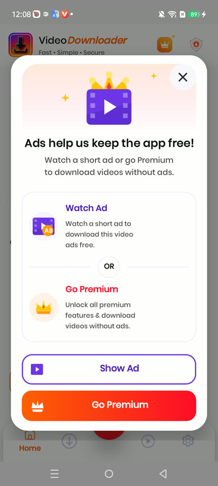

**Download gate**Shown before each download

Screenshots

## Captured during testing

Real device captures from builds 7–15 on 14–15 Sep 2026. Some show Google test ads. Tap any screen to enlarge it.

### Download

6 screens

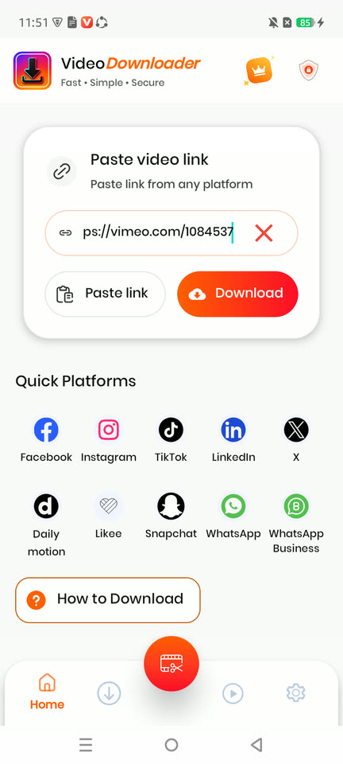

**Home**Paste link, Quick Platforms

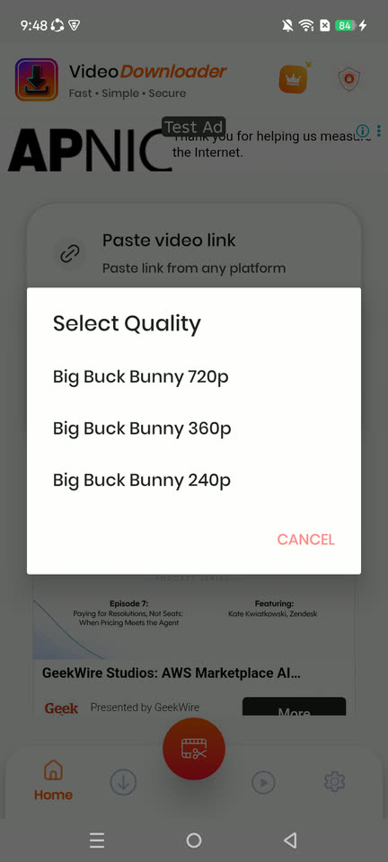

**Quality picker**Vimeo: 720p, 360p, 240p

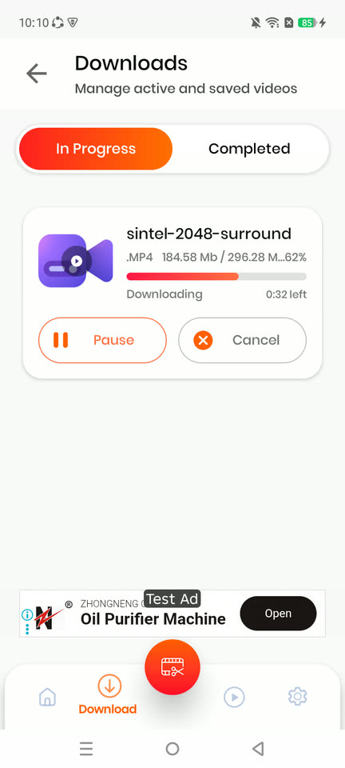

**In progress**Pause, cancel, time left

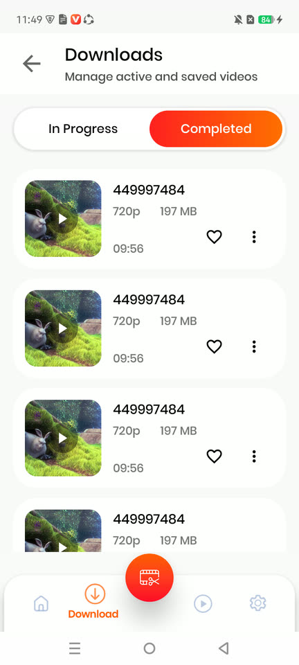

**Completed**Size, quality, length

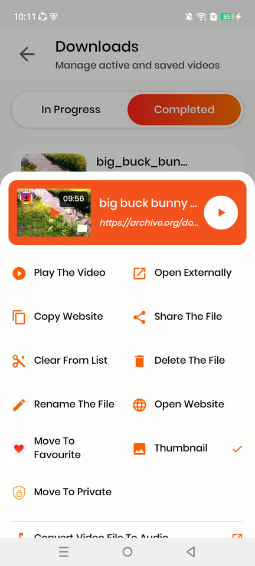

**File actions**Rename, share, vault, convert

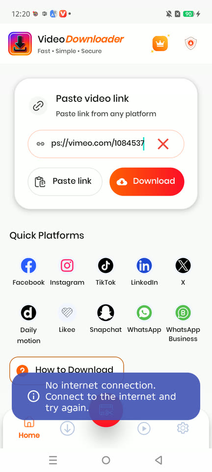

**Offline**Clear message, no dead end

### Video cutter

9 tools

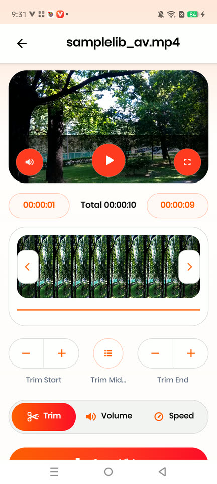

**Trim**Start, end, remove middle

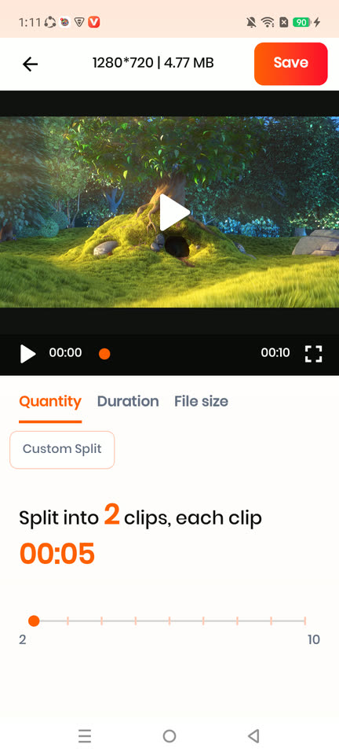

**Split**By count, duration or size

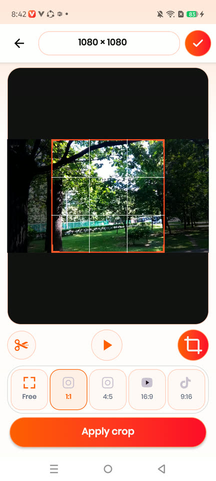

**Crop**1:1 on 16:9 → 1080 × 1080

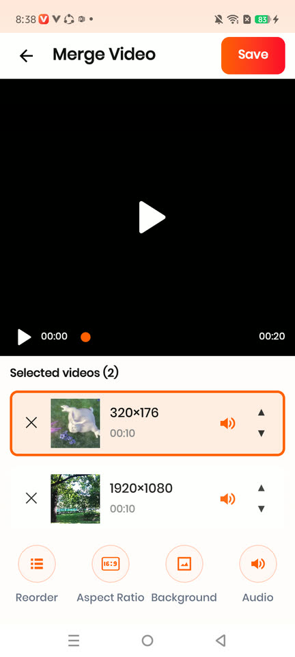

**Merge**Mixed clips, audio kept

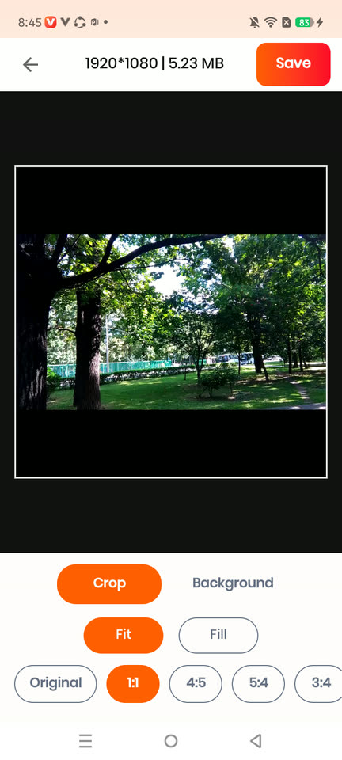

**Aspect ratio**Fit on colour or blur

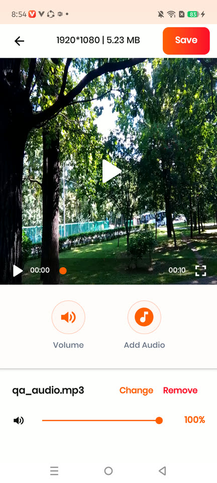

**Add audio**Music over video, volume mix

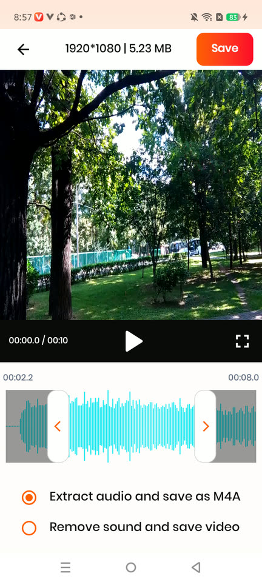

**Extract audio**Pick a range, save M4A

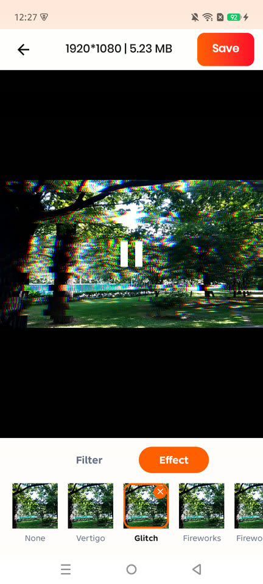

**Filters & effects**Glitch, snow, vignette…

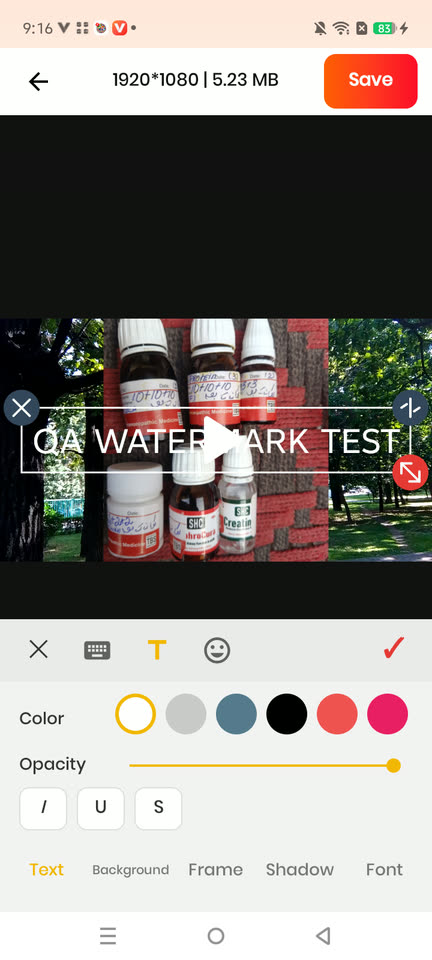

**Watermark**Image and styled text

### Privacy & settings

4 screens

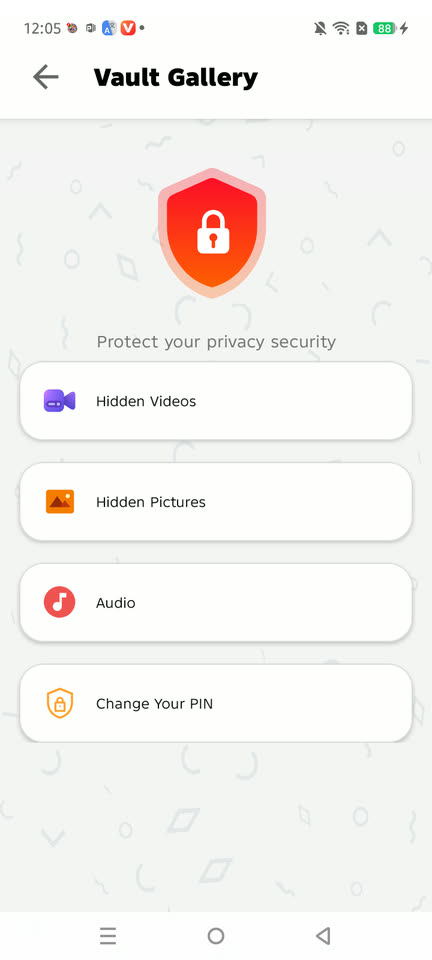

**Vault**Behind a 4-digit PIN

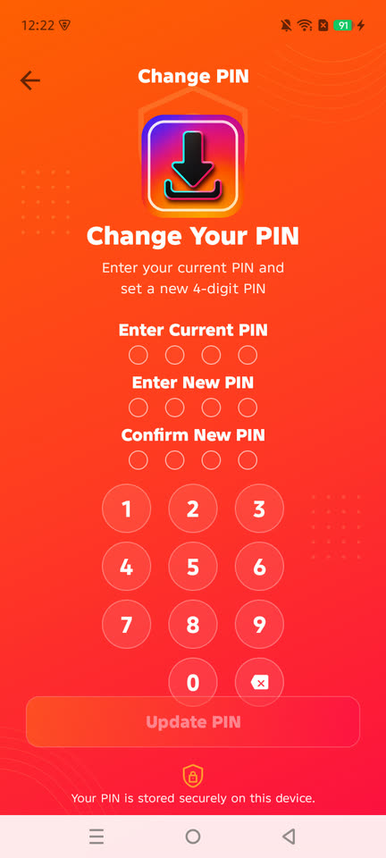

**Change PIN**Keypad no longer covers the button

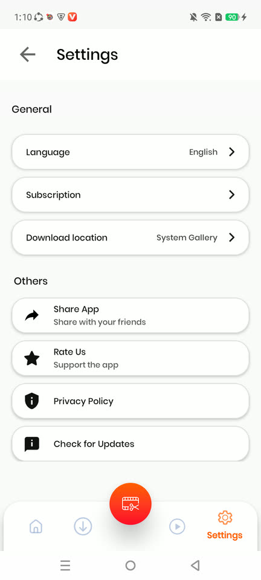

**Settings**Language, subscription, location

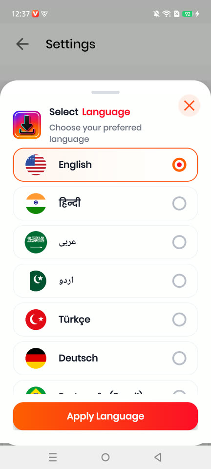

**Language**9 languages, names in their own script

### Urdu, right-to-left

4 screens

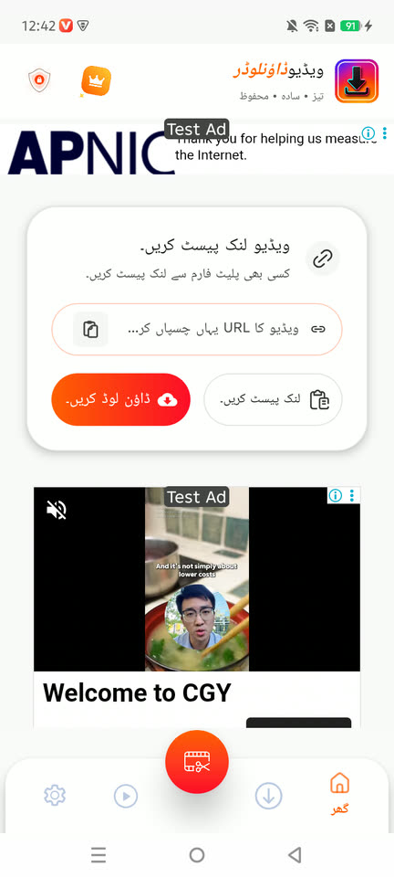

**Home**Mirrored layout

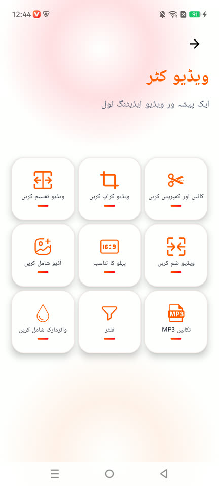

**Video cutter**All 9 tools translated

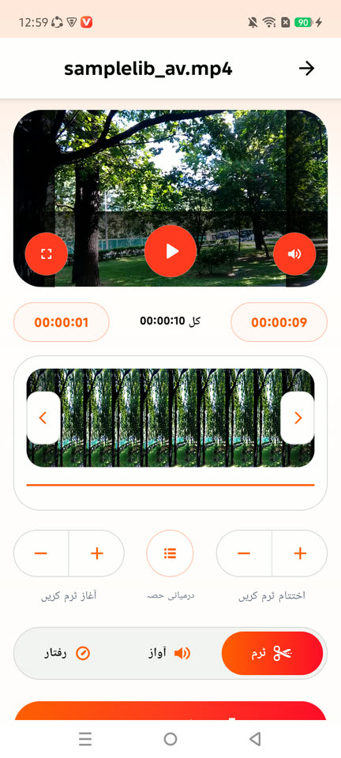

**Trim**Timeline stays left-to-right

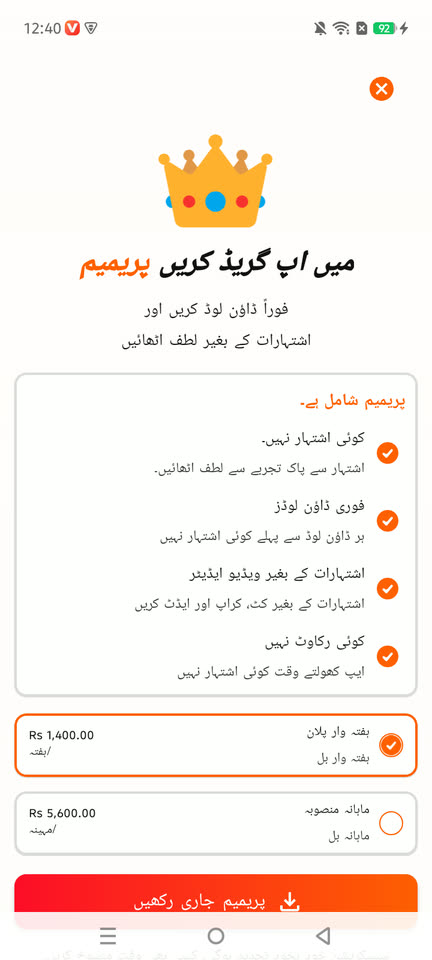

**Premium**Corrected benefits and title

Graphics

## Brand assets and store readiness

The icon borrows two worlds: a violet-to-orange square and a download arrow with the cyan and pink edges of short-video apps. The app UI uses the orange-to-red half.

**Play icon**

512 × 512 PNG

Meets Play spec

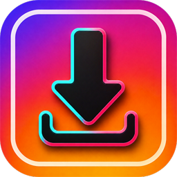

**Splash logo**

512 × 512 PNG, rounded

In app

1024 × 500 not in the repo

**Feature graphic**

Required by Play

Missing locally

720 × 1600 captures ratio 1 : 2.22

**Phone screenshots**

Play allows up to 1 : 2

Need framing

Palette, sampled from the icon and the app

Violet · `#491FEE` · Magenta · `#C90C8A` · Flame · `#FE5F02` · Red · `#FD0D28` · Amber · `#FD7300` · Edge cyan · `#4CFEFC` · Edge pink · `#FF629F` · Arrow ink · `#161315`

UI buttons use the #FE5F02 → #FD0D28 gradient. Dialog button text now uses #D9480F (about 4.6 : 1 on white).

QA history

## Five weeks of testing, one real phone at a time

Every bug from the four QA rounds, counted once. Each cutter output was checked with ffprobe and frame comparisons, not only that a file appeared.

Bugs found · **167** · Across 7 QA rounds, 10 Aug – 15 Sep · 5 owner-decided items removed

Fixed · **165** · 99% fix rate · every fix checked on a device

Still open · **2** · 0 critical, high, medium or low · reasons below

QA score · **95 / 100** · Target 90 · started at 72

Fixed vs open · all rounds · 165 fixed · 2 open · Fixed 165 · Open 2 · Open bugs by severity · Critical · **0** · High · **0** · Medium · **0** · Low · **0** · Not rated · **2**

| QA round | Found | Fixed | Open | Fix rate |
| --- | --- | --- | --- | --- |
| **45-bug QA list** 10–18 Aug 2026 · team-reported bugs | 45 | 43 | 2 | 96% |
| **19-category audit** 14 Sep 2026 · IDs C1–C3, H1–H8, M1–M13, L1–L11 | 32 | 32 | 0 | 100% |
| **On-device round** 14–15 Sep 2026 · cutter, platforms, downloads, RTL | 27 | 27 | 0 | 100% |
| **High-bug follow-up** 15 Sep 2026 · found while fixing H1, H2, H5, H6 and Instagram | 5 | 5 | 0 | 100% |
| **Low-severity re-audit** 15 Sep 2026 · accessibility, 130% font, translations, UX on the current build | 44 | 44 | 0 | 100% |
| **Second device round** 16 Sep 2026 · LDPlayer, Android 9 · the tests left over from 15 Sep | 7 | 7 | 0 | 100% |
| **Ads integration round** 16 Sep 2026 · code audit of 8,267 lines, then fixes verified on the phone | 7 | 7 | 0 | 100% |
| Total | 167 | 165 | 2 | 99% |

### Why 2 bugs are still open

Neither is a defect in a shipped feature

### Needs retest or a new feature

#19 · #25

#19, text overlap in the link flow, needs a retest at several screen sizes. #25, "Add media to Vault", was never built; it is a missing feature rather than a defect.

2

Not counted as bugs, by the owner's decision: **M2** delayed close on the premium screen, **M5** Get Started with a banner on every launch (since changed at the owner's request), and **M13** interstitial on tab switch are product requirements. **Pinterest** is outside the app's supported platforms. The **website privacy policy text** will be updated by the owner later.

QA assessment · out of 100

Audit, 14 Sep · **72**

Projected after code fixes · **83**

After device round, 15 Sep · **91**

After the second device round, 16 Sep · **95**

0 · 50 · 90 target · 100

How the score works: each of the 19 categories starts at 100 and loses 25 per open critical, 12 per high, 6 per medium, 4 per unrated and 2 per low bug, 3 per fix not yet checked on a device, and 5 per planned test that could not be run; the total is the average, capped while serious items remain — at most 69 with an open critical, 84 with an open high, 94 with an open medium, 95 with an unrated bug open, and 99 until every fix is device-checked. Load testing is not scored (no server component). **95** is what the rules give today: nothing critical, high, medium or low is open and every fix has been verified on a device, and the cap comes from the two unrated items, #19 and #25. Reaching 100 needs #19 retested at several screen sizes and #25 built.

### H1 and H2 · before and after

Fixed and measured on device · 15 Sep

Both high-severity ad placements put an ad where a tap meant for the app could land on it. They were fixed without removing either ad.

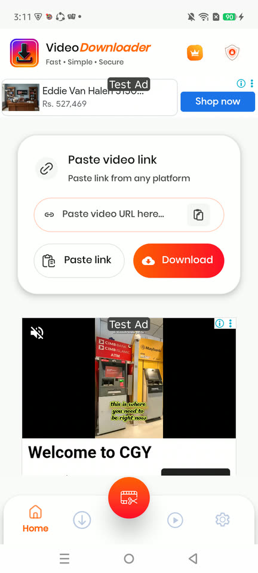

**H1 · before**Ad cut at the fold, 4px from the FAB

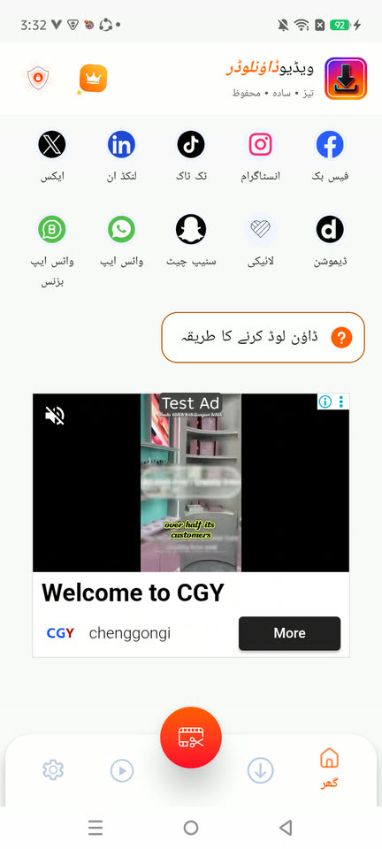

**H1 · after**Below content, 92px from the FAB, fully visible

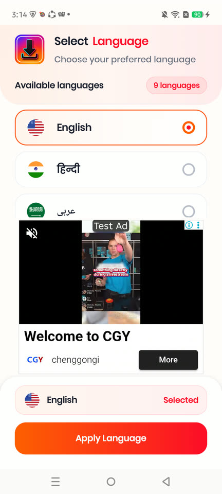

**H2 · before**2.6 languages, ad touching a row

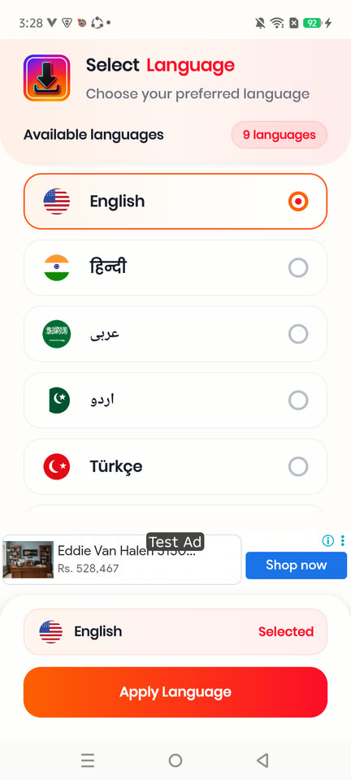

**H2 · after**5 languages, banner 22dp clear

The H1 after-shot was taken while the app was in Urdu; the layout is the same in every language.

### H5 and H6 · before and after

Fixed and measured on device · 15 Sep

H5 put the privacy policy in images a screen reader cannot read. H6 sent links over plain HTTP, including to a raw-IP server that no longer answers.

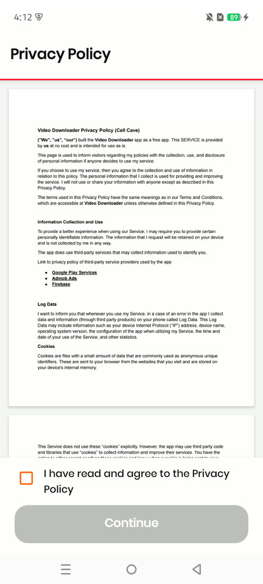

**H5 · before**PDF pages as images, 0 readable text nodes

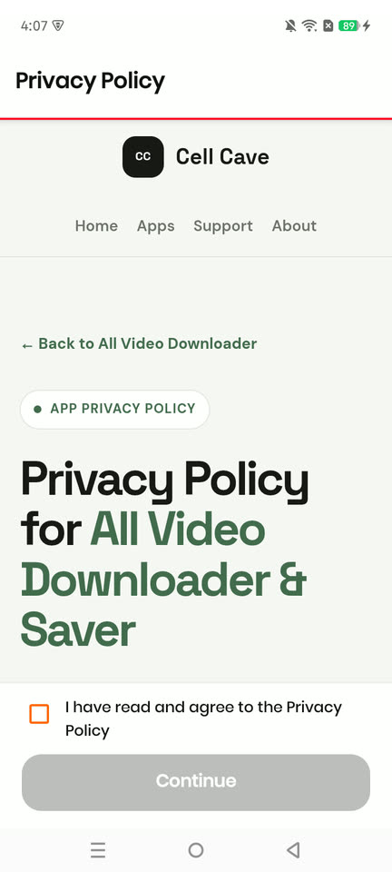

**H5 · after**Live policy as text, 208 readable nodes, follows font size

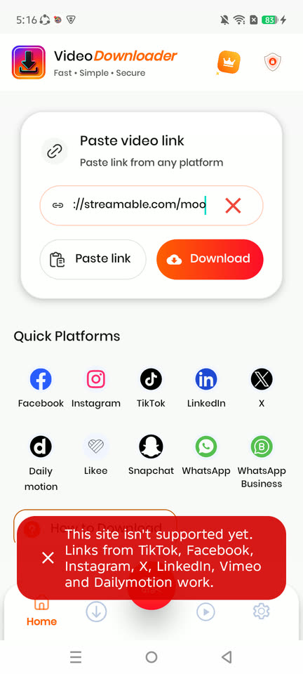

**H6 · after**Dead HTTP server gone: answer in ~2 s, not a timeout

| H6 check · same videos | Before (HTTP allowed) | After (HTTPS only) |
| --- | --- | --- |
| TikTok | 56.80 s | 56.80 s · pass |
| Facebook | 19.30 s | 19.30 s · pass after library fix |
| X | 204.89 s | 204.89 s · pass |
| LinkedIn | 63.04 s | 63.04 s · pass |
| Vimeo | 596.54 s | 596.54 s · pass |
| Dailymotion | 77.39 s | 77.39 s · pass |
| Instagram | 45.79 s | 45.79 s · pass after the Instagram fix |
| Cleartext requests blocked | — | 0 |

Testing caught one regression before it shipped: a bundled Cloudflare library passed a bare host name that WebView loads over HTTP, which broke Facebook. It now passes a full HTTPS address. Ads were re-checked with HTTPS only.

### Instagram · the last high bug

Fixed and measured on device · 15 Sep

Instagram stopped giving post data to logged-out requests. The public embed page still carries it, but only when the request looks like an embedded frame, and the app never said so. It found nothing, fell back to snapsave, and saved a carousel photo named .mp4.

| Post type | Before | After |
| --- | --- | --- |
| Carousel · 1 video, 3 photos | 1 photo saved as .mp4 | video 45.79 s + 3 photos 1080×1350 |
| Reel | no video | 43.21 s · 720×1280 · audio |
| Single video | no video | 235.68 s · 854×480 · audio |
| TikTok, Facebook (regression) | 56.80 s, 19.30 s | 56.80 s, 19.30 s · unchanged |

Two older bugs surfaced on the way and were fixed: carousel items after the first were blocked as "download already in progress" because they share one post link, and Instagram videos were filed under "Facebook Videos" because Instagram serves them from fbcdn.net. Tested with ads switched off to save time; they must be switched back on before release. 0 crashes.

### M6–M9 · UI, performance, stress, offline

Measured on device with ads on · 15 Sep

Each was measured before and after the change on the same phone, with ads switched on because three of the four involve ads.

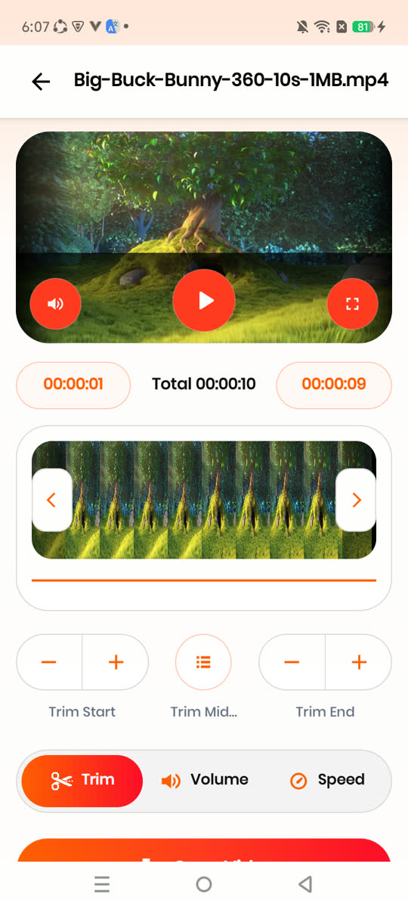

**M6 · before**Save Video cut off at the fold

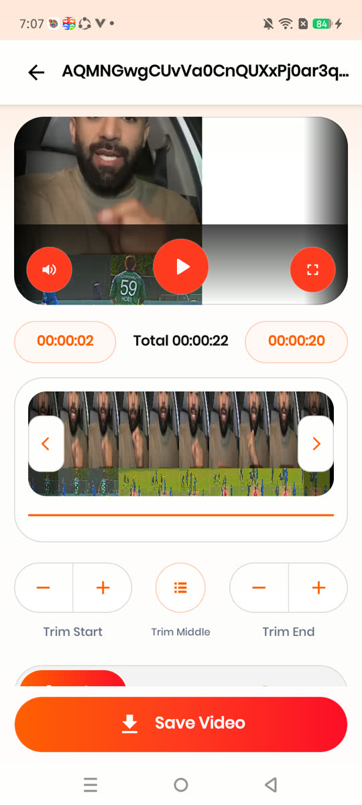

**M6 · after**Pinned, always visible; save tested

| Bug | Before | After |
| --- | --- | --- |
| **M7** Home scroll · 10 flings | 530 frames · 99th pct 22–40 ms · slow UI 4–7 | 360 frames · 99th pct 18–28 ms · slow UI 2–4 |
| **M8** 40 rapid tab switches | Audit: 242 → 407 MB, WebViews 4 → 16 | 5 cycles: 286–336 MB, no upward trend · no change needed |
| **M9** Offline launch to Get Started | ~8.4 s | ~2.6 s |

M7: the two looping toolbar icons redrew every frame; with animations off, frames halved and most slow frames went away. They now pause while the home page scrolls and resume 0.4 s after it stops. M9: with no network the splash waited through Remote Config retries (2 s + 4 s); retries are now skipped offline. M8 no longer reproduces on current code and was closed without a change.

### Low-severity round · M5 and 14 lows

15 Sep · build 45 on the test phone

The 14 open lows were four named items plus audit IDs L2–L11 whose details were never recorded. Rather than guess at those, the current build was re-audited in the same categories (accessibility, large font, translations, UX). That found 44 concrete issues; all are fixed. M5 was also changed at the owner's request, although it is not counted as a bug.

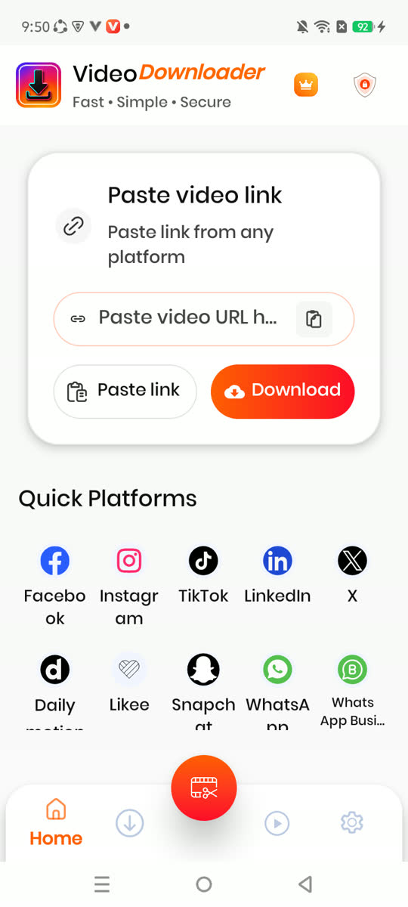

**130% font · before**"Facebo / ok", "Instagr / am"

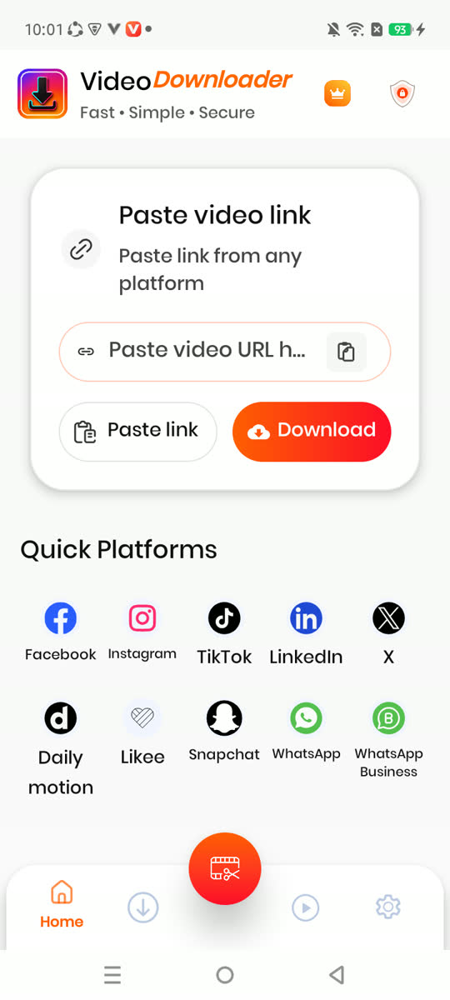

**130% font · after**Whole names, sized to fit

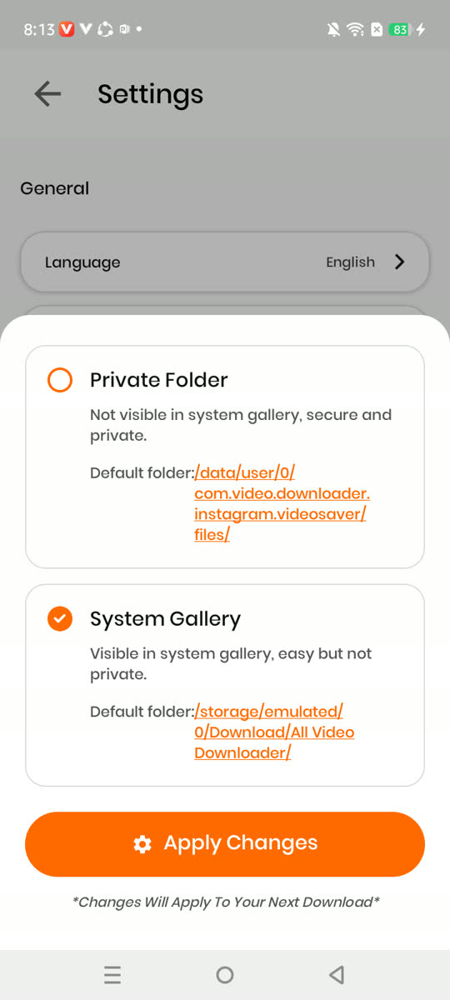

**Location · before**Raw /data/user/0 path, "secure"

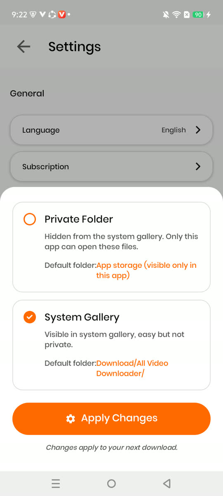

**Location · after**"App storage", accurate wording

| Item | What was wrong | Verified result |
| --- | --- | --- |
| **M5** Get Started | Tap needed on every launch | First run still shows it; returning launches reach Home by themselves (~3.8 s, ads off); leaving during the splash and coming back also works |
| **B-frame cut end** | Trim/split ended ~4 frames early | 1–9 s trim: 240 frames, source frames 30→269 exact. 29.97 fps clip with audio: 245 frames, exact. Split: 150 + 150 frames, no gap. Re-encoded at 1.5× bitrate, SSIM 0.957, 7 s |
| Touch targets | 23 controls under 48dp (22–46dp) | All 48dp; drawn size kept with inset backgrounds; scanner clean on every screen |
| Screen reader labels | 8 issues: unlabeled buttons, "Mute all clips" on one clip, Snapchat tile read as "Vimeo" | Labelled in 9 languages |
| Translations | 7 issues: French "Back" was a sentence, "Close" untranslated in 7 languages, rate-us text broken in 6 | Fixed in all 9 locales |
| UX and large font | 6 issues: raw storage path, inaccurate "secure", cut titles, words split at 130% | Checked on screenshots at 100% and 130% |
| Vimeo folder | Vimeo saved to "Other Videos" | Own folder and Player card; a Vimeo download lands in it (16 Sep) |
| File names | Ids such as 449997484.mp4 | Real downloads: holler-academy-20260916-121906.jpg, LinkedIn-20260916-122411.mp4 (16 Sep) |
| Offline privacy policy | Outdated PDF when offline | All three sources checked on a device (16 Sep): live page, cached copy, bundled snapshot |

All of these were finished on 16 Sep in the second device round below. Debug APK size varies with incremental builds and is not a release figure.

### Second device round · LDPlayer, Android 9

16 Sep · build 47, ads off

The tests left over on 15 Sep were finished here, on a second device with a different Android version. That alone found seven bugs the phone could not show: an emulator has no fingerprint sensor, no Android 15 edge-to-edge, and it downloads fast enough for a carousel's four files to be queued in the same second.

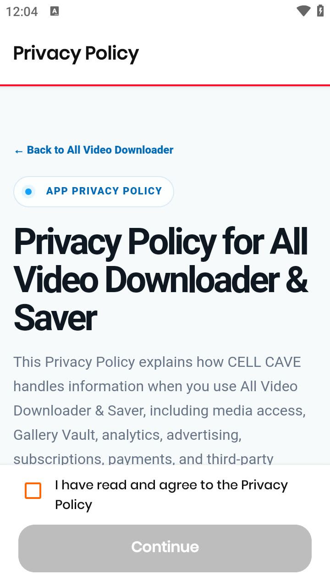

**Policy offline**Bundled copy, current text

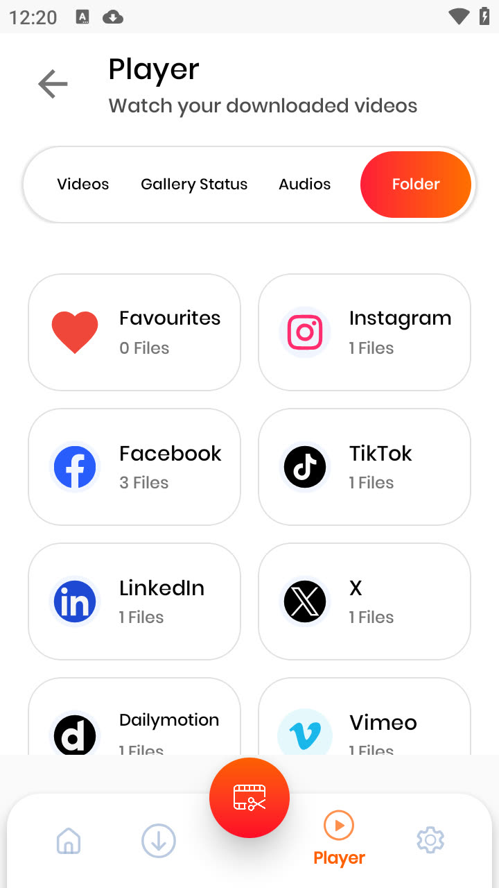

**Vimeo folder**Its own card, 1 file

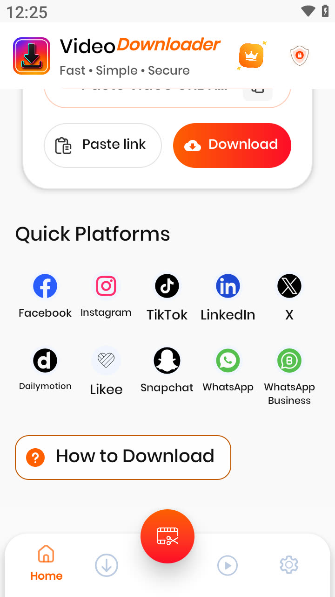

**130% font**"Dailymotion" whole again

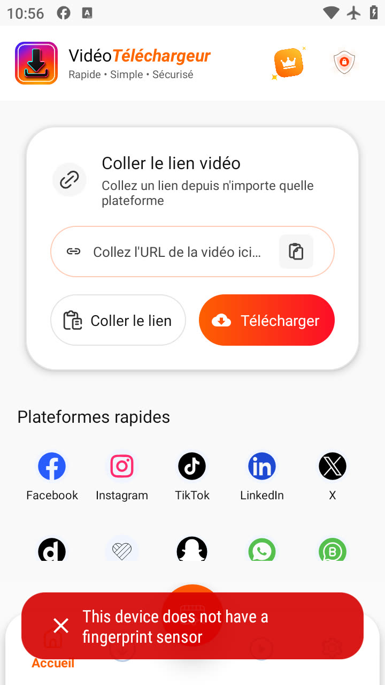

**French**Whole flow checked

| Found on the second device | What the user saw | Fixed and verified |
| --- | --- | --- |
| **Policy website address dead** | The published policy and terms pages returned 404: the site moved to a new address | App now points at the new address; live page loads. **The Play listing link still has to be updated by the owner** |
| **Carousel photos overwrote each other** | An Instagram post with 4 items saved 2 files: all photos were given the same name | Names are reserved as they are handed out; the post now saves 1 video + 3 photos |
| **Fingerprint message on every launch** | "This device does not have a fingerprint sensor", in English, on a phone without a sensor | Biometric unlock is switched off silently, as it already was for "no fingerprint saved" |
| **Policy opened in the browser** | Settings → Privacy Policy left the app, so offline it showed the browser's error page | Opens in the app as a reading screen, with the offline fallbacks |
| **Video names in the player** | Downloads without a title read "20260916 121357" | Keeps the platform: "LinkedIn 20260916 122411" |
| **"Dailymotion" split in two** | At 130% font it wrapped mid-word | One line that shrinks to fit |
| **Red strip above the policy title** | On Android 9 the status bar painted red over a white screen | Transparent status bar on every Android version |

| Pending test, now done | Result on the second device |
| --- | --- |
| Privacy policy, all three sources | Live page loads; with the network blocked the cached copy shows; with no cache at all the bundled snapshot shows, now refreshed from the current page |
| Seven platforms, end to end | TikTok 56.80 s · Facebook 19.30 s · X 204.89 s · LinkedIn 63.04 s · Vimeo 596.54 s · Dailymotion 77.56 s · Instagram carousel (video + 3 photos). Every duration matches the phone, so the new naming and folder code changed nothing |
| File names and folders | Readable names with the platform and date; photos save as .jpg; each platform lands in its own folder, Vimeo included |
| French | Language picker, onboarding, premium, home, settings, policy title and rate-us all translated; rate-us opens the store listing |
| Get Started (M5) | First run shows it; returning launches reach Home in 5.1 and 5.8 s without a tap |
| 130% font, second row | Whole names on both rows after the fix |

0 crashes and 0 ANRs across the round. An emulator is not a substitute for a phone — it translates ARM code and its Android 9 storage rules differ — but as a second Android version it earned its place. Still not covered: other Android versions and screen sizes, a release build, and a real incoming call.

### Ads integration · audit and fixes

16 Sep · measured on the phone, live units, test creatives

The ad code was reviewed in full — configuration, consent, caching, pacing, placements and every request path — and scored **80 / 100**. The engineering was strong; the revenue settings were not. Six items were fixed and re-tested on the device, which lifts it to **86 / 100**. What still holds it back is a missing ad unit, not code.

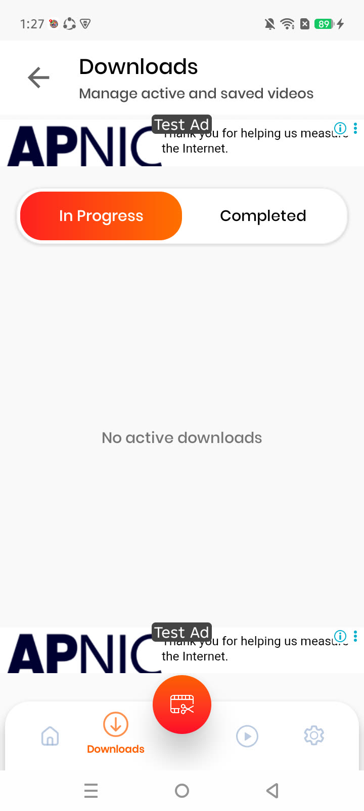

**Downloads**Both slots filled, test creatives

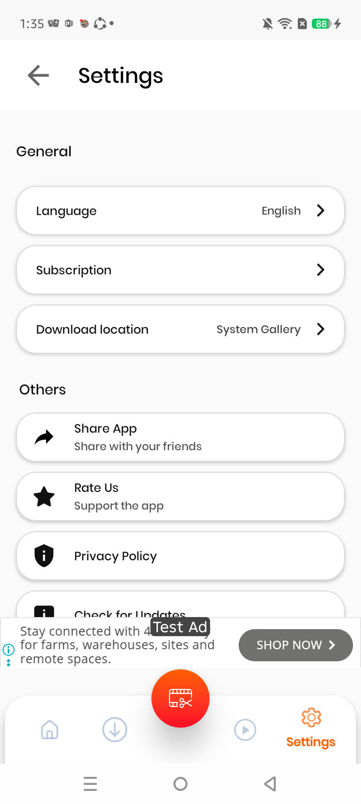

**Settings**Was empty on every second visit

| Fixed | What it was | Proof on the device |
| --- | --- | --- |
| **Fixed-size banners** | Downloads, Settings and Gallery asked for the old 320×50 banner | Requests now log size=360x56_as — the adaptive size Google serves today |
| **No collapsible banner** | The cheapest banner uplift available was unused | First request of each session logs requesting collapsible banner (position=bottom) |
| **Retry was one rule for every failure** | Two tries, five seconds apart, whatever went wrong | Network dropped mid-request → "waiting for a network before retrying"; network back → "network back — retrying load". No fill now waits 3× longer, and delays carry ±20% jitter |
| **Cached ads refused offline** | An ad already paid for was not shown without a network | Airplane mode on, Downloads tab: the cached interstitial still showed, 0 "No Internet" blocks on the show path |
| **No duplicate-load guard on banners** | Two screens attaching at once fired two requests for one slot | Fast tab flipping logged 3 × "Already Loading" instead of extra requests |
| **Missing ANR flags** | SDK init and ad loading ran on the main thread | OPTIMIZE_INITIALIZATION and OPTIMIZE_AD_LOADING confirmed inside the built APK |
| **Empty slot after a tab switch** found during this testing | The shared bottom banner was re-requested on every visit and the 30-second rule left it blank | The attached banner is reused: "Banner already attached to this container" |

| Still open on the money side | Why it matters |
| --- | --- |
| **Native ad unit does not exist** | The highest-earning in-feed format is switched off: the unit was never created in the new AdMob account, so Home and Downloads have no native slot |
| Rewarded-interstitial unit missing | Same cause; a fallback format the app can already show |
| One mediation partner (Meta) | Fill rate has a ceiling with a single partner |
| Three full-screen ads before Home on first run | Splash app-open, language and onboarding interstitials, with the splash one exempt from the 60-second spacing |
| Download gate preloads two formats | Rewarded and interstitial both load; the unused one expires unseen |

Testing used the live ad units with the QA phone registered as a test device, so every impression in this round was a test creative and none of it reaches the AdMob account as real traffic. 0 crashes and 0 ANRs. A download with ads on still finished in 62 s with correct audio and duration.

1. 16 Sep · Ads: audit and six fixes · The whole ad stack was read (8,267 lines) and scored. Banners are adaptive and the bottom one asks for a collapsible ad; a failed load now waits for the network instead of a timer; a cached ad shows offline; duplicate banner requests are blocked; and the two Google ANR flags are in the manifest. Verified on the phone with test creatives on the live units.
2. 16 Sep · Second device round: the pending tests, and 7 more bugs · Offline policy, seven-platform downloads, file names, the Vimeo folder and the French flow all verified. The emulator exposed seven bugs a phone hides — among them a dead policy website address and carousel photos overwriting each other. All seven fixed and re-tested.
3. 15 Sep · M5 and the low-severity round · Returning launches skip Get Started. Clips end on the exact frame. A re-audit found and fixed 44 accessibility, large-font, translation and UX issues. Offline policy, file names and Vimeo folder await their device tests.
4. 15 Sep · OneSignal removed · The unused OneSignal SDK is gone: 13 manifest components and 18 permissions (mostly launcher badges) removed, APK 38.5 → 36.7 MB. Firebase push stays; TikTok download and its notification re-tested, 0 crashes. Website policy text deferred by the owner.
5. 15 Sep · Four items reclassified as by design · M2, M5 and M13 are the owner's product requirements and Pinterest is out of scope, so they no longer count as bugs. No medium bug in the app itself is left open.
6. 15 Sep · M6, M7, M9 fixed; M8 closed · Trim screen Save button pinned, toolbar animations pause while scrolling, offline splash no longer waits for retries. Tab-switch memory growth no longer reproduces. H1–H6 and Instagram committed as d0b1daf.
7. 15 Sep · Instagram downloads restored · Posts now read from the embed page: reels, videos, photos and whole carousels. Carousel items no longer block each other, and Instagram files go to their own folder. No high-severity bugs left open.
8. 15 Sep · H5 and H6 fixed; Instagram block found · Privacy policy shown as text; app switched to HTTPS only and the dead HTTP server removed. Six top platforms re-downloaded with identical results. Instagram started returning 403, confirmed unrelated with a control build.
9. 15 Sep · H1 and H2 ad placements fixed · Home MREC moved below the content with a clipped strip above the bottom bar. The language screen picks MREC or banner from the space available. A tap on the lowest language row selected the language, not the ad.
10. 14–15 Sep · On-device round: everything a downloader must do · 9 cutter tools, 7 platforms, pause/resume/cancel, vault, share-in, offline, 130% font and Urdu. 28 bugs found, 24 fixed; 0 crashes and 0 ANRs across both days.
11. 14 Sep · 19-category audit · 35 findings: permission flow, exported activities, battery-optimization policy, localization and trim accuracy. 13 fixed that day, including all 3 critical; H1, H2, H5, H6 and M11 followed on 15 Sep. Started at 72.
12. 08 Sep · AdMob account migration verified · New account's ad units confirmed on device; logcat reported aligned=true.
13. 19 Aug · Ads and storage · Preload and cache for banners and natives; expiry and refill for full-screen formats; delete fixed by restoring the MediaStore consent dialog.
14. 18 Aug · 45-bug list: 43 fixed · A 28:49, 781 MB two-clip merge passed; merging made about 1.8× faster. #19 and #25 stayed open.
15. 12 Aug · First device pass, Android 15 · Blur crash, stuck image download and the Arabic flag placeholder fixed; ten QA-reported bugs closed.
16. 10 Aug · Code audit and background downloads · Full read-through into three reference notes. Large downloads no longer die after ~5 minutes in the background.

Fixed in the 14–15 Sep round · 24

- Merge dropped audio when clips differed
- Crop presets picked the wrong area
- Trim and split lost whole seconds
- Trim Middle kept part of the cut
- Aspect ratio ignored resolution
- Remove Sound left an empty track
- Watermark text ran off the video
- Dailymotion saved as 0-second files
- Vimeo downloads failed silently
- App Open ad after pickers and share
- Offline Download did nothing
- Paywall and vault claims untrue
- RTL timelines, handles and sizes
- Change PIN keypad over button
- Low-contrast dialog buttons
- Translations, duplicate filters, units

Fixed in the 19-category audit · 22

- **C1** Download lost after ad if a permission was denied
- **C2** 1s–9s trim saved as 0.63 s
- **C3** Battery dialog could not be dismissed
- **H1** Home MREC cut at the fold beside the FAB
- **H2** Language MREC hid most languages
- **H3** Labels broken at 130% font
- **H4** Bottom nav unlabeled for TalkBack
- **H5** Privacy policy only as images
- **H6** Links sent over plain HTTP
- **H7** 7 internal activities exported
- **H8** Up to 4 dialogs before a download
- **M1** Invisible status bar icons
- **M3** Storage asked on first home visit
- **M4** Missing spaces in 7 strings × 9 locales
- **M6** Trim screen Save button cut off
- **M7** Home scroll jank from toolbar animations
- **M8** Tab-switch memory growth (no longer reproduces)
- **M9** Splash waited offline for retries
- **M10** "Check for Updates" said "About us"
- **M11** Policy in app did not name Meta ads
- **M12** Notification prompt loop
- **L1** "valid URI" wording

Release to-do (not counted as bugs)

Set ADS_ENABLED back to true, commit the M6, M7, M9, OneSignal-removal, M5 and low-severity changes, update the privacy policy URL in the Play listing (the old one 404s), build a signed AAB, make the feature graphic and framed store screenshots.

All Video Downloader 2.4 (6) · compiled 15 Sep 2026 from the app repository, device testing on an Infinix X6728B and an LDPlayer 9 emulator, and Google Play listings checked the same day.
