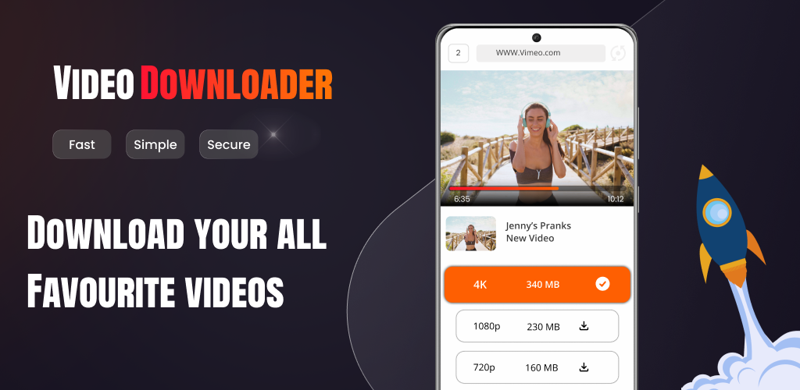
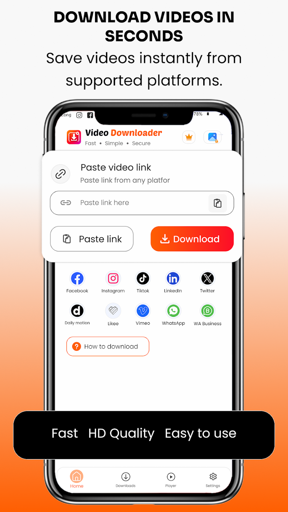
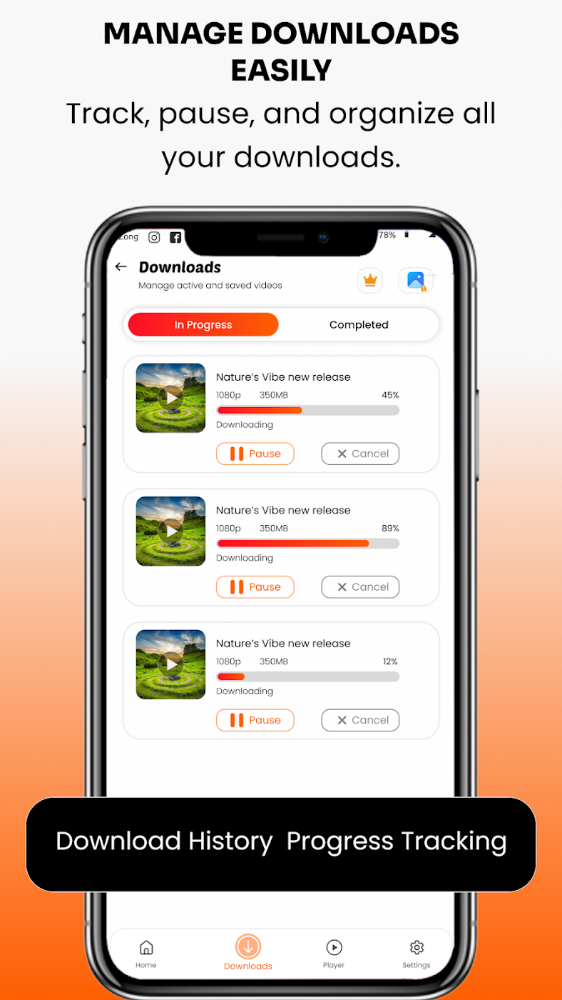
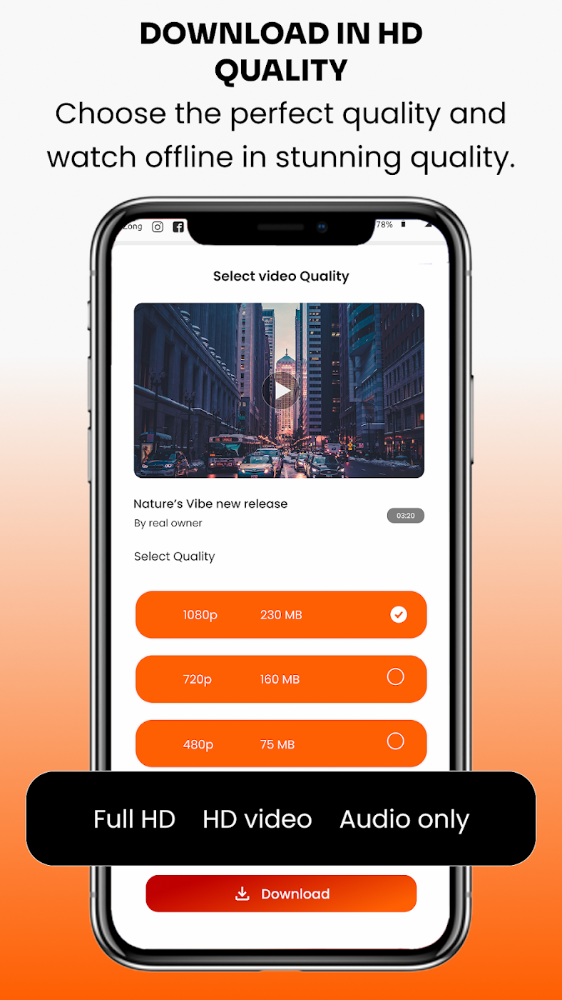
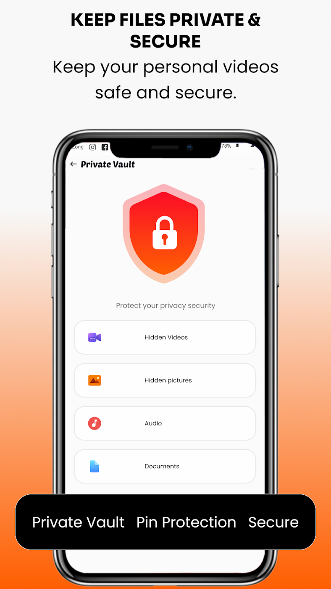

# PlayStore Metadata

> **Generated file: do not edit by hand.** Full visible text of the tab as it renders by default, produced by `node tools/export-docs.js` on 2026-09-22.
> Live page: https://zaeem-ahmad-growth.github.io/All-Video-Downloader-App/tabs/03-playstore-metadata/ · Source: [tabs/03-playstore-metadata/index.html](../../tabs/03-playstore-metadata/index.html) · Drawn by [assets/app.js](../../assets/app.js) from [assets/data.js](../../assets/data.js) · Where each section comes from: [code map](../code-map.md#03-playstore-metadata)
> Controls on the page (market pickers, version switches, filters, "show more") change the view; this snapshot shows their default state. The data behind every state is in [assets/data.js](../../assets/data.js), described in the [data dictionary](../data-dictionary.md).

**PlayStore Metadata** · Proposed metadata · Tiksta · United States · English

# Tiksta: Reels Video Downloader

Proposed · not yet live · Replaces “All Video Downloader & Saver” · Cell Cave · Productivity · Contains ads · In-app purchases $4.99 - $19.99 per item · 0 brand names in the text

[Live listing it replaces ↗](https://play.google.com/store/apps/details?id=com.video.downloader.instagram.videosaver&hl=en&gl=US) · [Privacy policy ↗](https://cellcave.github.io/cell-cave-website/apps/all-video-downloader-saver/privacy/) · [Developer site ↗](https://cellcave.github.io/cell-cave-website/) · com.video.downloader.instagram.videosaver

30/30 · title characters

80/80 · short description characters

3,033/4,000 · full description characters

52/100 · board keywords targeted

33/37 · finalized keywords targeted

24/37 · finalized keywords in the title or short description

Store assets · as published

## Graphics on the listing

The icon, feature graphic and screenshots currently published on Google Play, measured against Play’s asset requirements.

Feature graphic · 1024 × 500 · [original ↗](https://play-lh.googleusercontent.com/q4weOoYNzbX0TD4RtvgBm1VsiywteBuYuZsb5Rr0JzQPEFYto2uU7Taj_ueFgCp65xXjCQ9zFHSZ9jwTq7lk8Q)

App icon · 512 × 512 · [original ↗](https://play-lh.googleusercontent.com/qLNXtLkR4z4KiAhmkwjlXx1TpuC4aaH6qsMoZgkWzjg1-ZaXUh-KMfdG1gXfayu_gkStOl6S1w4tCfe2WMPBbQ)

Slot 1 · [original ↗](https://play-lh.googleusercontent.com/j2_25nIZRvSsEN0BlWJSIIRtIx-N1I7ugFgLUo5rDuBOnNTugt1bnMxlZt9p-RnjyAXdCFKK5KMAYzsaqTK8VA)

Slot 2 · [original ↗](https://play-lh.googleusercontent.com/TDaaCxqjFa48ZfwV0k4SNIeBK-v0Cwt33ue3sNB5cqdlGlK4sYIZGuNKiKX2zGtm62hpnf9h3Zmc8ajaon7LXg)

Slot 3 · [original ↗](https://play-lh.googleusercontent.com/iWFuKpcYqHVHeGgYoYhIrSjIrlR9FcRwAaGP1dZaP3WYRiq5zov4dfdatnjVHXoBdObNVJClXxRpLiWW2OhOTw)

Slot 4 · [original ↗](https://play-lh.googleusercontent.com/3n20NxyQhoOWJOgRndJyj48dCylpmBu1lIGTP9GG5lS89ovMzjfum-Ps_cLIDr_54bKevER-jTLc-Um63vy_nw)

| Status | Asset | Detail |
| --- | --- | --- |
| ✓ Met | **App icon** | 512 × 512 PNG, as Play requires. |
| ✓ Met | **Feature graphic** | Exactly 1024 × 500, as Play requires. |
| • Recorded | **Phone screenshots** | 4 of 8 slots used, all 9:16. The editor and the vault are not yet shown. |
| • Recorded | **Device captures in the dossier** | The dossier’s test captures are 720 × 1600 (1 : 2.22); Play allows at most 1 : 2, so they need framing before upload. |
| • Recorded | **Promo video** | None on the listing. |

Metadata · United States · proposed for Tiksta

## Title, short description and full description

A new version positioned as a reels downloader. The title joins the brand, the category’s top keyword and a low-competition term. The strongest rankable keywords sit in the first two paragraphs, and the features follow as short sections with bullets. No brand names appear anywhere.

Recommended title

Tiksta: Reels Video Downloader

30/30

“Video Downloader” is the category’s top keyword (priority 83). “Reels” adds the positioning and a low bar: the smallest app in the top 10 for “reels downloader app” has 1.5K installs. With the short and full description below, it reaches 44% priority coverage.

video downloader · downloader · reels downloader

Alternative 1

Tiksta Social Video Downloader

30/30

Keeps “social video downloader” as an exact phrase: 2 competitors in its top 10, smallest app 9.6K installs. Drops the reels positioning. With the short and full description below, it reaches 45% priority coverage.

video downloader · social video downloader · downloader

Alternative 2

Tiksta: Reels Downloader App

28/30

Carries every word of “reels downloader app” (priority 74) but gives up the exact phrase “video downloader”. With the short and full description below, it reaches 27% priority coverage.

reels downloader app · downloader · reels downloader

targeted keyword

Tiksta: Reels Video Downloader · Cell Cave · Productivity

Title · 30 / 30

Tiksta: Reels Video Downloader

Short description · 80 / 80

Save & download reels & social videos in HD from a link. Private story saver app

Alternative (79/80): Save & download reels and social videos in HD from a link. Fast story saver app

Full description · 3,033 / 4,000

Tiksta is a reels downloader and social video downloader in one fast app. Copy the link of a reel, a story or any public video, paste it into Tiksta and save video files straight to your phone in HD.

Download video from link in one tap, or share the link into the app. Built as an online video downloader for Android, Tiksta is also a private video downloader and video saver: keep downloads in a locked vault, watch them offline or cut them with the built-in editor.

#### SAVE REELS AND VIDEOS

- Paste a link or share it into Tiksta to download videos and reels
- Video downloader browser: open a page and Tiksta finds the video
- Choose the quality before you save, from HD 720p to smaller files
- Photo downloader too: saves every photo and video in a multi-item post
- Download several videos at once with pause, resume and retry
- Downloads keep running in the background, even for large files

#### REEL SAVER, STORY SAVER AND STATUS SAVER

- A story saver app for stories you are allowed to keep
- A status saver app for statuses shared with you, including business accounts
- Every download is filed in its own folder by source

#### HD VIDEO PLAYER AND DOWNLOAD MANAGER

- An all video downloader and player for everything you save
- Offline video player: watch saved videos without a connection
- Download manager to rename, share, delete or favourite any file

#### VIDEO DOWNLOADER WITH EDITOR

- Video cutter and video trimmer: trim the start, middle or end
- Video merger: split clips or join them into one
- Crop video and change the aspect ratio with a colour or blur fill
- Add music to video, or extract audio from video as MP3
- Filters, effects, speed and volume controls
- Watermark video with an image or styled text
- Video compressor: cut and compress files to save space

#### PRIVATE VIDEO VAULT

- Video locker with a 4-digit PIN for videos, pictures and audio
- Hide videos, unlock with your fingerprint and reset the PIN with a security question
- Private downloads stay out of your gallery

#### MADE FOR EVERYONE

- 9 languages, with right-to-left layouts for Urdu and Arabic
- A fast video downloader with dark mode and a clean, simple design

#### HOW TO DOWNLOAD REELS AND VIDEOS

1. Copy the link of a reel or video you have permission to save.

2. Open Tiksta and paste the link, or share the link into the app.

3. Pick the quality and tap Download.

4. Watch the video, cut it or move it to the vault.

#### QUESTIONS PEOPLE ASK

Where are my downloads saved? In Tiksta, sorted into a folder for each source. Move any video to the vault in one tap.

Will a large download stop if I leave the app? No. Downloads keep running in the background and resume after a network drop.

What does Premium change? Premium removes all ads, including the one shown before a download. Quality and speed stay the same.

#### IMPORTANT

Download only videos you own, videos in the public domain, or videos the owner lets you save. Please respect copyright.

Tiksta is an independent app and is not affiliated with, endorsed by or sponsored by any social media platform.

### Board keywords in the full description

532 words

| Phrase | Uses | Density | Tier |
| --- | --- | --- | --- |
| downloader | 9 | 1.7% | Core |
| video downloader | 7 | 2.6% | Core |
| story saver | 2 | 0.8% | Adjacent |
| download manager | 2 | 0.8% | Adjacent |
| status saver | 2 | 0.8% | Adjacent |
| video player | 2 | 0.8% | Adjacent |
| all video downloader | 1 | 0.6% | Core |
| private video downloader | 1 | 0.6% | Core |
| fast video downloader | 1 | 0.6% | Core |
| online video downloader | 1 | 0.6% | Core |
| download video | 1 | 0.4% | Core |
| download video from link | 1 | 0.8% | Core |
| video saver | 1 | 0.4% | Core |
| social video downloader | 1 | 0.6% | Core |
| video downloader and player | 1 | 0.8% | Core |
| video downloader for android | 1 | 0.8% | Core |
| video downloader browser | 1 | 0.6% | Core |
| story saver app | 1 | 0.6% | Core |
| reel saver | 1 | 0.4% | Core |
| save video | 1 | 0.4% | Core |
| download videos | 1 | 0.4% | Core |
| reels downloader | 1 | 0.4% | Core |
| status saver app | 1 | 0.6% | Core |
| video downloader with editor | 1 | 0.8% | Adjacent |
| photo downloader | 1 | 0.4% | Peripheral |
| hd video player | 1 | 0.6% | Adjacent |
| offline video player | 1 | 0.6% | Adjacent |
| private video vault | 1 | 0.6% | Adjacent |
| extract audio from video | 1 | 0.8% | Adjacent |
| add music to video | 1 | 0.8% | Adjacent |
| video merger | 1 | 0.4% | Adjacent |
| hide videos | 1 | 0.4% | Adjacent |
| video locker | 1 | 0.4% | Adjacent |
| crop video | 1 | 0.4% | Adjacent |
| video trimmer | 1 | 0.4% | Adjacent |
| video cutter | 1 | 0.4% | Adjacent |
| watermark video | 1 | 0.4% | Adjacent |
| video compressor | 1 | 0.4% | Adjacent |
| browser | 1 | 0.2% | Peripheral |

### Finalized keywords by field

| In the title | **3** |
| --- | --- |
| video downloader · downloader · reels downloader |  |
| Title + short description | **21** |
| hd video downloader · private video downloader · save video downloader app · reels downloader app · video saver - video downloader · save videos app · reels download app · download video · download video from link · video saver · social video downloader · video saver downloader · save videos download · video downloader app · video downloader and saver · video save · story saver app · save video · download videos · video download app · download videos app |  |
| Full description | **9** |
| all video downloader · fast video downloader · online video downloader · video downloader and player · video downloader for android · video downloader browser · reel saver · status saver app · video downloader with editor |  |
| Not in this version | **4** |
| video saver mp4 downloader · all video downloader and saver · download video browser · status save |  |

### Measured against the live listing

Both scored on the re-scored US board

|  | Live | Tiksta |
| --- | --- | --- |
| Priority coverage | 20% | **44%** |
| Finalized keywords used | 10 / 37 | **33 / 37** |
| …in title or short | 10 | **24** |
| Reels keywords used | 0 | **4** |
| Brand names in the text | 0 | **0** |
| Full description | 2,455 | 3,033 |

**Plain text to paste into Play Console**

Title · 30 characters

Short description · 80 characters

Full description · 3,033 characters

Targeted keywords · where each one came from

## Every keyword this metadata targets

All board keywords carried by the title, short description and full description, grouped by field, with how many competitors hold a top-10 rank and which competitors carry the keyword in their own title. Reels keywords show their re-scored priority.

| Keyword | Source | Priority | Relevance | Demand | Competitors in top 10 | In competitors’ titles | Smallest app in top 10 |
| --- | --- | --- | --- | --- | --- | --- | --- |
| In the title · 3 |  |  |  |  |  |  |  |
| video downloader Core | Core list | 83 | 99 | 100 | 5 / 16 | **16** · InShot, Gamma Play, QR Code Scanner, Story Saver, InSaver, Hub (DOSA), Fast Saver, AppTool, Saver & Player Studio, DevBay, Sky Vision, Attractive Apps, Markhoor, Mobile Notepad, Vidow, Vidpal | **266K** Video Downloader - without ads · #6 |
| downloader Core | Core list | 57 | 86 | 100 | 1 / 16 | **16** · InShot, Gamma Play, QR Code Scanner, Story Saver, InSaver, Hub (DOSA), Fast Saver, AppTool, Saver & Player Studio, DevBay, Sky Vision, Attractive Apps, Markhoor, Mobile Notepad, Vidow, Vidpal | **344K** Downloader TV: APK Installer · #10 |
| reels downloader Core reels · checked on Play | Platform list | 54 was 37 | 97 | 0 | 5 / 16 | none | **under 1K** iReels Save – Reels Downloader · #9 |
| Title + short description · 22 |  |  |  |  |  |  |  |
| hd video downloader Core | Core list | 80 | 100 | 86 | 5 / 16 | none | **157K** All Video Downloader HD Saver · #10 |
| private video downloader Core | Core list | 77 | 100 | 71 | 6 / 16 | none | **27K** Private Video Vault Downloader · #8 |
| save video downloader app Core | Play autocomplete | 77 | 100 | 77 | 8 / 16 | none | **249K** 9xbuddy: Video downloader · #8 |
| reels downloader app Core reels · checked on Play | Play autocomplete | 74 was 51 | 97 | 66 | 4 / 16 | none | **1.5K** ReelSave - Reels Downloader · #6 |
| video saver - video downloader Core | Play autocomplete | 72 | 100 | 66 | 7 / 16 | none | **741K** Save From Net Video Downloader · #5 |
| save videos app Core | Play autocomplete | 72 | 99 | 66 | 6 / 16 | none | **266K** Video Downloader - without ads · #8 |
| reels download app Core reels · checked on Play | Platform list | 72 was 50 | 97 | 75 | 4 / 16 | none | **1.5K** ReelSave - Reels Downloader · #4 |
| download video Core | Core list | 71 | 99 | 60 | 6 / 16 | none | **266K** Video Downloader - without ads · #7 |
| download video from link Core | Play autocomplete | 71 | 99 | 60 | 6 / 16 | none | **102K** LinkedIn Video Downloader · #10 |
| video saver Core | Core list | 68 | 100 | 49 | 8 / 16 | **1** · Saver & Player Studio | **266K** Video Downloader - without ads · #8 |
| social video downloader Core | Core list | 68 | 94 | 75 | 2 / 16 | none | **9.6K** All Social Video Downloader · #10 |
| video saver downloader Core | Core list | 68 | 100 | 48 | 7 / 16 | none | **249K** 9xbuddy: Video downloader · #6 |
| save videos download Core | Play autocomplete | 68 | 99 | 51 | 6 / 16 | none | **249K** 9xbuddy: Video downloader · #6 |
| video downloader app Core | Core list | 65 | 99 | 38 | 6 / 16 | none | **266K** Video Downloader - without ads · #4 |
| video downloader and saver Core | Core list | 64 | 100 | 35 | 9 / 16 | **1** · Attractive Apps | **266K** Video Downloader - without ads · #9 |
| video save Core | Play autocomplete | 64 | 100 | 38 | 5 / 16 | none | **741K** Save From Net Video Downloader · #3 |
| story saver app Core | Play autocomplete | 64 | 94 | 48 | 3 / 16 | none | **5.6K** Story Saver for Whatsapp · #10 |
| save video Core | Core list | 58 | 94 | 60 | 2 / 16 | **1** · Markhoor | **under 1K** SaveVideo HD · #5 |
| download videos Core | Core list | 58 | 99 | 20 | 4 / 16 | none | **249K** 9xbuddy: Video downloader · #10 |
| video download app Core | Core list | 56 | 94 | 38 | 3 / 16 | none | **249K** 9xbuddy: Video downloader · #9 |
| download videos app Core | Play autocomplete | 52 | 85 | 66 | 1 / 16 | none | **249K** 9xbuddy: Video downloader · #7 |
| story saver Adjacent | Platform list | 46 | 79 | 60 | 3 / 16 | **2** · Story Saver, Fast Saver | **21K** Story Downloader - Story Saver · #8 |
| Full description · 27 |  |  |  |  |  |  |  |
| all video downloader Core | Core list | 79 | 99 | 86 | 6 / 16 | **6** · QR Code Scanner, InSaver, AppTool, DevBay, Sky Vision, Attractive Apps | **266K** Video Downloader - without ads · #9 |
| fast video downloader Core | Core list | 75 | 100 | 71 | 5 / 16 | none | **266K** Video Downloader - without ads · #8 |
| online video downloader Core | Core list | 75 | 99 | 75 | 6 / 16 | none | **249K** 9xbuddy: Video downloader · #6 |
| video downloader and player Core | Core list | 68 | 96 | 77 | 5 / 16 | none | **203K** Video player Video Downloader · #8 |
| video downloader for android Core | Core list | 68 | 100 | 48 | 7 / 16 | none | **249K** 9xbuddy: Video downloader · #8 |
| video downloader browser Core | Core list | 67 | 98 | 62 | 5 / 16 | **1** · DevBay | **202K** Video downloader, mp4, m3u8 · #10 |
| reel saver Core reels · checked on Play | Platform list | 62 was 42 | 95 | 40 | 3 / 16 | none | **under 1K** Video Downloader & Reel Saver · #9 |
| status saver app Core | Play autocomplete | 51 | 83 | 48 | 0 / 16 | none | **1.4K** Status Saver · #9 |
| download manager Adjacent | Adjacent list | 44 | 77 | 56 | 1 / 16 | none | **1.4K** XDM–Download Manager & Browser · #9 |
| video downloader with editor Adjacent | Adjacent list | 36 | 81 | 0 | 5 / 16 | none | **195K** Tube Video Downloader · #9 |
| status saver Adjacent | Platform list | 31 | 64 | 75 | 0 / 16 | none | **287K** Status Saver: Video Downloader · #8 |
| video player Adjacent | Adjacent list | 23 | 55 | 88 | 0 / 16 | none | **2M** Night Video Player - voice amp · #10 |
| photo downloader Peripheral | Peripheral list | 23 | 57 | 49 | 2 / 16 | none | **28K** Bulk Photos Videos Downloader · #6 |
| hd video player Adjacent | Adjacent list | 22 | 55 | 81 | 0 / 16 | none | **2M** Night Video Player - voice amp · #10 |
| offline video player Adjacent | Adjacent list | 21 | 53 | 66 | 0 / 16 | none | **11K** Offline Video Player · #3 |
| private video vault Adjacent | Adjacent list | 19 | 54 | 35 | 0 / 16 | none | **27K** Private Video Vault Downloader · #10 |
| extract audio from video Adjacent | Adjacent list | 19 | 49 | 72 | 0 / 16 | none | **9.5K** Video to MP3 Audio Conversion · #8 |
| add music to video Adjacent | Adjacent list | 19 | 49 | 88 | 0 / 16 | none | **64K** Add Music To Video · #5 |
| video merger Adjacent | Adjacent list | 18 | 49 | 49 | 0 / 16 | none | **2.1K** Video Merger · #10 |
| hide videos Adjacent | Adjacent list | 18 | 51 | 60 | 0 / 16 | none | **5.9M** Hide Photo Vault &Videos · #2 |
| video locker Adjacent | Adjacent list | 17 | 49 | 53 | 0 / 16 | none | **15K** Video Locker - Hide Videos · #7 |
| crop video Adjacent | Adjacent list | 17 | 49 | 75 | 0 / 16 | none | **922K** Resize Video, Compress & Crop · #6 |
| video trimmer Adjacent | Adjacent list | 16 | 49 | 46 | 0 / 16 | none | **256K** Video Trimmer, Merger & Joiner · #4 |
| video cutter Adjacent | Adjacent list | 15 | 49 | 40 | 0 / 16 | none | **1.1M** Trim Video - Cut Video · #4 |
| watermark video Adjacent | Adjacent list | 15 | 46 | 56 | 0 / 16 | none | **1.2K** eZy Watermark Videos Classic · #8 |
| video compressor Adjacent | Adjacent list | 12 | 42 | 46 | 0 / 16 | none | **12K** Compressor · #6 |
| browser Peripheral | Peripheral list | 8 | 36 | 100 | 0 / 16 | **1** · DevBay | **26M** Browser · #5 |

This metadata targets 52 of the 100 US board keywords. Competitors hold top-10 ranks on 35 of them, and 9 sit word for word in at least one competitor’s title.

Keyword analysis · United States · from “Keyword opportunity board, relevance first”

## Finalized keywords

The 37 US keywords with core or adjacent intent, relevance of 80 or above and no brand name, on the board re-scored for reels. “Free”, “without ads” and “4K” keywords are left out because this listing makes none of those claims. Split by whether this metadata targets them.

### Targeted in this metadata · 33 of 37

| # | Keyword | Priority | Relevance | Winnable | Demand | Entry bar | Competitors ranking (US) | Targeted in |
| --- | --- | --- | --- | --- | --- | --- | --- | --- |
| 1 | video downloader Core Core list | **83** | 99 | 10/10 | 100 | **266K** Video Downloader - without ads · #6 | **InShot** #1 **QR Code Scanner** #2 **Hub (DOSA)** #3 **Saver & Player Studio** #5 **Gamma Play** #6 +3 more | Title · exact phrase · full ×7 |
| 2 | hd video downloader Core Core list | **80** | 100 | 10/10 | 86 | **157K** All Video Downloader HD Saver · #10 | **InShot** #1 **QR Code Scanner** #3 **Hub (DOSA)** #4 **Gamma Play** #5 **AppTool** #8 +4 more | Title + short · all words |
| 3 | all video downloader Core Core list | **79** | 99 | 10/10 | 86 | **266K** Video Downloader - without ads · #9 | **InShot** #1 **QR Code Scanner** #2 **Saver & Player Studio** #3 **AppTool** #6 **Hub (DOSA)** #7 +4 more | Full description ×1 |
| 4 | private video downloader Core Core list | **77** | 100 | 10/10 | 71 | **27K** Private Video Vault Downloader · #8 | **InShot** #2 **Saver & Player Studio** #3 **Hub (DOSA)** #4 **QR Code Scanner** #7 **AppTool** #9 +4 more | Title + short · all words · full ×1 |
| 5 | save video downloader app Core Play autocomplete | **77** | 100 | 10/10 | 77 | **249K** 9xbuddy: Video downloader · #8 | **InShot** #1 **QR Code Scanner** #2 **Story Saver** #4 **Hub (DOSA)** #5 **Gamma Play** #6 +4 more | Title + short · all words |
| 6 | fast video downloader Core Core list | **75** | 100 | 10/10 | 71 | **266K** Video Downloader - without ads · #8 | **InShot** #1 **Saver & Player Studio** #2 **QR Code Scanner** #5 **Hub (DOSA)** #7 **Gamma Play** #8 +5 more | Full description ×1 |
| 7 | online video downloader Core Core list | **75** | 99 | 10/10 | 75 | **249K** 9xbuddy: Video downloader · #6 | **InShot** #1 **Gamma Play** #3 **Hub (DOSA)** #5 **QR Code Scanner** #7 **AppTool** #8 +3 more | Full description ×1 |
| 8 | reels downloader app Core Play autocomplete reels · checked on Play | **74** was 51 | 97 | 10/10 | 66 | **1.5K** ReelSave - Reels Downloader · #6 | **Story Saver** #2 **InSaver** #3 **InShot** #5 **Fast Saver** #8 **Gamma Play** #12 +4 more | Title + short · all words |
| 9 | video saver - video downloader Core Play autocomplete | **72** | 100 | 10/10 | 66 | **741K** Save From Net Video Downloader · #5 | **InShot** #2 **InSaver** #3 **Story Saver** #4 **Fast Saver** #6 **QR Code Scanner** #7 +5 more | Title + short · all words |
| 10 | save videos app Core Play autocomplete | **72** | 99 | 10/10 | 66 | **266K** Video Downloader - without ads · #8 | **InShot** #1 **Story Saver** #3 **InSaver** #6 **Hub (DOSA)** #7 **Gamma Play** #8 +5 more | Title + short · all words |
| 11 | reels download app Core Platform list reels · checked on Play | **72** was 50 | 97 | 10/10 | 75 | **1.5K** ReelSave - Reels Downloader · #4 | **InSaver** #1 **Story Saver** #3 **Fast Saver** #7 **InShot** #8 **DevBay** #13 +2 more | Title + short · all words |
| 12 | download video Core Core list | **71** | 99 | 10/10 | 60 | **266K** Video Downloader - without ads · #7 | **InShot** #1 **Hub (DOSA)** #3 **QR Code Scanner** #4 **Gamma Play** #7 **Story Saver** #8 +4 more | Title + short · all words · full ×1 |
| 13 | download video from link Core Play autocomplete | **71** | 99 | 10/10 | 60 | **102K** LinkedIn Video Downloader · #10 | **InShot** #1 **Gamma Play** #3 **Story Saver** #4 **QR Code Scanner** #5 **Hub (DOSA)** #6 +5 more | Title + short · all words · full ×1 |
| 15 | video saver Core Core list | **68** | 100 | 10/10 | 49 | **266K** Video Downloader - without ads · #8 | **InShot** #1 **InSaver** #2 **Fast Saver** #3 **Story Saver** #4 **Hub (DOSA)** #6 +5 more | Title + short · all words · full ×1 |
| 16 | social video downloader Core Core list | **68** | 94 | 10/10 | 75 | **9.6K** All Social Video Downloader · #10 | **InShot** #2 **Gamma Play** #4 **Story Saver** #13 **InSaver** #14 **Fast Saver** #18 +2 more | Title + short · all words · full ×1 |
| 17 | video downloader and player Core Core list | **68** | 96 | 9/10 | 77 | **203K** Video player Video Downloader · #8 | **InShot** #1 **QR Code Scanner** #3 **AppTool** #4 **Hub (DOSA)** #6 **Gamma Play** #9 +3 more | Full description ×1 |
| 18 | video saver downloader Core Core list | **68** | 100 | 10/10 | 48 | **249K** 9xbuddy: Video downloader · #6 | **InShot** #1 **Story Saver** #2 **InSaver** #4 **Hub (DOSA)** #5 **Fast Saver** #7 +5 more | Title + short · all words |
| 19 | video downloader for android Core Core list | **68** | 100 | 10/10 | 48 | **249K** 9xbuddy: Video downloader · #8 | **InShot** #1 **Gamma Play** #3 **QR Code Scanner** #4 **AppTool** #5 **Story Saver** #6 +5 more | Full description ×1 |
| 20 | save videos download Core Play autocomplete | **68** | 99 | 10/10 | 51 | **249K** 9xbuddy: Video downloader · #6 | **InShot** #1 **Story Saver** #3 **Hub (DOSA)** #4 **InSaver** #5 **Gamma Play** #7 +5 more | Title + short · all words |
| 21 | video downloader browser Core Core list | **67** | 98 | 9/10 | 62 | **202K** Video downloader, mp4, m3u8 · #10 | **InShot** #1 **Gamma Play** #2 **Hub (DOSA)** #4 **AppTool** #6 **QR Code Scanner** #9 +4 more | Full description ×1 |
| 22 | video downloader app Core Core list | **65** | 99 | 10/10 | 38 | **266K** Video Downloader - without ads · #4 | **InShot** #1 **QR Code Scanner** #2 **Hub (DOSA)** #3 **Gamma Play** #4 **AppTool** #8 +4 more | Title + short · all words |
| 23 | video downloader and saver Core Core list | **64** | 100 | 10/10 | 35 | **266K** Video Downloader - without ads · #9 | **Saver & Player Studio** #1 **InShot** #2 **Story Saver** #3 **Hub (DOSA)** #4 **QR Code Scanner** #5 +5 more | Title + short · all words |
| 25 | video save Core Play autocomplete | **64** | 100 | 10/10 | 38 | **741K** Save From Net Video Downloader · #3 | **InShot** #1 **Story Saver** #2 **Hub (DOSA)** #4 **InSaver** #5 **Fast Saver** #7 +5 more | Title + short · all words |
| 27 | story saver app Core Play autocomplete | **64** | 94 | 10/10 | 48 | **5.6K** Story Saver for Whatsapp · #10 | **Story Saver** #1 **InSaver** #4 **Fast Saver** #9 **DevBay** #15 | Short · exact phrase · full ×1 |
| 28 | reel saver Core Platform list reels · checked on Play | **62** was 42 | 95 | 10/10 | 40 | **under 1K** Video Downloader & Reel Saver · #9 | **InSaver** #1 **Story Saver** #2 **Fast Saver** #8 **DevBay** #15 | Full description ×1 |
| 29 | save video Core Core list | **58** | 94 | 7/10 | 60 | **under 1K** SaveVideo HD · #5 | **InShot** #2 **Gamma Play** #6 | Title + short · all words · full ×1 |
| 30 | download videos Core Core list | **58** | 99 | 10/10 | 20 | **249K** 9xbuddy: Video downloader · #10 | **InShot** #1 **QR Code Scanner** #3 **Hub (DOSA)** #6 **Gamma Play** #8 **AppTool** #11 +4 more | Title + short · all words · full ×1 |
| 31 | downloader Core Core list | **57** | 86 | 8/10 | 100 | **344K** Downloader TV: APK Installer · #10 | **InShot** #2 **Hub (DOSA)** #12 **Gamma Play** #24 **Saver & Player Studio** #28 **Story Saver** #29 +1 more | Title · exact phrase · full ×9 |
| 32 | video download app Core Core list | **56** | 94 | 9/10 | 38 | **249K** 9xbuddy: Video downloader · #9 | **InShot** #1 **QR Code Scanner** #2 **Gamma Play** #7 **Story Saver** #14 **Hub (DOSA)** #15 +3 more | Title + short · all words |
| 33 | reels downloader Core Platform list reels · checked on Play | **54** was 37 | 97 | 10/10 | 0 | **under 1K** iReels Save – Reels Downloader · #9 | **InSaver** #1 **Story Saver** #2 **InShot** #4 **Fast Saver** #7 **Gamma Play** #10 +3 more | Title · all words · full ×1 |
| 34 | download videos app Core Play autocomplete | **52** | 85 | 9/10 | 66 | **249K** 9xbuddy: Video downloader · #7 | **InShot** #1 **QR Code Scanner** #11 **Gamma Play** #12 **Story Saver** #20 **Hub (DOSA)** #21 +3 more | Title + short · all words |
| 35 | status saver app Core Play autocomplete | **51** | 83 | 10/10 | 48 | **1.4K** Status Saver · #9 | None in results | Full description ×1 |
| 37 | video downloader with editor Adjacent Adjacent list | **36** | 81 | 10/10 | 0 | **195K** Tube Video Downloader · #9 | **InShot** #3 **InSaver** #4 **DevBay** #6 **QR Code Scanner** #7 **Story Saver** #8 +2 more | Full description ×1 |

### Not in this version · 4 of 37

| # | Keyword | Priority | Relevance | Winnable | Demand | Entry bar | Competitors ranking (US) |
| --- | --- | --- | --- | --- | --- | --- | --- |
| 14 | video saver mp4 downloader Core Play autocomplete | **70** | 99 | 10/10 | 60 | **266K** Video Downloader - without ads · #3 | **InShot** #2 **Gamma Play** #3 **AppTool** #7 **Story Saver** #8 **DevBay** #9 +1 more |
| 24 | all video downloader and saver Core Core list | **64** | 100 | 10/10 | 38 | **741K** Save From Net Video Downloader · #5 | **InShot** #1 **QR Code Scanner** #2 **AppTool** #3 **Saver & Player Studio** #4 **Hub (DOSA)** #6 +5 more |
| 26 | download video browser Core Play autocomplete | **64** | 97 | 9/10 | 57 | **266K** Video Downloader - without ads · #5 | **InShot** #1 **Hub (DOSA)** #4 **Gamma Play** #5 **Saver & Player Studio** #9 **AppTool** #10 +1 more |
| 36 | status save Core Play autocomplete | **46** | 83 | 10/10 | 33 | **14K** Save Status - Video Downloader · #10 | None in results |

Roadmap · United States

## Launch keyword ladder of this metadata

The US ladder rebuilt on the re-scored board, so reels keywords take the phase their entry bars earn. T = title, T+S = every word across title and short description, S = short description, L = full description, and a dash = not in this version.

Phase 0 · launch → 10K · weeks 0–6

- private video downloader *P77*T+S *· 6 comp. top-10 · smallest app 27K*
- reels downloader app *P74*T+S *· 4 comp. top-10 · smallest app 1.5K*
- reels download app *P72*T+S *· 4 comp. top-10 · smallest app 1.5K*
- social video downloader *P68*T+S *· 2 comp. top-10 · smallest app 9.6K*
- story saver app *P64*S *· 3 comp. top-10 · smallest app 5.6K*
- reel saver *P62*L *· 3 comp. top-10 · smallest app under 1K*

This metadata carries **5** in the title or short description and **1** in the full description; **0** not in this version.

Phase 1 · 10K → 100K

- hd video downloader *P80*T+S *· 5 comp. top-10 · smallest app 157K*
- download video from link *P71*T+S *· 6 comp. top-10 · smallest app 102K*
- save video *P58*T+S *· 2 comp. top-10 · smallest app under 1K*
- reels downloader *P54*T *· 5 comp. top-10 · smallest app under 1K*

This metadata carries **4** in the title or short description and **0** in the full description; **0** not in this version.

Phase 2 · 100K → 1M

- video downloader *P83*T *· 5 comp. top-10 · smallest app 266K*
- all video downloader *P79*L *· 6 comp. top-10 · smallest app 266K*
- save video downloader app *P77*T+S *· 8 comp. top-10 · smallest app 249K*
- fast video downloader *P75*L *· 5 comp. top-10 · smallest app 266K*
- online video downloader *P75*L *· 6 comp. top-10 · smallest app 249K*
- video saver - video downloader *P72*T+S *· 7 comp. top-10 · smallest app 741K*

This metadata carries **3** in the title or short description and **3** in the full description; **0** not in this version.

Phase 3 · 1M+

- save videos app *P72*T+S *· 6 comp. top-10 · smallest app 266K*
- download video *P71*T+S *· 6 comp. top-10 · smallest app 266K*
- video saver mp4 downloader *P70*— *· 6 comp. top-10 · smallest app 266K*
- video saver *P68*T+S *· 8 comp. top-10 · smallest app 266K*
- video downloader and player *P68*L *· 5 comp. top-10 · smallest app 203K*
- video saver downloader *P68*T+S *· 7 comp. top-10 · smallest app 249K*

This metadata carries **4** in the title or short description and **1** in the full description; **1** not in this version.

Competitor rankings · United States · keywords in this metadata

## How your competitors rank on the keywords you use

Every board keyword this metadata carries, with each competitor’s verified US rank. Keywords where at least one competitor ranks come first, then the rest; each group sorted by relevance, then priority.

| Keyword · where this metadata uses it | Relevance | Priority | InShot | Gamma Play | QR Code Scanner | Story Saver | InSaver | Hub (DOSA) | Fast Saver | AppTool | Saver & Player Studio | DevBay | Sky Vision | Attractive Apps | Markhoor | Mobile Notepad | Vidow | Vidpal | Top 10 |
| --- | --- | --- | --- | --- | --- | --- | --- | --- | --- | --- | --- | --- | --- | --- | --- | --- | --- | --- | --- |
| Competitors rank on these · 37 |  |  |  |  |  |  |  |  |  |  |  |  |  |  |  |  |  |  |  |
| hd video downloader Title + short · all words | 100 | 80 | 1 | 5 | 3 | 19 | 12 | 4 | · | 8 | 28 | 21 | · | · | · | · | · | · | **5** / 16 |
| private video downloader Title + short · all words · full ×1 | 100 | 77 | 2 | 10 | 7 | 15 | 11 | 4 | · | 9 | 3 | 24 | · | · | · | · | · | · | **6** / 16 |
| save video downloader app Title + short · all words | 100 | 77 | 1 | 6 | 2 | 4 | 7 | 5 | 10 | 9 | · | 28 | · | · | · | · | · | · | **8** / 16 |
| fast video downloader Full description ×1 | 100 | 75 | 1 | 8 | 5 | 20 | 17 | 7 | 30 | 12 | 2 | 21 | · | · | · | · | · | · | **5** / 16 |
| video saver - video downloader Title + short · all words | 100 | 72 | 2 | 16 | 7 | 4 | 3 | 10 | 6 | 12 | 8 | 14 | · | · | · | · | · | · | **7** / 16 |
| video saver Title + short · all words · full ×1 | 100 | 68 | 1 | 8 | 9 | 4 | 2 | 6 | 3 | 10 | 28 | 22 | · | · | · | · | · | · | **8** / 16 |
| video saver downloader Title + short · all words | 100 | 68 | 1 | 8 | 15 | 2 | 4 | 5 | 7 | 10 | 29 | 25 | · | · | · | · | · | · | **7** / 16 |
| video downloader for android Full description ×1 | 100 | 68 | 1 | 3 | 4 | 6 | 10 | 7 | 25 | 5 | 21 | 23 | · | · | · | · | · | · | **7** / 16 |
| video downloader and saver Title + short · all words | 100 | 64 | 2 | 9 | 5 | 3 | 7 | 4 | 10 | 8 | 1 | 15 | · | · | · | · | · | · | **9** / 16 |
| video save Title + short · all words | 100 | 64 | 1 | 11 | 12 | 2 | 5 | 4 | 7 | 14 | 22 | 16 | · | · | · | · | · | · | **5** / 16 |
| video downloader Title · exact phrase · full ×7 | 99 | 83 | 1 | 6 | 2 | 17 | 25 | 3 | · | 14 | 5 | · | · | · | · | · | · | · | **5** / 16 |
| all video downloader Full description ×1 | 99 | 79 | 1 | 9 | 2 | 12 | 20 | 7 | 25 | 6 | 3 | · | · | · | · | · | · | · | **6** / 16 |
| online video downloader Full description ×1 | 99 | 75 | 1 | 3 | 7 | 9 | 12 | 5 | 21 | 8 | · | · | · | · | · | · | · | · | **6** / 16 |
| save videos app Title + short · all words | 99 | 72 | 1 | 8 | 10 | 3 | 6 | 7 | 11 | 15 | 19 | 22 | · | · | · | · | · | · | **6** / 16 |
| download video Title + short · all words · full ×1 | 99 | 71 | 1 | 7 | 4 | 8 | 17 | 3 | 24 | 10 | 22 | · | · | · | · | · | · | · | **6** / 16 |
| download video from link Title + short · all words · full ×1 | 99 | 71 | 1 | 3 | 5 | 4 | 7 | 6 | 24 | 20 | 11 | 15 | · | · | · | · | · | · | **6** / 16 |
| save videos download Title + short · all words | 99 | 68 | 1 | 7 | 9 | 3 | 5 | 4 | 12 | 17 | 16 | 21 | · | · | · | · | · | · | **6** / 16 |
| video downloader app Title + short · all words | 99 | 65 | 1 | 4 | 2 | 10 | 17 | 3 | 21 | 8 | 30 | · | · | · | · | · | · | · | **6** / 16 |
| download videos Title + short · all words · full ×1 | 99 | 58 | 1 | 8 | 3 | 15 | 16 | 6 | 22 | 11 | 21 | · | · | · | · | · | · | · | **4** / 16 |
| video downloader browser Full description ×1 | 98 | 67 | 1 | 2 | 9 | · | 16 | 4 | 28 | 6 | 20 | 22 | · | · | · | · | · | · | **5** / 16 |
| reels downloader app reels · checked on Play Title + short · all words | 97 | 74 | 5 | 12 | 14 | 2 | 3 | 23 | 8 | 17 | · | 15 | · | · | · | · | · | · | **4** / 16 |
| reels download app reels · checked on Play Title + short · all words | 97 | 72 | 8 | 16 | · | 3 | 1 | · | 7 | 27 | · | 13 | · | · | · | · | · | · | **4** / 16 |
| reels downloader reels · checked on Play Title · all words · full ×1 | 97 | 54 | 4 | 10 | 16 | 2 | 1 | · | 7 | 19 | · | 12 | · | · | · | · | · | · | **5** / 16 |
| video downloader and player Full description ×1 | 96 | 68 | 1 | 9 | 3 | 14 | 12 | 6 | 29 | 4 | · | · | · | · | · | · | · | · | **5** / 16 |
| reel saver reels · checked on Play Full description ×1 | 95 | 62 | · | · | · | 2 | 1 | · | 8 | · | · | 15 | · | · | · | · | · | · | **3** / 16 |
| story saver app Short · exact phrase · full ×1 | 94 | 64 | · | · | · | 1 | 4 | · | 9 | · | · | 15 | · | · | · | · | · | · | **3** / 16 |
| video download app Title + short · all words | 94 | 56 | 1 | 7 | 2 | 14 | 23 | 15 | 28 | 21 | · | · | · | · | · | · | · | · | **3** / 16 |
| social video downloader Title + short · all words · full ×1 | 94 | 68 | 2 | 4 | · | 13 | 14 | 23 | 18 | 24 | · | · | · | · | · | · | · | · | **2** / 16 |
| save video Title + short · all words · full ×1 | 94 | 58 | 2 | 6 | · | · | · | · | · | · | · | · | · | · | · | · | · | · | **2** / 16 |
| downloader Title · exact phrase · full ×9 | 86 | 57 | 2 | 24 | 30 | 29 | · | 12 | · | · | 28 | · | · | · | · | · | · | · | **1** / 16 |
| download videos app Title + short · all words | 85 | 52 | 1 | 12 | 11 | 20 | 25 | 21 | 29 | 23 | · | · | · | · | · | · | · | · | **1** / 16 |
| video downloader with editor Full description ×1 | 81 | 36 | 3 | · | 7 | 8 | 4 | · | 12 | · | 25 | 6 | · | · | · | · | · | · | **5** / 16 |
| story saver Short · exact phrase · full ×2 | 79 | 46 | · | · | · | 2 | 6 | · | 9 | · | · | 22 | · | · | · | · | · | · | **3** / 16 |
| download manager Full description ×2 | 77 | 44 | 6 | · | · | · | · | · | · | · | · | · | · | · | · | · | · | · | **1** / 16 |
| photo downloader Full description ×1 | 57 | 23 | 16 | · | · | 10 | 9 | · | 18 | · | · | 21 | · | · | · | · | · | · | **2** / 16 |
| video player Full description ×2 | 55 | 23 | 17 | · | · | · | · | · | · | · | · | · | · | · | · | · | · | · | **0** / 16 |
| offline video player Full description ×1 | 53 | 21 | 15 | · | · | · | · | · | · | · | · | · | · | · | · | · | · | · | **0** / 16 |
| No competitor in the results · 15 |  |  |  |  |  |  |  |  |  |  |  |  |  |  |  |  |  |  |  |
| status saver app Full description ×1 | 83 | 51 | · | · | · | · | · | · | · | · | · | · | · | · | · | · | · | · | **0** / 16 |
| status saver Full description ×2 | 64 | 31 | · | · | · | · | · | · | · | · | · | · | · | · | · | · | · | · | **0** / 16 |
| hd video player Full description ×1 | 55 | 22 | · | · | · | · | · | · | · | · | · | · | · | · | · | · | · | · | **0** / 16 |
| private video vault Full description ×1 | 54 | 19 | · | · | · | · | · | · | · | · | · | · | · | · | · | · | · | · | **0** / 16 |
| hide videos Full description ×1 | 51 | 18 | · | · | · | · | · | · | · | · | · | · | · | · | · | · | · | · | **0** / 16 |
| video merger Full description ×1 | 49 | 18 | · | · | · | · | · | · | · | · | · | · | · | · | · | · | · | · | **0** / 16 |
| extract audio from video Full description ×1 | 49 | 19 | · | · | · | · | · | · | · | · | · | · | · | · | · | · | · | · | **0** / 16 |
| add music to video Full description ×1 | 49 | 19 | · | · | · | · | · | · | · | · | · | · | · | · | · | · | · | · | **0** / 16 |
| video locker Full description ×1 | 49 | 17 | · | · | · | · | · | · | · | · | · | · | · | · | · | · | · | · | **0** / 16 |
| crop video Full description ×1 | 49 | 17 | · | · | · | · | · | · | · | · | · | · | · | · | · | · | · | · | **0** / 16 |
| video trimmer Full description ×1 | 49 | 16 | · | · | · | · | · | · | · | · | · | · | · | · | · | · | · | · | **0** / 16 |
| video cutter Full description ×1 | 49 | 15 | · | · | · | · | · | · | · | · | · | · | · | · | · | · | · | · | **0** / 16 |
| watermark video Full description ×1 | 46 | 15 | · | · | · | · | · | · | · | · | · | · | · | · | · | · | · | · | **0** / 16 |
| video compressor Full description ×1 | 42 | 12 | · | · | · | · | · | · | · | · | · | · | · | · | · | · | · | · | **0** / 16 |
| browser Full description ×1 | 36 | 8 | · | · | · | · | · | · | · | · | · | · | · | · | · | · | · | · | **0** / 16 |

Policy & listing record

## Metadata policy record

| Status | Rule | Detail |
| --- | --- | --- |
| ✓ Met | **Title within 30 characters** | 30 / 30. |
| ✓ Met | **Title free of “best”, “#1”, “free” and sale wording** | None present. |
| ✓ Met | **Title distinct from other apps’ titles** | No app among the 392 in the playbook or the 143 checked on 16 Sep 2026 is named Tiksta. |
| ✓ Met | **No brand names in the title, short or full description** | None of Instagram, Insta, Facebook, TikTok, WhatsApp, YouTube, Pinterest, X / Twitter, LinkedIn, Vimeo, Dailymotion, Snapchat or Likee appear. |
| • Recorded | **“Reels” used as a generic term** | Checked on Google Play: 22 live app titles carry it, 6 of them listed for 2+ years, 1 with 1M+ installs. Meta’s Instagram brand rules name “Insta” and “gram”, not “Reels”. Tolerated, but the proof at scale is thin; see the check below. |
| • Recorded | **Brand name “Tiksta”** | No app on Google Play uses the name, and it contains neither “Insta” nor “gram”. 8 live titles use a “Tik” name, 7 of them listed for 2+ years (for example HD Tik Downloader No Watermark, 1M+; Tikget - Video Downloader, 500K+). This is a store check, not a trademark clearance. |
| • Recorded | **App name inside the APK** | The build’s app name is “All Video Downloader” (dossier spec). Rename the launcher label and in-app name to Tiksta in the same release as this title, so the installed app matches the listing. |
| • Recorded | **Package name** | com.video.downloader.instagram.videosaver contains “instagram”. A published app’s package name cannot change; it shows in the listing URL, not in the metadata text. |
| ✓ Met | **No YouTube references** | None present. |
| ✓ Met | **No “no watermark” promise** | The only watermark mention is the editor adding your own. |
| ✓ Met | **Non-affiliation statement** | Present at the end of the full description. |
| ✓ Met | **Copyright notice** | Present: download only content you own or may save. |
| ✓ Met | **Ad wording matches the “Contains ads” label** | Premium is described as removing ads; there is no ad-free claim for the app itself. |
| ✓ Met | **Premium described as it works** | Premium removes all ads, including the one before a download. No speed, quality or unlimited-download promise. |
| ✓ Met | **Short description within 80 characters** | 80 / 80. |
| ✓ Met | **Full description within 4,000 characters** | 3,033 / 4,000 · 967 unused. |
| • Recorded | **Keyword repetition** | Most repeated board phrase: “video downloader” ×7, 2.6% of 532 words. Headings and bullets carry the keywords; no phrase is stacked in a list. |
| ✓ Met | **Every feature claim is in the Product Dossier** | Paste or share a link · built-in browser · quality picker · photos and multi-item posts · parallel downloads with pause, resume, retry · background downloads · status saver · 9-tool editor · vault with PIN, fingerprint and security question · 9 languages with RTL · dark mode. |
| ✓ Met | **Privacy policy link** | Linked and loading (HTTP 200). |

### Borderline terms, checked on Google Play

16 US English searches on 16 Sept 2026, 143 distinct apps, each app page read for its title, installs and first listing date. Apps published by the brand owner are not counted.

| Term | Live titles | 1M+ installs | Listed 2+ years | Largest examples | Brand owner’s rules | Decision |
| --- | --- | --- | --- | --- | --- | --- |
| **Reels / Reel** | 22 | 1 | 6 | Story Saver & Reels Downloader · 1M+ · since 16 Mar 2024 Copy Caption Reels Downloader · 50K+ · since 2 May 2023 All Video Downloader & Reels · 50K+ · since 23 Jul 2026 Reels Downloader · 50K+ · since 24 Feb 2025 | Not named in Meta’s Instagram brand rules | Used title, short, full |
| **Story (generic baseline)** | 18 | 7 | 11 | Video downloader - Story Saver · 50M+ · since 13 Oct 2023 Video Downloader : Story Saver · 10M+ · since 7 Dec 2020 Video Downloader & Story Saver · 10M+ · since 28 Mar 2024 Story Saver - Video Downloader · 5M+ · since 9 Feb 2023 | Everyday word; the baseline for “proven” | Used short, full |
| **Tik- prefix (the Tiksta name)** | 8 | 3 | 7 | TikBoost - Followers & Likes · 1M+ · since 12 Aug 2021 TikMate: Download No Watermark · 1M+ · since 13 Dec 2023 HD Tik Downloader No Watermark · 1M+ · since 20 Nov 2022 Tikget - Video Downloader · 500K+ · since 16 Aug 2023 | No store evidence against it; get a trademark check | Name only the Tiksta brand |
| **Insta** | 4 | 0 | 0 | Insta Saver - Video Downloader · 1K+ · since 14 Jul 2026 Reels Downloader \| Insta Saver · 1K+ · since 18 Apr 2026 Insta Reel Download & Organize · 100+ · since 26 Jul 2026 Insta Saver: Reel Downloader · 0+ · since 11 Sept 2026 | Meta: “Don’t combine ‘Insta’ or ‘gram’ with your own brand” | Not used fails the check |
| **TikTok** | 4 | 1 | 2 | Downloader for TikTok · 10M+ · since 22 Feb 2019 TikVid - TikTok Downloader · 100K+ · since 4 Jun 2023 Video Downloader For Tiktok · 10K+ · since 15 Jun 2025 Video Downloader for TikTok · 100+ · since 15 Jun 2026 | Brand name, kept out by your decision | Not used brand name |
| **Instagram** | 3 | 0 | 2 | Video Downloader for Instagram · 10K+ · since 21 Aug 2024 Instagram Video Downloader · 10K+ · since 5 Jul 2026 Video Downloader for Instagram · 1K+ · since 28 Jan 2020 | Meta allows only a descriptive “for Instagram”; kept out by your decision | Not used brand name |

**Does a crowded title prove a term is safe?** Only partly. Google Play acts on complaints from the brand owner, so apps removed after a complaint no longer appear in a count like this. Many small, new apps show a term is tolerated today; titles that have stayed live for two years with a million installs are the stronger proof. By that test “Story” is proven (7 titles with 1M+ installs, 11 listed 2+ years), “Reels” is tolerated but thin at scale (22 titles, 6 listed 2+ years, 1 with 1M+), and “Insta” fails (4 titles, none past 1K+ installs or a year old, and Meta bans it by name).

**Why “Reels” is still worth the title.** On “reels downloader”, 5 of the top 10 apps carry reels in their title, including ReelSave - Reels Downloader (1K+ installs, listed 3 Sept 2026) at #5 and iReels Save – Reels Downloader (100+) at #9. The 10M+ leaders rank there without the word, so a new app wins those slots by naming it. A search for “tiksta” returns TikTok - Videos, Shop & LIVE, TkStar - Followers Likes Views, TikTok Lite - Faster TikTok and other apps; none uses the name. Source for Meta’s rule: [Instagram brand guidelines ↗](https://www.meta.com/brand/resources/instagram/instagram-brand/).

Method

## How this tab was built

**The copy.** Title, short and full description written for Tiksta on 16 Sep 2026 from the playbook’s US board. Every feature claim maps to the device-tested build in the Product Dossier; the header facts, links and assets are the live listing’s.

**Reels re-score.** Board rows flagged only for “reels” are scored as core intent after the Google Play check: relevance rises by 0.55 × (1 − 0.7) = 0.165 and priority = 100 · relevance² · opportunity. Rows that also name a brand, such as “instagram reels downloader”, keep their flag.

**Finalized keywords.** The 37 rows with core or adjacent intent, relevance of 80 or above and no brand name. “Free”, “without ads” (the app contains ads) and “4K” (not a verified quality) are left out.

**Keyword coverage.** Text is lowercased and “&” is read as “and”. A keyword counts as in the title when its exact phrase or all its words appear there; as title + short when all its words appear across both; otherwise its exact-phrase uses in the full description are counted. Ranks belong to the 16 competitors, from the playbook’s US results.
