# Competitor’s Graphics

> **Generated file: do not edit by hand.** Full visible text of the tab as it renders by default, produced by `node tools/export-docs.js`, which GitHub runs after every push.
> Live page: https://zaeem-ahmad-growth.github.io/All-Video-Downloader-App/tabs/05-competitors-graphics/ · Source: [tabs/05-competitors-graphics/index.html](../../tabs/05-competitors-graphics/index.html) · Drawn by [assets/app.js](../../assets/app.js) from [assets/data.js](../../assets/data.js) · Where each section comes from: [code map](../code-map.md#05-competitors-graphics)
> Controls on the page (market pickers, version switches, filters, "show more") change the view; this snapshot shows their default state. The data behind every state is in [assets/data.js](../../assets/data.js), described in the [data dictionary](../data-dictionary.md).

**Competitor’s Graphics** · Google Play listing assets · Our app + 16 competitors · Captured 23 Sep 2026 · English / US listings

# Competitor’s Graphics

Our own store graphics set against every competitor named on the [Video Downloader](../../tabs/01-video-downloader), [ASO Playbook](../../tabs/02-aso-playbook) and [Features Comparison](../../tabs/04-features-comparison) tabs — one list, duplicates removed. **Our app comes first in every section:** the icon lineup, the feature graphics and the app-by-app library.

Our app + 16 competitors · 17 icons · 17 feature graphics · 130 screenshots · 128 portrait · 2 landscape

Our own store listing set against 16 competitors, asset for asset: 17 icons, 17 feature graphics and 130 screenshots, 164 files in all. Our app leads every section — the icon lineup, the feature graphics and the app-by-app library — so the comparison reads in one direction.

The 16 are the deduplicated union of three tabs: the competitors annotated on the ASO Playbook, the sixteen-listing audit behind Features Comparison, and the apps named in the Video Downloader dossier. Every asset is stored in the repository, so the set stays stable even when a listing changes.

The category has no brand wall and almost no visual identity. Seven of the seventeen icons are a red “V”, five are a download arrow on a flat square (ours among them) and three are a ring-and-arrow on a gradient — fifteen of seventeen in three families. Four feature graphics are the same dark grid of media tiles.

Where we already differ: our rainbow-gradient icon is the most distinctive mark in the library, and our screenshot headings state outcomes rather than repeating the title. Where we do not: we publish four screenshots against a category median of seven, and our best-evidenced features — the vault, the editor, MP3 extraction — are barely shown.

Asset URLs come from the 16 September 2026 Google Play scrape behind the ASO Playbook; every image file was downloaded on 23 September 2026 and is stored in this repository. Requested listing locale: English / United States. Click an image to view it large; each caption links to the full-resolution original on Google Play.

Icon lineup · 512 × 512 originals

## All 17 icons side by side — ours first

Our icon is the leftmost column, then the 16 competitors. Each one at 96, 64, 48 and 32 pixels on a white plate — the sizes a shopper actually sees in a result list. Seven of the competitor marks are a red “V”; watch how little separates them as they shrink.

|  | [Our app](#g-00-our-app) our app | [InShot](#g-01-inshot) | [Story Saver](#g-02-story-saver) | [InSaver](#g-03-insaver) | [Gamma Play](#g-04-gamma-play) | [QR Code Scanner](#g-05-qr-code-scanner) | [Hub (DOSA)](#g-06-dosa-hub) | [Fast Saver](#g-07-fast-saver) | [AppTool](#g-08-apptool) | [Saver & Player Studio](#g-09-saver-player-studio) | [DevBay](#g-10-devbay) | [Sky Vision](#g-11-sky-vision) | [Attractive Apps](#g-12-attractive-apps) | [Markhoor](#g-13-markhoor) | [Mobile Notepad](#g-14-mobile-notepad) | [Vidow](#g-15-vidow) | [Vidpal](#g-16-vidpal) |
| --- | --- | --- | --- | --- | --- | --- | --- | --- | --- | --- | --- | --- | --- | --- | --- | --- | --- |
| 96 px |  |  | 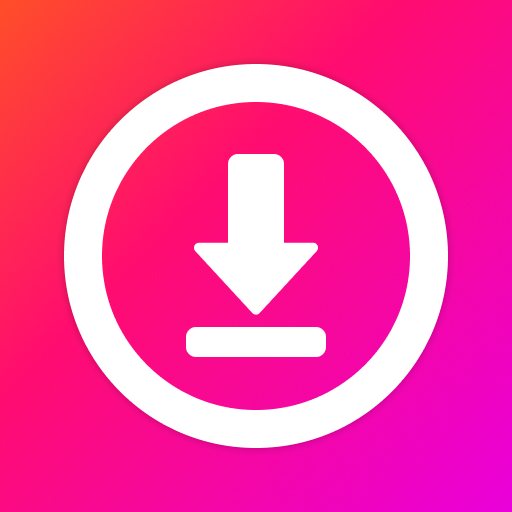 | 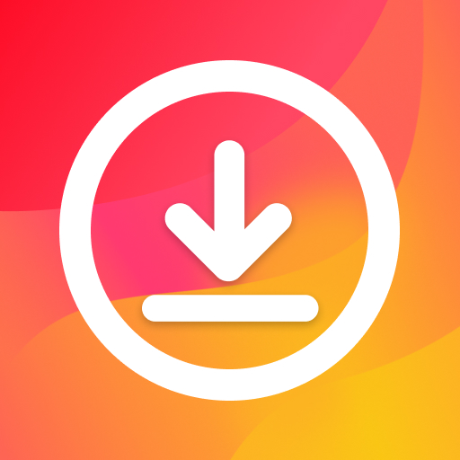 |  |  | 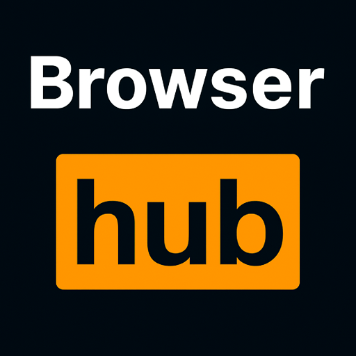 |  |  |  | 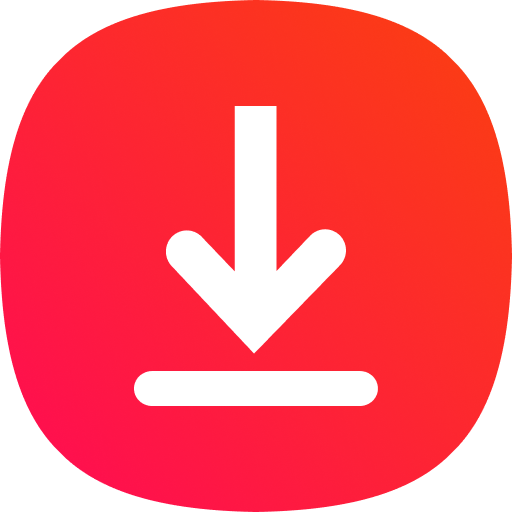 |  |  |  |  | 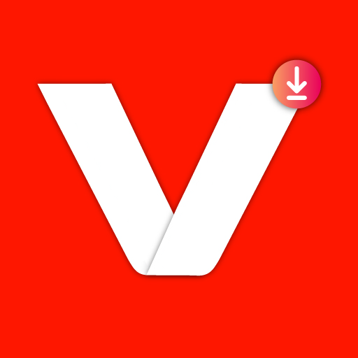 |  |
| 64 px |  |  |  |  |  |  |  |  |  |  |  |  |  |  |  |  |  |
| 48 px |  |  |  |  |  |  |  |  |  |  |  |  |  |  |  |  |  |
| 32 px |  |  |  |  |  |  |  |  |  |  |  |  |  |  |  |  |  |
| Downloads | **5+** Cell Cave | **100M+** InShot Inc. | **50M+** Video Downloader Story Saver | **10M+** Video Downloader Story Saver | **100K+** Gamma Play | **100M+** QR Code Scanner. | **10M+** DOSA Apps | **10M+** Video Downloader & Fast Saver | **10M+** AppTool-Browser-Video | **50M+** All Video Downloader, Saver & Player Studio | **50M+** Fast Video Downloader & Story Saver - DevBay | **10M+** Sky Vision Apps Lab | **10M+** Attractive Apps Valley | **10M+** Markhoor Studio | **5M+** Mobile Notepad Apps | **100M+** Vidow™ | **50M+** Vidpal Apps Studio |

Feature graphics · 1024 × 500

## All 17 feature graphics — ours first

The banner each listing shows above its screenshots, ours in the top-left. Click any graphic to view it large.

[00 · Our app](#g-00-our-app) · Cell Cave · 5+ downloads · 1024 × 500 · landscape · Feature graphic, original file · [Original image on Google Play ↗](https://play-lh.googleusercontent.com/q4weOoYNzbX0TD4RtvgBm1VsiywteBuYuZsb5Rr0JzQPEFYto2uU7Taj_ueFgCp65xXjCQ9zFHSZ9jwTq7lk8Q)

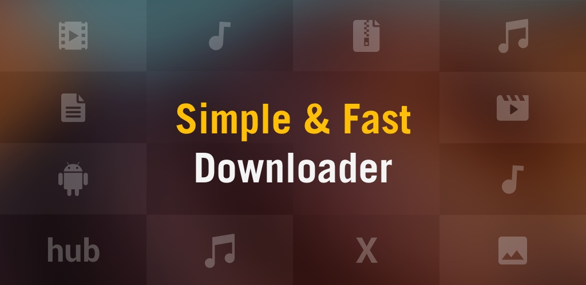

[01 · InShot](#g-01-inshot) · InShot Inc. · 100M+ downloads · 1024 × 500 · landscape · Feature graphic, original file · [Original image on Google Play ↗](https://play-lh.googleusercontent.com/QrAO-trY2kMBozJxNbFVwlmHb6y4SyYaTsLlAOVW2na_Th8ED1XOKFJecVhVpj9hXeIaezkfd2Xmep1DQB2DSno)

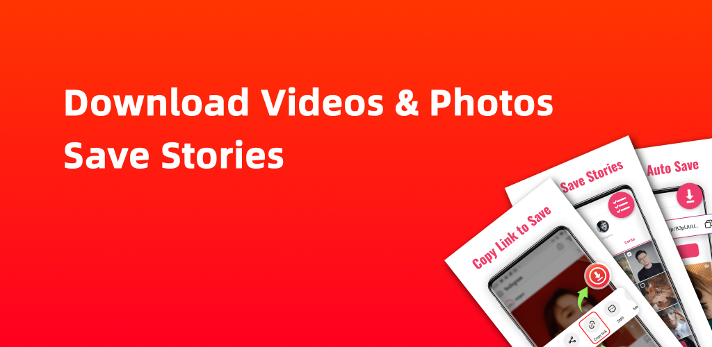

[02 · Story Saver](#g-02-story-saver) · Video Downloader Story Saver · 50M+ downloads · 1024 × 500 · landscape · Feature graphic, original file · [Original image on Google Play ↗](https://play-lh.googleusercontent.com/bsU9OfF1Q7vV2d-wAAYS9VzvgknS78ba7C5WRqDFzkRlkG-j3PZJwCLP-6RpJC725CRrlf3gBya-HOMuSTqY)

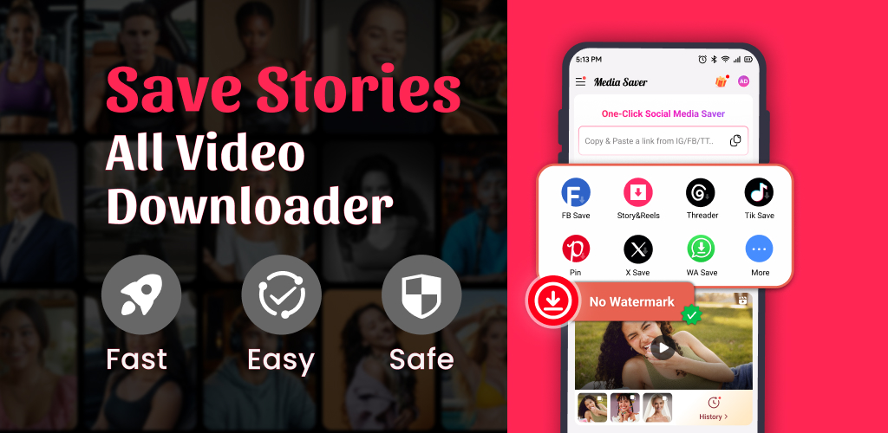

[03 · InSaver](#g-03-insaver) · Video Downloader Story Saver · 10M+ downloads · 1024 × 500 · landscape · Feature graphic, original file · [Original image on Google Play ↗](https://play-lh.googleusercontent.com/NkXnlgo7Vi5rm86MfQLfW-gLoucel_vkCuCXJUi6aFpaU-iHpBN5ihBw2QREGPsCfFrwefFBnqO-zq2C3LMW)

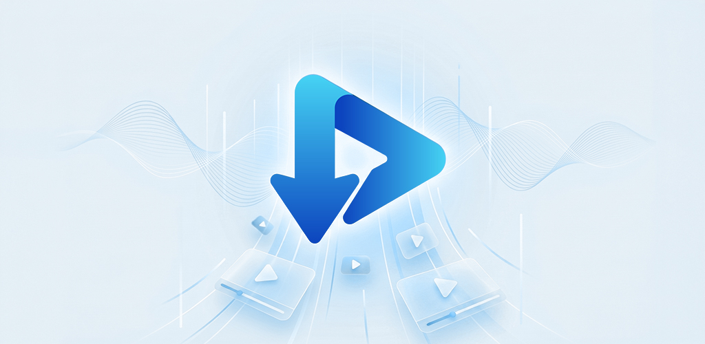

[04 · Gamma Play](#g-04-gamma-play) · Gamma Play · 100K+ downloads · 1024 × 500 · landscape · Feature graphic, original file · [Original image on Google Play ↗](https://play-lh.googleusercontent.com/R0RPcCkjGrOrSY69hOH5SMKaE0FH6do2bOYNETkwJWq-qAkSpsUQYdGDfB0Zg2qGFd_oYq515kOks7_ZqcT4-9E)

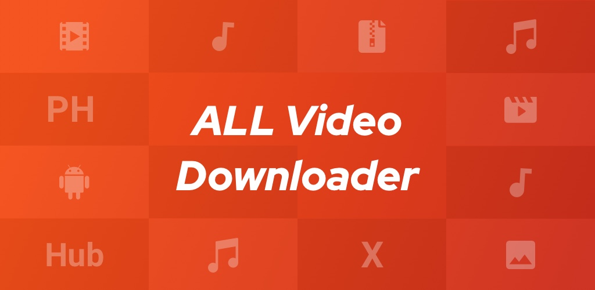

[05 · QR Code Scanner](#g-05-qr-code-scanner) · QR Code Scanner. · 100M+ downloads · 1024 × 500 · landscape · Feature graphic, original file · [Original image on Google Play ↗](https://play-lh.googleusercontent.com/NnxBVfBMclFKOfLXSwK39BbujWhkjBAyZrx0-zQ6sLgxWFGivXetTkR1oBBxRDrXylf90EzuLoDG-FegNkG6-Zs)

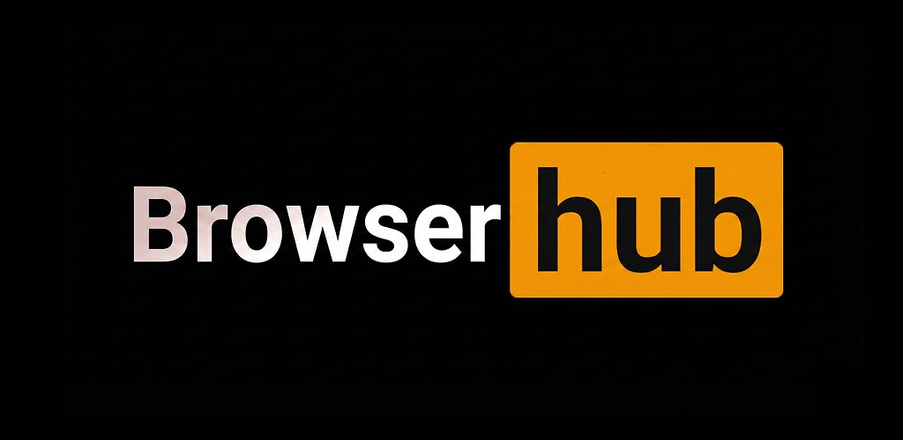

[06 · Hub (DOSA)](#g-06-dosa-hub) · DOSA Apps · 10M+ downloads · 1024 × 500 · landscape · Feature graphic, original file · [Original image on Google Play ↗](https://play-lh.googleusercontent.com/sSno7wEWk_kU4ec840CSjwmZSj1lMgdecvg86sn3Ne2tUdB1rcBWmVxwpaCN1OFWG28DTTiiROnxq2-LnQCI8NA)

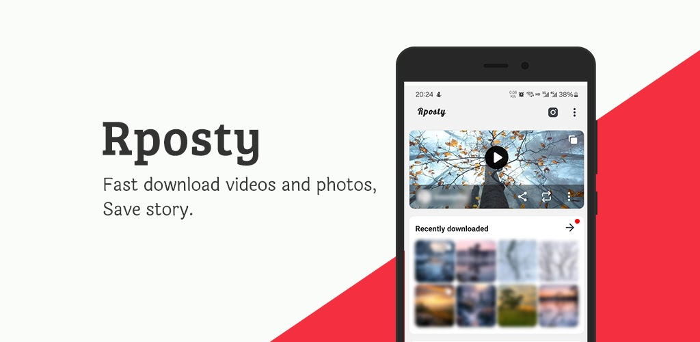

[07 · Fast Saver](#g-07-fast-saver) · Video Downloader & Fast Saver · 10M+ downloads · 1024 × 500 · landscape · Feature graphic, original file · [Original image on Google Play ↗](https://play-lh.googleusercontent.com/YnHVhcTPX5dm8XVwrEbqgTISNXdkTNmJsTC42u1ZpQB6E7Zy2VqDfIenSDaKR69q5UJVjgunWY_mwx26F13oGg)

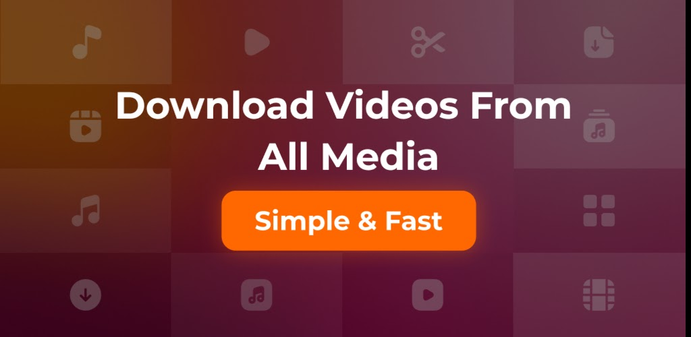

[08 · AppTool](#g-08-apptool) · AppTool-Browser-Video · 10M+ downloads · 1024 × 500 · landscape · Feature graphic, original file · [Original image on Google Play ↗](https://play-lh.googleusercontent.com/oBpdy9TOIkDchxD_mO2tgPWcnB_RvXhiYbrTHckeWZZEWWJWPCqnM9rvOO5RJGCi39ISI_VRy3kTQrHy-EF4og)

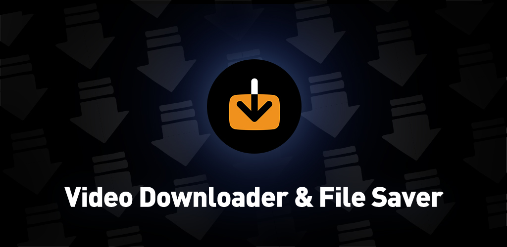

[09 · Saver & Player Studio](#g-09-saver-player-studio) · All Video Downloader, Saver & Player Studio · 50M+ downloads · 1024 × 500 · landscape · Feature graphic, original file · [Original image on Google Play ↗](https://play-lh.googleusercontent.com/nqzrNRvz5GxCC5EMcfiv1xQfe0u41JUeXKFbEeHHzf0UIaEimWsqqCTL8iExgJ2XvaY9tzsTwfgdFotO9MIGkw)

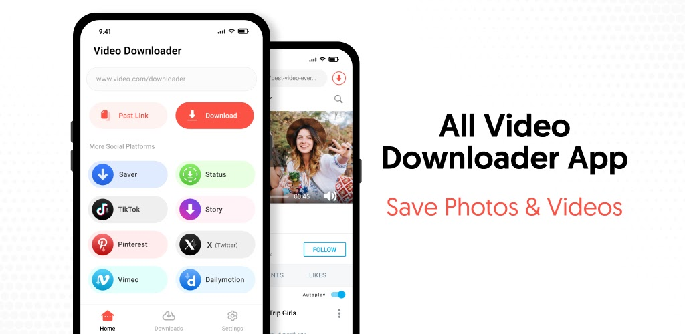

[10 · DevBay](#g-10-devbay) · Fast Video Downloader & Story Saver - DevBay · 50M+ downloads · 1024 × 500 · landscape · Feature graphic, original file · [Original image on Google Play ↗](https://play-lh.googleusercontent.com/dsB1ZAkEauERXsS4EJ9Xs-41JbAo0qaaOtCawqlJCIO2CBGkivNy8bPyT5X5bg1tbcMWkfptjMVxOK_7Z8vNdA)

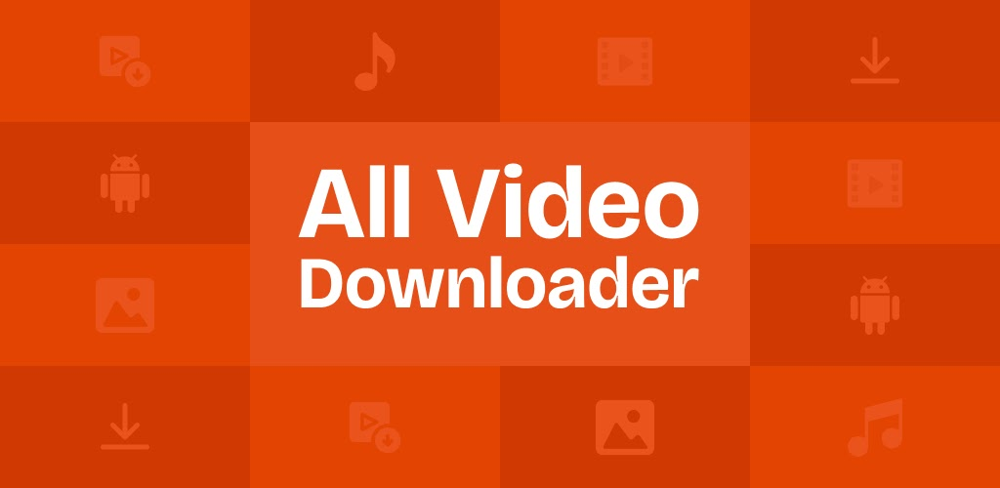

[11 · Sky Vision](#g-11-sky-vision) · Sky Vision Apps Lab · 10M+ downloads · 1024 × 500 · landscape · Feature graphic, original file · [Original image on Google Play ↗](https://play-lh.googleusercontent.com/C2PO4WH7Gv29t-ooMW1PPM9A9-cbIqGvEAG9s6_9d3DMkonhbur9en9_JdkS3tRyHCS_UlJtFSK2EEKWimefVQ)

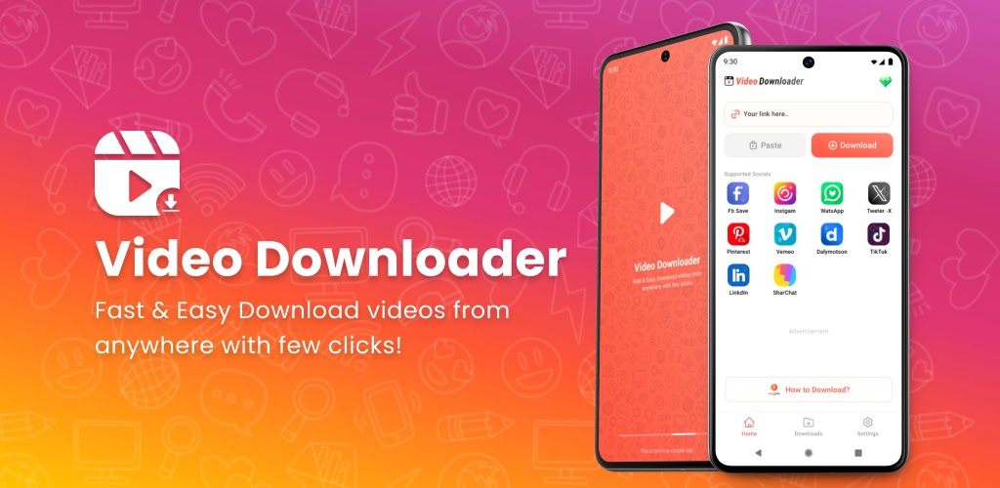

[12 · Attractive Apps](#g-12-attractive-apps) · Attractive Apps Valley · 10M+ downloads · 1024 × 500 · landscape · Feature graphic, original file · [Original image on Google Play ↗](https://play-lh.googleusercontent.com/5r0E7gFgJq3qBZMhHLZiXfdAWVrfY5uAgDOxzjo748IXGoaOqb6qONlQ1vzWg67i90uSp0jCSt3cPv2oJ7SQgA)

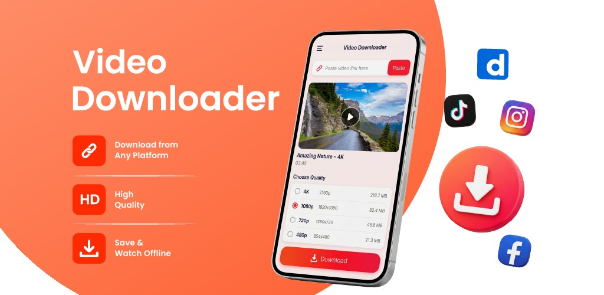

[13 · Markhoor](#g-13-markhoor) · Markhoor Studio · 10M+ downloads · 1024 × 500 · landscape · Feature graphic, original file · [Original image on Google Play ↗](https://play-lh.googleusercontent.com/y2Eu9k8uHLfd4kJh9Oeyoz0oVaFA_j1vxz33AeA9e0AU6ojg1TVokD-TaUtSsiyO1a7AnVG6UPf3yYE0d9vL)

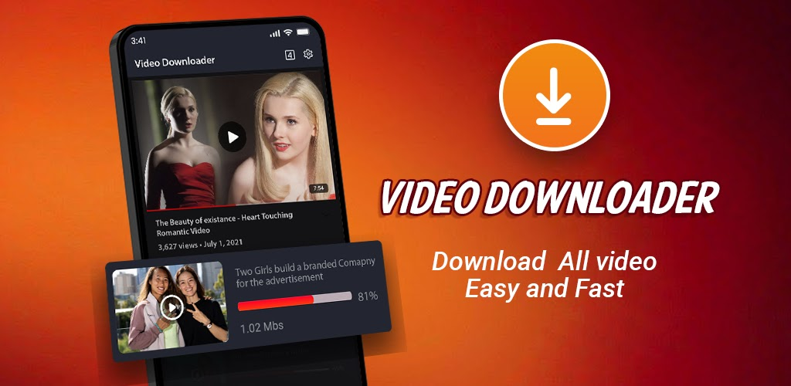

[14 · Mobile Notepad](#g-14-mobile-notepad) · Mobile Notepad Apps · 5M+ downloads · 1024 × 500 · landscape · Feature graphic, original file · [Original image on Google Play ↗](https://play-lh.googleusercontent.com/qWfVvWHKmTRQ2vXnnUpzNP9abfuuFfV5onKZB9na02OqXtzX9T_2bGQf3eO_5p-a52OVjhATv-nYfccf_KTVlW4)

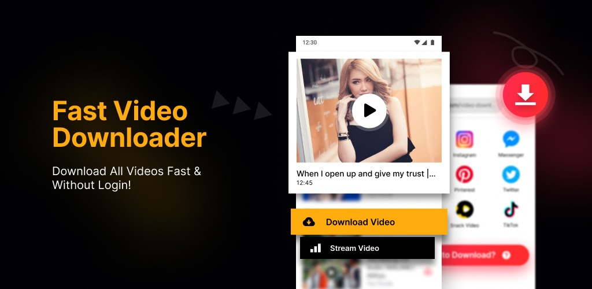

[15 · Vidow](#g-15-vidow) · Vidow™ · 100M+ downloads · 1024 × 500 · landscape · Feature graphic, original file · [Original image on Google Play ↗](https://play-lh.googleusercontent.com/ril_T7cBwEpev8WrRQwHByvNfT9Up3cm4e4enIU9INgTS5Ly4PhchS0ydj8Pu80Dm-xMn4e1-vk1WDHAk47VFA)

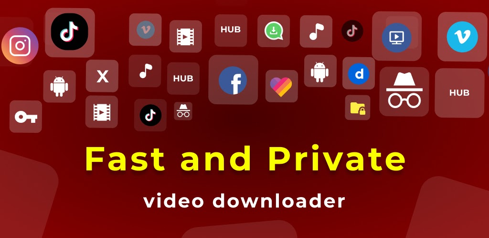

[16 · Vidpal](#g-16-vidpal) · Vidpal Apps Studio · 50M+ downloads · 1024 × 500 · landscape · Feature graphic, original file · [Original image on Google Play ↗](https://play-lh.googleusercontent.com/Ye-23wxIpXrZZEUTOGuDHyQRXVoo5_aQWbe1oQsdXpXmbdony9s9g4tx1flagohZFCfjvAWRkZ_ruu_1vntR)

Visual library · 164 assets

## Every asset, app by app — ours first

Our listing opens the library, then the 16 competitors in keyword-board order. Listing facts as captured, a four-part design read, and every icon, feature graphic and screenshot. Filter by app, asset type or orientation, or search the notes and captions. Click an image to view it large, then use ‹ and › to step through the set.

| # | App | Publisher | Downloads | Rating | Portrait | Landscape | Listing |
| --- | --- | --- | --- | --- | --- | --- | --- |
| 00 | [**Our app**](#g-00-our-app) ours All Video Downloader & Saver | Cell Cave | 5+ | too few ratings | 4 | 0 | [Google Play ↗](https://play.google.com/store/apps/details?id=com.video.downloader.instagram.videosaver&hl=en&gl=US) |
| 01 | [**InShot**](#g-01-inshot) Video Downloader | InShot Inc. | 100M+ | 4.72 (2.7M) | 11 | 1 | [Google Play ↗](https://play.google.com/store/apps/details?id=video.downloader.videodownloader&hl=en&gl=US) |
| 02 | [**Story Saver**](#g-02-story-saver) Video downloader - Story Saver | Video Downloader Story Saver | 50M+ | 4.74 (1.4M) | 6 | 0 | [Google Play ↗](https://play.google.com/store/apps/details?id=instagram.video.downloader.story.saver.ig&hl=en&gl=US) |
| 03 | [**InSaver**](#g-03-insaver) InSaver: All Video Downloader | Video Downloader Story Saver | 10M+ | 4.74 (295K) | 7 | 0 | [Google Play ↗](https://play.google.com/store/apps/details?id=instagram.video.downloader.story.saver.ig.insaver&hl=en&gl=US) |
| 04 | [**Gamma Play**](#g-04-gamma-play) Video Downloader - without ads | Gamma Play | 100K+ | 4.63 (3.1K) | 7 | 0 | [Google Play ↗](https://play.google.com/store/apps/details?id=com.gamma.videodownloader&hl=en&gl=US) |
| 05 | [**QR Code Scanner**](#g-05-qr-code-scanner) All Video Downloader & Player | QR Code Scanner. | 100M+ | 4.52 (1.9M) | 8 | 0 | [Google Play ↗](https://play.google.com/store/apps/details?id=videoplayer.videodownloader.downloader&hl=en&gl=US) |
| 06 | [**Hub (DOSA)**](#g-06-dosa-hub) Hub Video Downloader | DOSA Apps | 10M+ | 4.36 (82K) | 5 | 0 | [Google Play ↗](https://play.google.com/store/apps/details?id=hub.browser.video.downloader.saver&hl=en&gl=US) |
| 07 | [**Fast Saver**](#g-07-fast-saver) Video Downloader & Story Saver | Video Downloader & Fast Saver | 10M+ | 4.80 (377K) | 5 | 0 | [Google Play ↗](https://play.google.com/store/apps/details?id=videodownloader.instagram.videosaver&hl=en&gl=US) |
| 08 | [**AppTool**](#g-08-apptool) All Video Downloader & Player | AppTool-Browser-Video | 10M+ | 4.36 (66K) | 6 | 1 | [Google Play ↗](https://play.google.com/store/apps/details?id=com.videodownload.browser.videodownloader&hl=en&gl=US) |
| 09 | [**Saver & Player Studio**](#g-09-saver-player-studio) Video Downloader & Video Saver | All Video Downloader, Saver & Player Studio | 50M+ | 4.42 (357K) | 7 | 0 | [Google Play ↗](https://play.google.com/store/apps/details?id=downloader.video.download.free&hl=en&gl=US) |
| 10 | [**DevBay**](#g-10-devbay) All Video Downloader & Browser | Fast Video Downloader & Story Saver - DevBay | 50M+ | 3.89 (649K) | 7 | 0 | [Google Play ↗](https://play.google.com/store/apps/details?id=instasaver.videodownloader.photodownloader.repost&hl=en&gl=US) |
| 11 | [**Sky Vision**](#g-11-sky-vision) All Video Downloader & Saver | Sky Vision Apps Lab | 10M+ | 4.09 (24K) | 7 | 0 | [Google Play ↗](https://play.google.com/store/apps/details?id=com.allvideodownloader.hdvideodownloader.savevideos&hl=en&gl=US) |
| 12 | [**Attractive Apps**](#g-12-attractive-apps) All video downloader and saver | Attractive Apps Valley | 10M+ | 3.99 (23K) | 6 | 0 | [Google Play ↗](https://play.google.com/store/apps/details?id=allinone.videodownloader.savevideos&hl=en&gl=US) |
| 13 | [**Markhoor**](#g-13-markhoor) Video Downloader & Save Video | Markhoor Studio | 10M+ | 4.00 (9.5K) | 13 | 0 | [Google Play ↗](https://play.google.com/store/apps/details?id=com.videosaver.savevideos.story.saverapp&hl=en&gl=US) |
| 14 | [**Mobile Notepad**](#g-14-mobile-notepad) Video Downloader - Player | Mobile Notepad Apps | 5M+ | 3.83 (7.5K) | 16 | 0 | [Google Play ↗](https://play.google.com/store/apps/details?id=com.videodownloder.alldownloadvideos&hl=en&gl=US) |
| 15 | [**Vidow**](#g-15-vidow) Video Downloader HD - Vidow | Vidow™ | 100M+ | 3.96 (335K) | 6 | 0 | [Google Play ↗](https://play.google.com/store/apps/details?id=com.hdvideodownloader.downloaderapp&hl=en&gl=US) |
| 16 | [**Vidpal**](#g-16-vidpal) Video Downloader and 4k Player | Vidpal Apps Studio | 50M+ | 4.25 (402K) | 7 | 0 | [Google Play ↗](https://play.google.com/store/apps/details?id=free.video.downloader.freevideodownloader2021.video.saver.videosaverlite&hl=en&gl=US) |

164 of 164 assets shown

Our app

### Our app ours

“All Video Downloader & Saver” · 5+ downloads · rating too few ratings · 4 portrait and 0 landscape screenshots

US keyword board (16 Sep): **0** top-10 · **0** placements on 100 keywords · best #—

Open listing on Google Play ↗

#### Icon

A rainbow gradient square — magenta through orange, yellow and green to blue — carrying a heavy black download arrow over a tray. In a category where seven icons are a red “V” and five more are an arrow on a flat square, the gradient is the most distinctive thing we own. The arrow itself is the category default; the colour is not.

#### Feature graphic

Black banner with “VIDEO DOWNLOADER” split white/red, “DOWNLOAD YOUR ALL FAVOURITE VIDEOS” beneath it, a phone mock on the right and a small rocket. Three chips read Fast · Simple · Secure. It sits in the same dark-banner family as four competitors, and the headline is a category label rather than a reason to install.

#### Screenshot system

Four frames, one template: a white band carrying a bold dark all-caps heading and a grey sub-line, an orange gradient panel holding the device, and a black pill strip at the foot listing three feature words. The run is download, manage, quality, private vault. It is clean, consistent and legible at thumbnail size.

#### Design assessment

The template is sound and the copy is benefit-led — but we ship **four** screenshots where the category median is seven and the leaders ship twelve to sixteen, so four of eight phone slots sit empty. The vault, the editor and MP3 extraction — the three things the feature audit says no audited competitor has — are represented by one frame between them. Screenshot 1 also shows a row of platform brand marks, which is the one thing on this page our own rules tell us not to do.

ours · rainbow gradient icon · benefit-led headings · 4 of 8 slots used · platform icons in frame 1 · no editor frame

Icon and feature graphic

Icon 01 · 512 × 512 · square · Listing icon, original file · [Original image on Google Play ↗](https://play-lh.googleusercontent.com/qLNXtLkR4z4KiAhmkwjlXx1TpuC4aaH6qsMoZgkWzjg1-ZaXUh-KMfdG1gXfayu_gkStOl6S1w4tCfe2WMPBbQ)

Feature Graphic 01 · 1024 × 500 · landscape · Feature graphic, original file · [Original image on Google Play ↗](https://play-lh.googleusercontent.com/q4weOoYNzbX0TD4RtvgBm1VsiywteBuYuZsb5Rr0JzQPEFYto2uU7Taj_ueFgCp65xXjCQ9zFHSZ9jwTq7lk8Q)

Portrait screenshots · 4

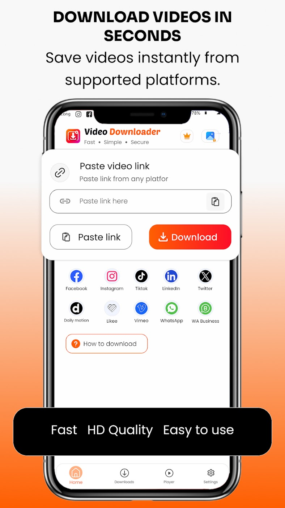

Screenshot 01 · 788 × 1400 · portrait · Download videos in seconds · [Original image on Google Play ↗](https://play-lh.googleusercontent.com/j2_25nIZRvSsEN0BlWJSIIRtIx-N1I7ugFgLUo5rDuBOnNTugt1bnMxlZt9p-RnjyAXdCFKK5KMAYzsaqTK8VA)

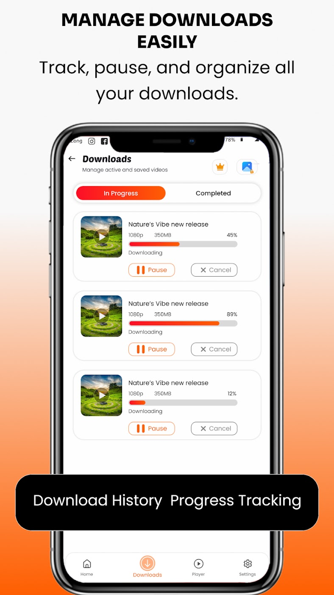

Screenshot 02 · 788 × 1400 · portrait · Manage downloads easily · [Original image on Google Play ↗](https://play-lh.googleusercontent.com/TDaaCxqjFa48ZfwV0k4SNIeBK-v0Cwt33ue3sNB5cqdlGlK4sYIZGuNKiKX2zGtm62hpnf9h3Zmc8ajaon7LXg)

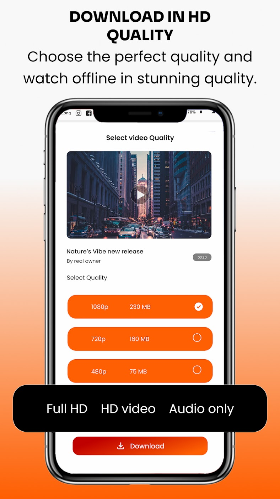

Screenshot 03 · 788 × 1400 · portrait · Download in HD quality · [Original image on Google Play ↗](https://play-lh.googleusercontent.com/iWFuKpcYqHVHeGgYoYhIrSjIrlR9FcRwAaGP1dZaP3WYRiq5zov4dfdatnjVHXoBdObNVJClXxRpLiWW2OhOTw)

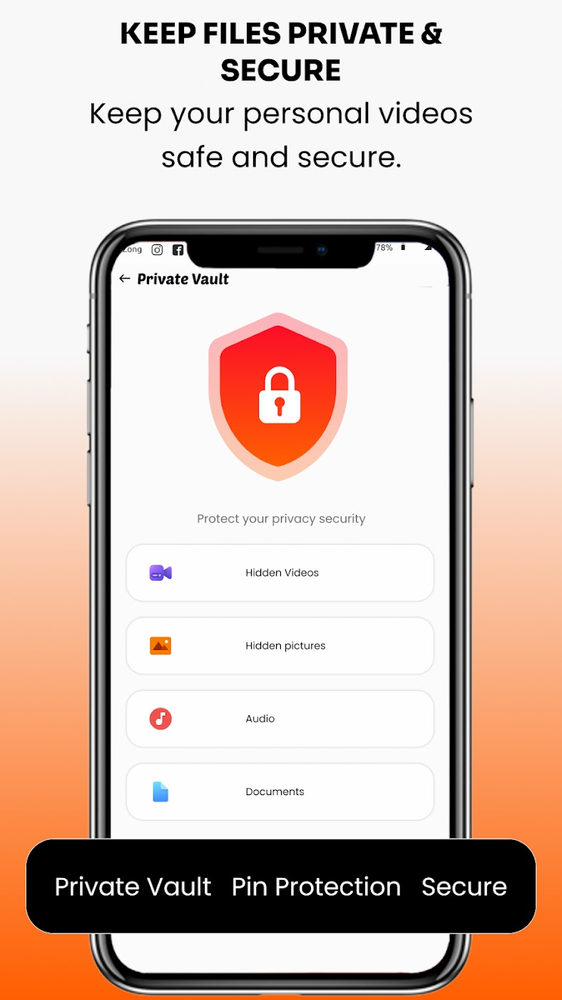

Screenshot 04 · 788 × 1400 · portrait · Keep files private & secure · [Original image on Google Play ↗](https://play-lh.googleusercontent.com/3n20NxyQhoOWJOgRndJyj48dCylpmBu1lIGTP9GG5lS89ovMzjfum-Ps_cLIDr_54bKevER-jTLc-Um63vy_nw)

Landscape screenshots: not observed in this snapshot.

01 · InShot Inc.

### InShot

“Video Downloader” · 100M+ downloads · rating 4.72 (2.7M) · 11 portrait and 1 landscape screenshots

US keyword board (16 Sep): **51** top-10 · **57** placements on 100 keywords · best #1

Open listing on Google Play ↗

#### Icon

A black rounded square with a white download arrow resting on a yellow bar. Nothing but the mark — no wordmark, no gradient, no device. It is the most reduced icon in the library and it holds at 32 px better than anything else here.

#### Feature graphic

A dark grid of faint media-type tiles with “Simple & Fast Downloader” set in yellow and white at the centre. Three competitors use almost exactly this tile-grid construction.

#### Screenshot system

Two systems in one carousel. Frames 2-7 are marketing panels: white ground, a two-tone heading, a device below (One-click Download, Social Media Downloader, Download Management, SD Card Supported, Keep Video Safe, Powerful Downloader). Frames 8-12 are bare device captures with no heading at all, and frame 1 is a landscape composite.

#### Design assessment

The category leader by search visibility — 51 US top-10 placements, 4.72★ from 2.7M ratings — and its listing is not especially polished: half the carousel is unlabelled screen grabs. Evidence that in this category ranking is won on keywords and install base, not on store art. The icon, though, is the one asset here worth studying.

black arrow icon · tile-grid banner · mixed labelled/unlabelled frames · landscape frame · category leader

Icon and feature graphic

Icon 01 · 512 × 512 · square · Listing icon, original file · [Original image on Google Play ↗](https://play-lh.googleusercontent.com/oju7a2AuqaQSc_l5O-2yRw8F_M0rUlHnBHjp_MqHNSAT3CXq7xbSqRVL7VSPNhMRjzaM2ft-LBoA05-q9hqmhg)

Feature Graphic 01 · 1024 × 500 · landscape · Feature graphic, original file · [Original image on Google Play ↗](https://play-lh.googleusercontent.com/QrAO-trY2kMBozJxNbFVwlmHb6y4SyYaTsLlAOVW2na_Th8ED1XOKFJecVhVpj9hXeIaezkfd2Xmep1DQB2DSno)

Portrait screenshots · 11

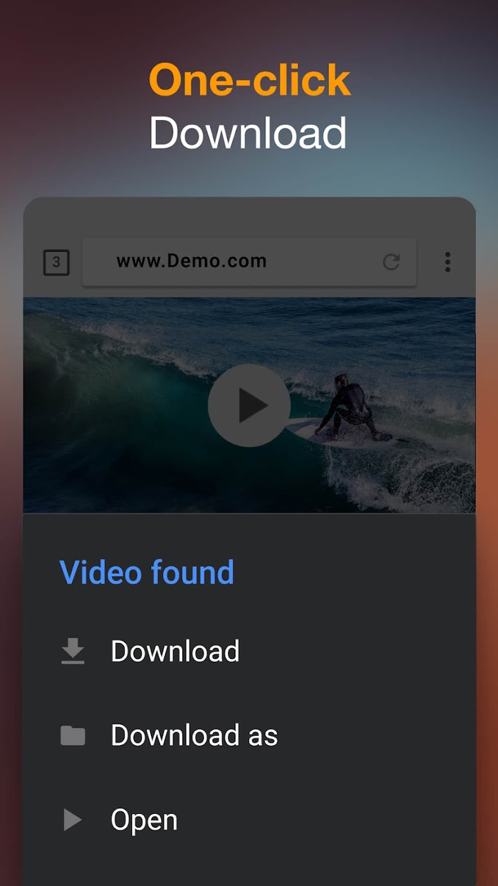

Screenshot 02 · 788 × 1400 · portrait · One-click Download · [Original image on Google Play ↗](https://play-lh.googleusercontent.com/gxUnDNwvtp0vd7HJX01UVlWG3OdKYfLHeSLUBcsRp3fe_ncRvXBTxjYs7-i19VEYvrXiqbzDDOaaXCHPoYtjxSA)

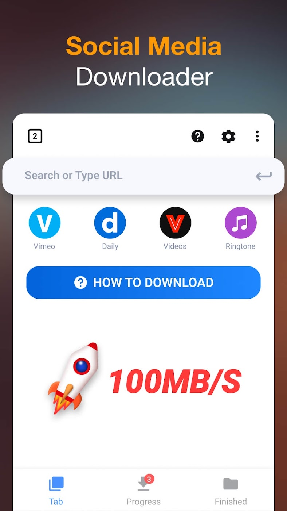

Screenshot 03 · 788 × 1400 · portrait · Social Media Downloader · [Original image on Google Play ↗](https://play-lh.googleusercontent.com/WFcH-IvsVpbLiJQx1pQC0Tr147jjjJNgmwvXbfeqC8MJRDPtgb68Yr6IFA-oOlY_Psa_U_8H4_bDW-ECltzt2g)

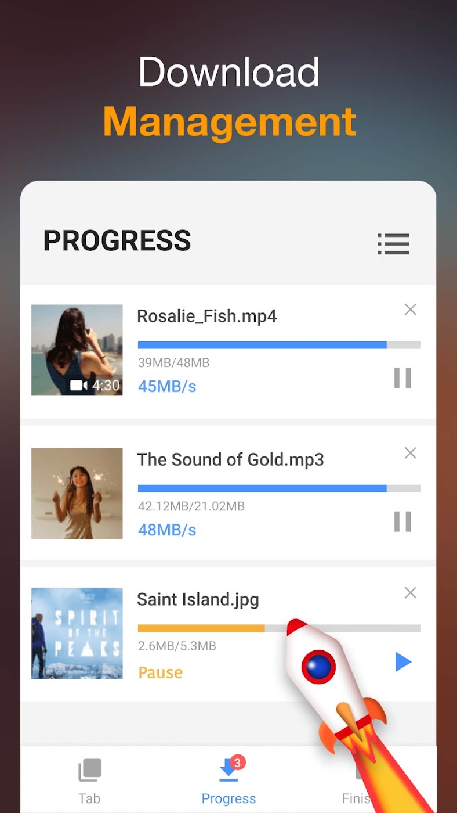

Screenshot 04 · 788 × 1400 · portrait · Download Management · [Original image on Google Play ↗](https://play-lh.googleusercontent.com/bUQFlAGdBI4UIMq2062v2WsBvk11Qb-v0JpULDAOmEonf54RZ9tapaeny4QYk0bS3shGIivg__F2bl3JbId7)

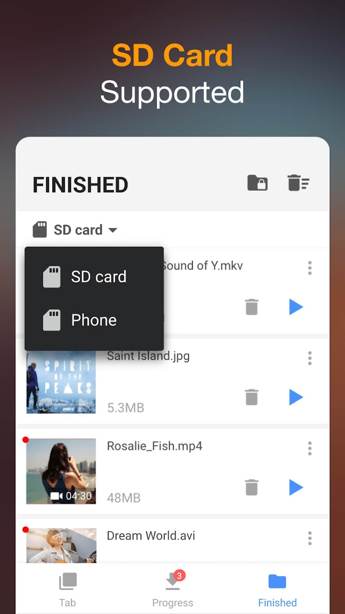

Screenshot 05 · 788 × 1400 · portrait · SD Card Supported · [Original image on Google Play ↗](https://play-lh.googleusercontent.com/Uy3NFS-H0YcvUyv2n48dyX76CpLJbhOH8GfhhiXIWtpL1lHitb_gl99KtWrnH4Nk7qkngPekNJaUpY59Gp7yKg)

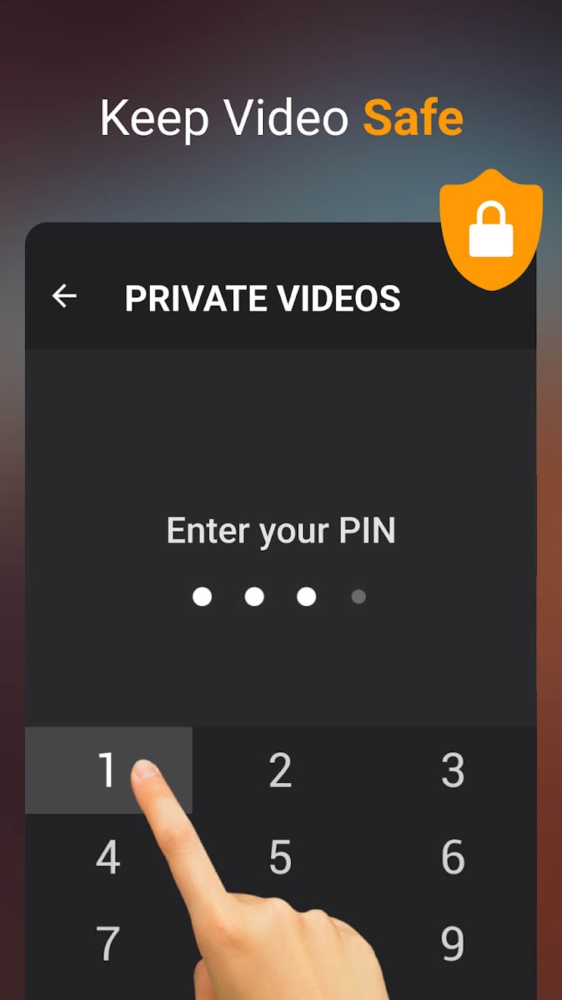

Screenshot 06 · 788 × 1400 · portrait · Keep Video Safe · [Original image on Google Play ↗](https://play-lh.googleusercontent.com/DLcnkImZEA7COuU2OJa2EAYTPWZnHVWWLDsY8fzqeOQvZRcIpoe_4L1_KWxgpPKcWlpY8quDIccYF7LFMHdkwg)

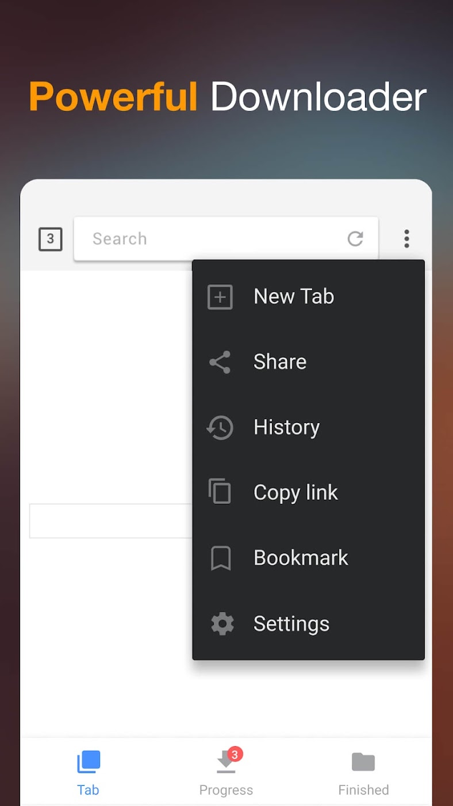

Screenshot 07 · 788 × 1400 · portrait · Powerful Downloader · [Original image on Google Play ↗](https://play-lh.googleusercontent.com/S3DOf7z5V0srj0YNUghtWNSJ9czeUIPsHKJrNDKbbb_4i7W1yfdC8iSrYYuhv-xli9HV68dOGKBsojC-8iWJ)

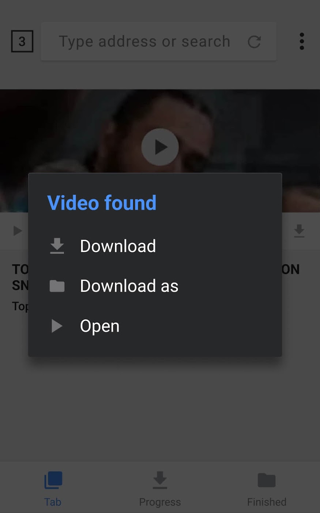

Screenshot 08 · 875 × 1400 · portrait · Browser — video found (no caption) · [Original image on Google Play ↗](https://play-lh.googleusercontent.com/ptR_jkjvK244mVyx3FAnK27AOXDT_VLe28BoWu7ACUBGLrNq5OWbpkmX8Ca5xX35fSyTftIgVH71rXC1vLiEJmQ)

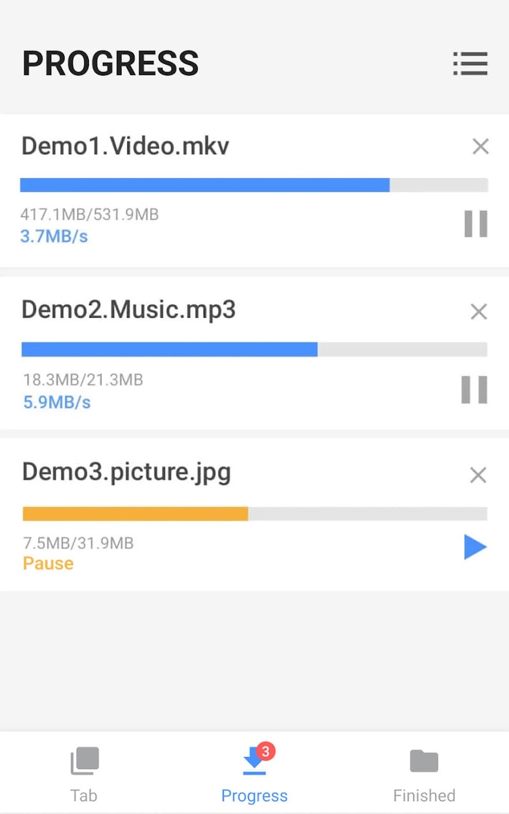

Screenshot 09 · 875 × 1400 · portrait · Progress list (no caption) · [Original image on Google Play ↗](https://play-lh.googleusercontent.com/ikeGVPFcD4aTDVAaVbpkZiQObefirUMBUm_6AgzOrqCe7Yk7VD3E0zhd3AUx4H0iveBg0GJkK3m29VoGanM4)

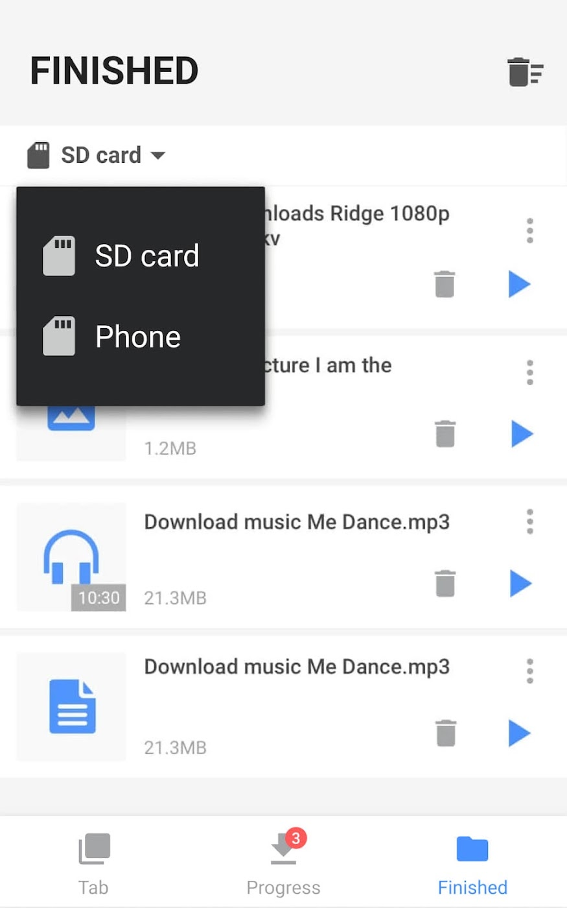

Screenshot 10 · 875 × 1400 · portrait · Finished list (no caption) · [Original image on Google Play ↗](https://play-lh.googleusercontent.com/pAAwl_n-Aotk9MTG417Iw7ngs5PmqrAAATFfDkZ1A3XIeXFrLfRdH44tZikXJDd1vLBa5zNlcszU2E5YWiCo68k)

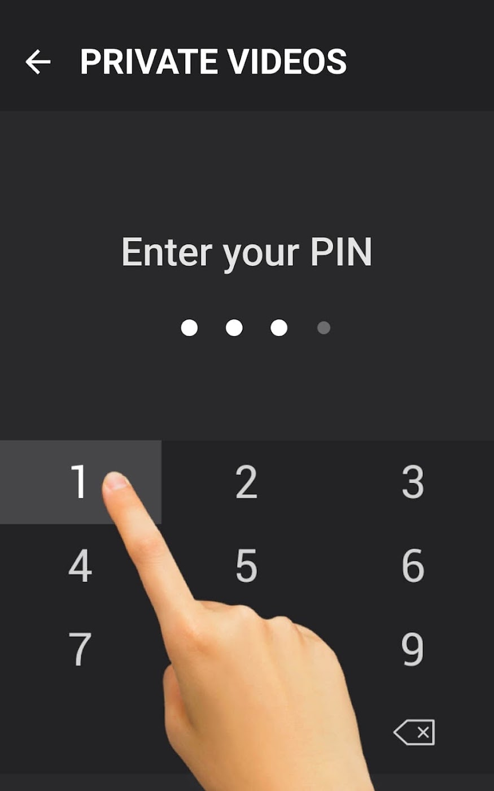

Screenshot 11 · 875 × 1400 · portrait · Private videos PIN (no caption) · [Original image on Google Play ↗](https://play-lh.googleusercontent.com/SHIVzBVSqh4A_SMeJN_i2ytNEfptgaBB7cT_SV7FeLKrrdxuYUmL3QQ2nZvWP8aXnMG8qWqUg5-RbsYF7c6J)

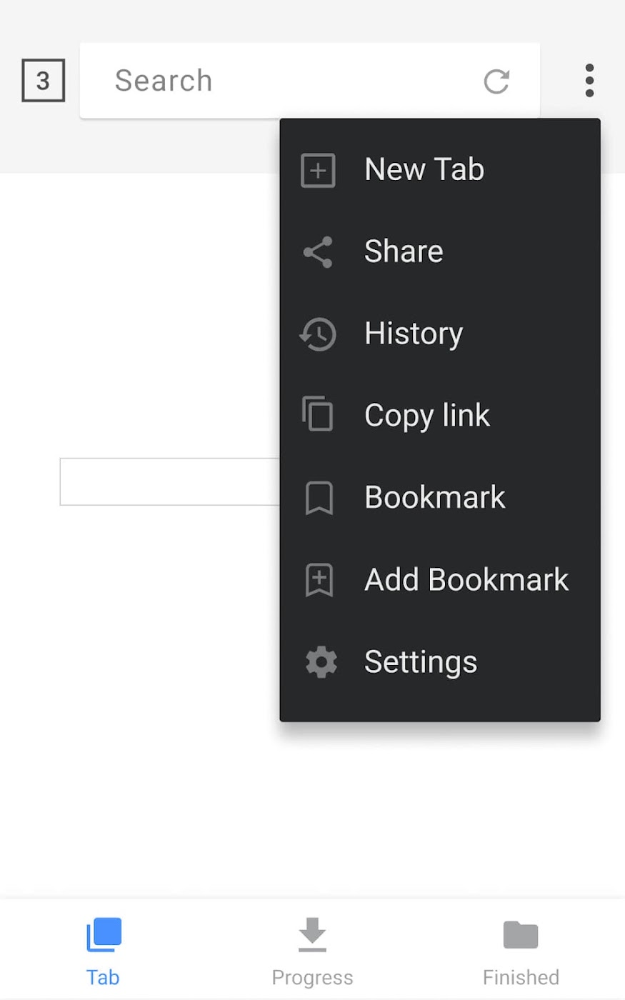

Screenshot 12 · 875 × 1400 · portrait · Browser menu (no caption) · [Original image on Google Play ↗](https://play-lh.googleusercontent.com/mpczvO0kyudX2Q489yz1KszXfvG5LtSe5aARGtlQe-NwbYtEDlyQ3AIadsKD6ByiN1-FHkLTs_0KKGmc86A1)

Landscape screenshots · 1

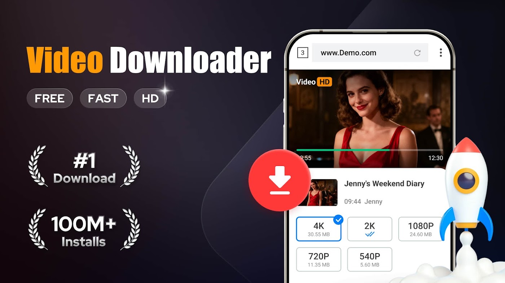

Screenshot 01 · 1400 × 788 · landscape · Video Downloader promo (landscape) · [Original image on Google Play ↗](https://play-lh.googleusercontent.com/NSGdsgwWRfwmx4fvTHQxemryYBrNUhWqMU2V8kQsrPQ9s3Z7d_X4x1SSyYZQ4f11L2-lD-3N-X8bKzW009-G)

02 · Video Downloader Story Saver

### Story Saver

“Video downloader - Story Saver” · 50M+ downloads · rating 4.74 (1.4M) · 6 portrait and 0 landscape screenshots

US keyword board (16 Sep): **36** top-10 · **52** placements on 100 keywords · best #1

Open listing on Google Play ↗

#### Icon

A magenta-to-pink gradient square holding a white ring with a download arrow inside. One of three circle-and-arrow icons here; the magenta is what separates it.

#### Feature graphic

Red banner, “Download Videos & Photos / Save Stories” in white at the left, a fan of tilted phone screens at the right. Direct and readable.

#### Screenshot system

Six frames on white, each with a pink heading in a heavy rounded face and a device below showing a real social feed. The run is copy-link, share-to-save, story saver & repost, auto save, save reels, history management.

#### Design assessment

Sells the workflow rather than the feature list — every frame shows the user's actual next tap, with arrows and numbered steps drawn over the UI. That is a stronger idea than most of this category manages. It also ships a visible typo in frame 1, “Video downlaoder”, on a 50M-install listing with 1.4M ratings.

magenta circle icon · workflow arrows · numbered steps · typo: downlaoder · third-party UI on screen

Icon and feature graphic

Icon 01 · 512 × 512 · square · Listing icon, original file · [Original image on Google Play ↗](https://play-lh.googleusercontent.com/TBQtIR4nBImNflXpt21UXPoOX_JykpbhIVoAjjwcJeJBVi5PKmV6_Gi4pul-aqz78ntdpUl8dvWN_yzBOvYcJA)

Feature Graphic 01 · 1024 × 500 · landscape · Feature graphic, original file · [Original image on Google Play ↗](https://play-lh.googleusercontent.com/bsU9OfF1Q7vV2d-wAAYS9VzvgknS78ba7C5WRqDFzkRlkG-j3PZJwCLP-6RpJC725CRrlf3gBya-HOMuSTqY)

Portrait screenshots · 6

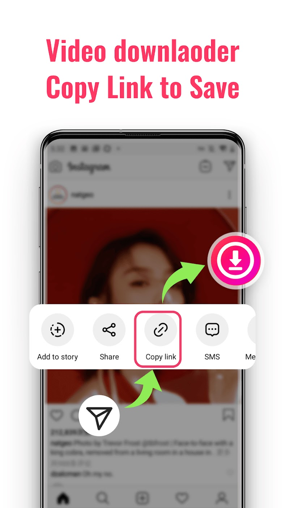

Screenshot 01 · 788 × 1400 · portrait · Video downlaoder — copy link to save (typo as published) · [Original image on Google Play ↗](https://play-lh.googleusercontent.com/026cg7-gFtD7o6Huk7RRt0AX56Pho4N_OK2a3W2i1Sx6yN6V-CI3dicRji9-3lNDK8OduffOWDuNwcxqDw8zDA)

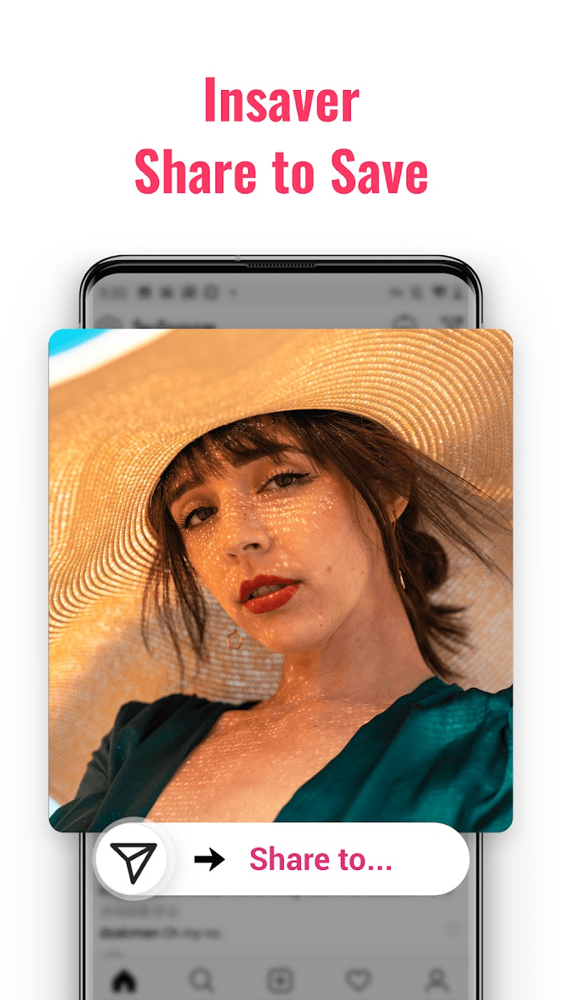

Screenshot 02 · 788 × 1400 · portrait · Insaver — share to save · [Original image on Google Play ↗](https://play-lh.googleusercontent.com/kRXnbqX2ikWH9Hr5r92D-ZaxQDYKLaAtYVb1pcuYoOw8hRBBFB-tIZfEh5Jl22BBXJ75UTxBJj9z-kNCZpTQgA4)

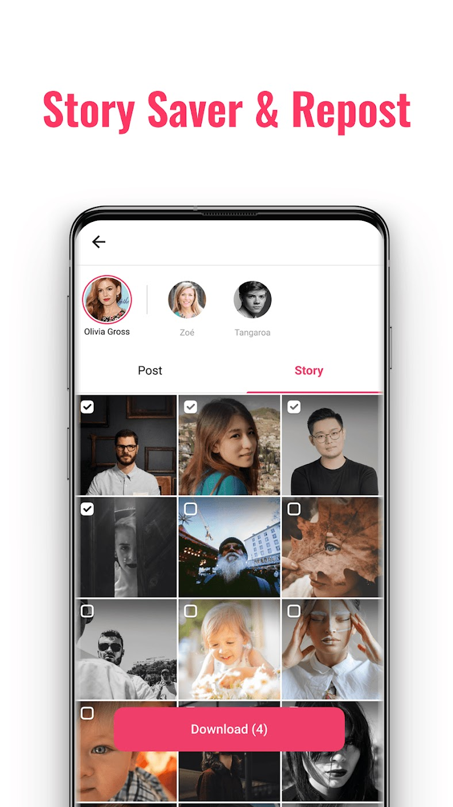

Screenshot 03 · 788 × 1400 · portrait · Story saver & repost · [Original image on Google Play ↗](https://play-lh.googleusercontent.com/0BANSyqcpXrMs3wGfHuXTMwP4PjpfPz3uu3lAcE0GXJVAhAxNsoEzxEOPGxBZuUzDT64oPGzPiklgOJr-MH3nA)

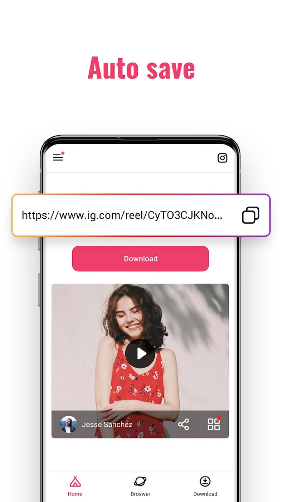

Screenshot 04 · 788 × 1400 · portrait · Auto save · [Original image on Google Play ↗](https://play-lh.googleusercontent.com/wMrHNUsStVRWicsBS6jrk4crq1u7B01RriIUDLDKQnF1eS-zrkuRXk6kpBQZ2SBZlQbuKRoTyqgEMG-0PmQU)

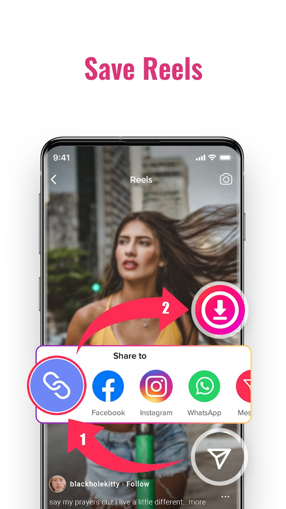

Screenshot 05 · 788 × 1400 · portrait · Save reels · [Original image on Google Play ↗](https://play-lh.googleusercontent.com/AP6qmSQOmzOPjwG1sAjrmxgEln8od8asGg5OcbmZSTqXbuunF3s5fKzmzrArDWOT7YrvGGovYB5uSeDzUp2txw)

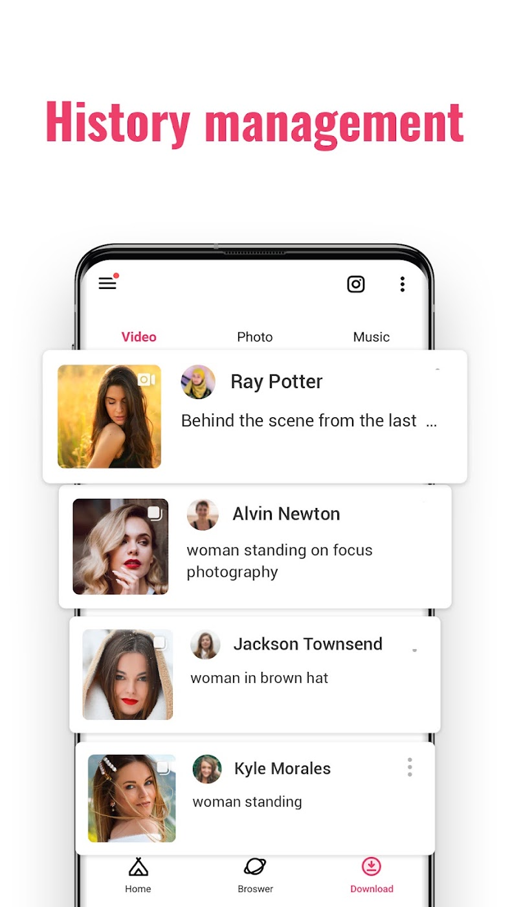

Screenshot 06 · 788 × 1400 · portrait · History management · [Original image on Google Play ↗](https://play-lh.googleusercontent.com/F3MAJkAegk90GfaH7Xx_bKFuANXKpkrGkfNr-LWqFIMV-ukuobqpS-bHbf30oDX801ImXu67uO9FeYOn-XaHvQ)

Landscape screenshots: not observed in this snapshot.

03 · Video Downloader Story Saver

### InSaver

“InSaver: All Video Downloader” · 10M+ downloads · rating 4.74 (295K) · 7 portrait and 0 landscape screenshots

US keyword board (16 Sep): **33** top-10 · **54** placements on 100 keywords · best #1

Open listing on Google Play ↗

#### Icon

An orange-to-pink gradient square with a white ring and download arrow — the same construction as its sibling app above, recoloured. Same publisher, two listings, two near-identical marks.

#### Feature graphic

Dark banner with “Save Stories / All Video Downloader” in red and white, three round chips reading Fast · Easy · Safe, and a phone showing a grid of platform marks.

#### Screenshot system

Seven frames on white with coral headings and a device below: Instsaver Video Downloader, Story Saver & Repost, No Watermark, Live Wallpapers & Ringtones, History Management, Batch Download, Auto Save.

#### Design assessment

The widest feature spread in the library — wallpapers and ringtones appear nowhere else — which makes the listing feel generous but unfocused. Frame 1 carries a typo in the brand name itself (“Instsaver”), and frame 3 promises “No Watermark”, a claim our own rules forbid us from making.

gradient circle icon · sibling of 02 · no-watermark claim · wallpapers & ringtones · typo: Instsaver

Icon and feature graphic

Icon 01 · 512 × 512 · square · Listing icon, original file · [Original image on Google Play ↗](https://play-lh.googleusercontent.com/Gxa3y2D4_k3xVRi4GcEoCz2VOJodVWgcLdCyUQY67w6_bier_KwRrqxVtGauUlciDHRfVdSgh3VO7UPAo7sS)

Feature Graphic 01 · 1024 × 500 · landscape · Feature graphic, original file · [Original image on Google Play ↗](https://play-lh.googleusercontent.com/NkXnlgo7Vi5rm86MfQLfW-gLoucel_vkCuCXJUi6aFpaU-iHpBN5ihBw2QREGPsCfFrwefFBnqO-zq2C3LMW)

Portrait screenshots · 7

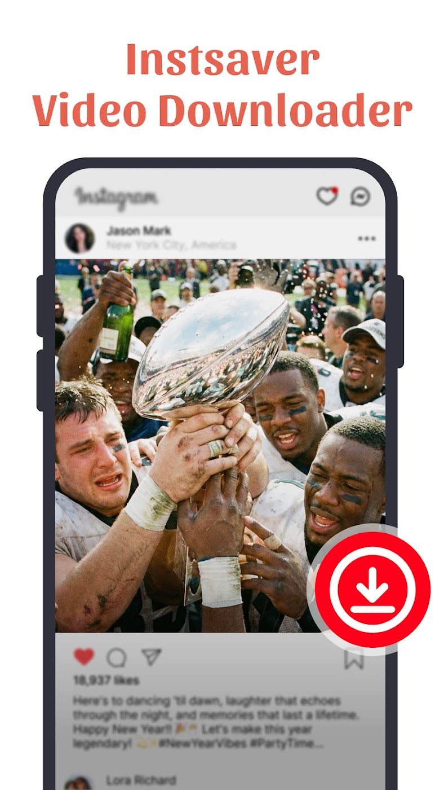

Screenshot 01 · 788 × 1400 · portrait · Instsaver Video Downloader (typo as published) · [Original image on Google Play ↗](https://play-lh.googleusercontent.com/EJJGQ0VKtrjO-ZIjF9_T4g6INHFpPUYBsGXGPnxD9hDsJyHXxZOUoi3j3mIAxJqXLWhW0b40UNwi25pqB6CiAkE)

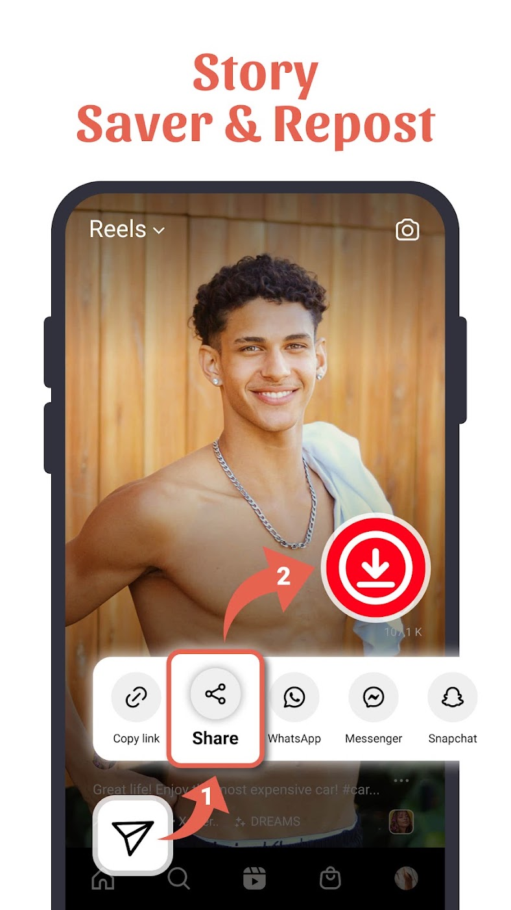

Screenshot 02 · 788 × 1400 · portrait · Story Saver & Repost · [Original image on Google Play ↗](https://play-lh.googleusercontent.com/YBRzMwVxKSM2fZQRcmBx_dD_NhZ7O8qXN38lpuWBI1NyKDdIeO13XMc9ti61N6Utcp3H1tR5wFYF_0GXZqG80w)

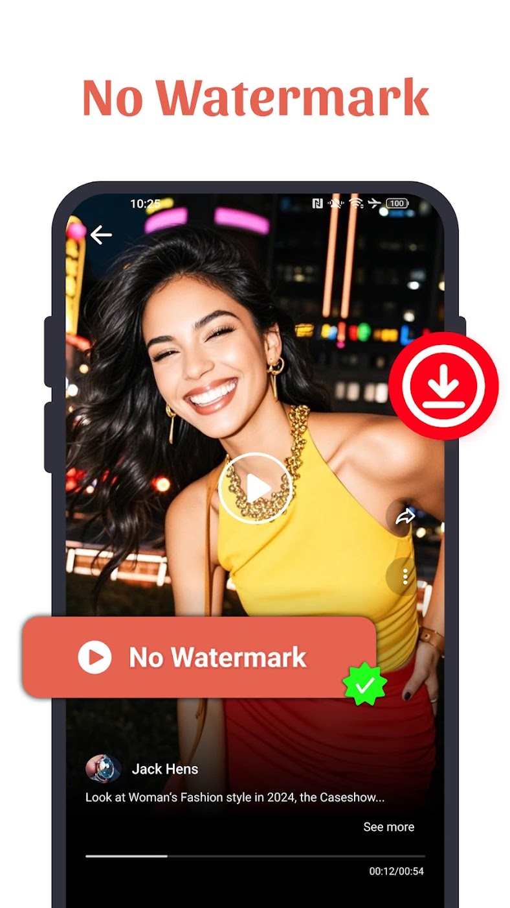

Screenshot 03 · 788 × 1400 · portrait · No Watermark · [Original image on Google Play ↗](https://play-lh.googleusercontent.com/98xatWrG5bp7YKrJa-fRtUl0An0LnhxthLRpwGG2n0j0zH1cxNX--wUjecRmEM8yuxs8hpcPKEzpJo_xOOzCvg)

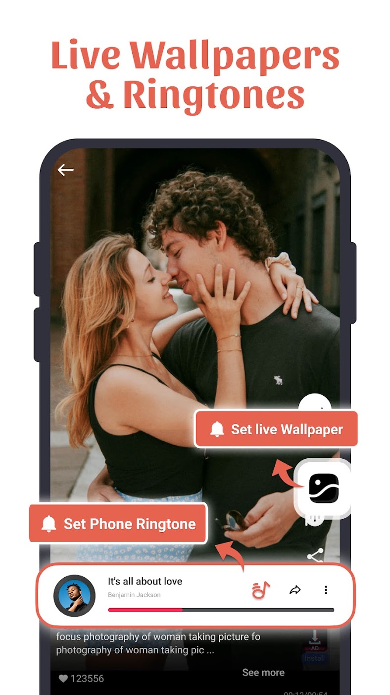

Screenshot 04 · 788 × 1400 · portrait · Live Wallpapers & Ringtones · [Original image on Google Play ↗](https://play-lh.googleusercontent.com/Wx30ELh6zRRnVV8NUwVC6JDVKPEncYwVMVommknCxGtO93BGhEyncQ28wIlEj0mDsRB3LG4T4iQ9HLMWkC4-uw)

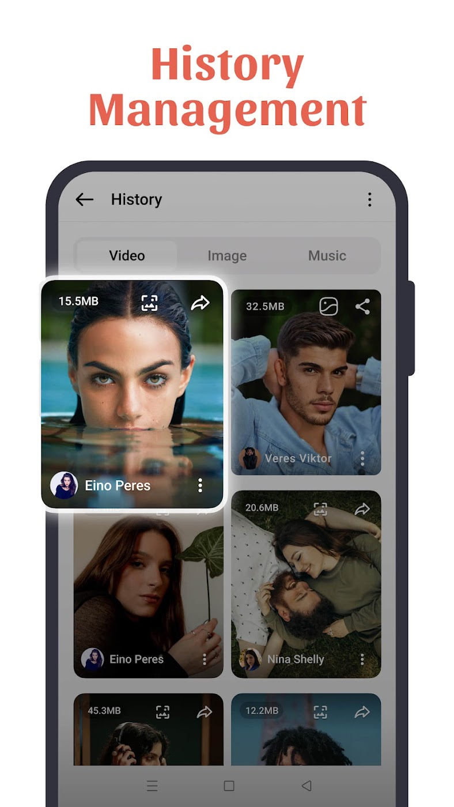

Screenshot 05 · 788 × 1400 · portrait · History Management · [Original image on Google Play ↗](https://play-lh.googleusercontent.com/m-M-0Rjcfdhq4qj_zA997K9ruIVkhZlTc_7sxKS_9hCuy-HTPNuwk8d-VwB4g8i_BvuPoSylvK2YeWS7-HAVmw)

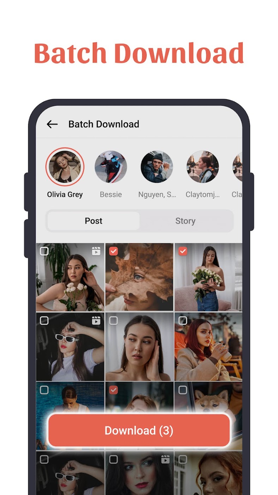

Screenshot 06 · 788 × 1400 · portrait · Batch Download · [Original image on Google Play ↗](https://play-lh.googleusercontent.com/z83FRL3aZlli1YRKP-rO6i-30hDdz9CsuQJEGamsQlVms0wmPieHfGpxoB9sdP9s8hARFn8hdGWU9zoyX5waJA)

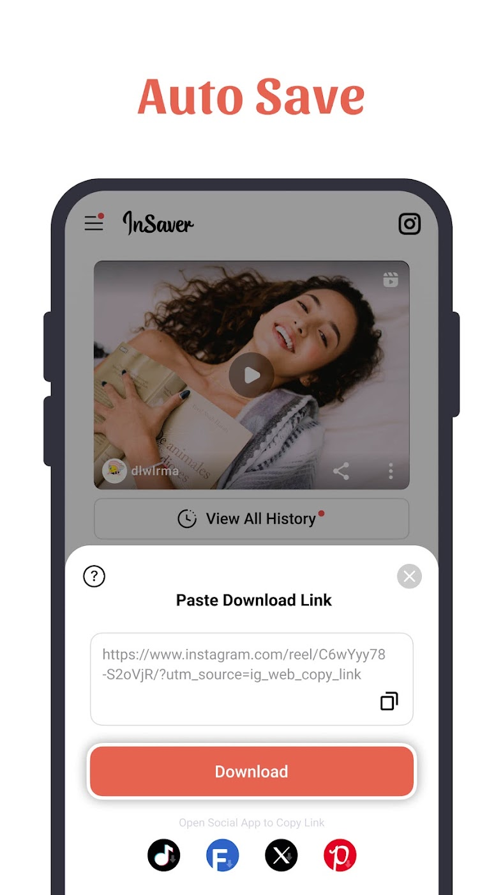

Screenshot 07 · 788 × 1400 · portrait · Auto Save · [Original image on Google Play ↗](https://play-lh.googleusercontent.com/WSluN0ZeZrsz-xz2SSOjz1HgwYhrs-PfQ0s1drpZw9NX8CG_PRBt5oUzBwYNcvC1Ihqage-j80pvS9kyPiXcXA)

Landscape screenshots: not observed in this snapshot.

04 · Gamma Play

### Gamma Play

“Video Downloader - without ads” · 100K+ downloads · rating 4.63 (3.1K) · 7 portrait and 0 landscape screenshots

US keyword board (16 Sep): **32** top-10 · **47** placements on 100 keywords · best #1

Open listing on Google Play ↗

#### Icon

A black rounded square with a white download arrow over a yellow bar — very nearly InShot's icon, from an unrelated 100K-install developer. Side by side at 48 px the two are hard to tell apart.

#### Feature graphic

A pale ice-blue field with an abstract blue play-and-arrow glyph and no text whatsoever. The only wordless banner in the library, and at listing size it says nothing about the app.

#### Screenshot system

Seven frames: white ground, a dark two-line heading, a device below. Download Any Video in One Tap, Choose Video Quality Before Downloading, Built-in Ad Blocker, Built-in Video Player, Instant Story Downloader, Download to Private Vault, Track Progress in Real Time.

#### Design assessment

**The one listing in this library that shows no third-party branding at all.** Every device frame runs an invented source app — “TravelHub”, “FREEVIDEOS” — so the screenshots demonstrate the download flow without borrowing anyone's logo or UI. That is the compliant pattern, and it comes from the smallest app here. The headings are also full sentences rather than category labels.

icon collides with InShot · wordless banner · invented source apps · no third-party branding · private vault frame

Icon and feature graphic

Icon 01 · 512 × 512 · square · Listing icon, original file · [Original image on Google Play ↗](https://play-lh.googleusercontent.com/RvHeqNSaT1XdrxNeTuPMUi9ijxcZbApZtdpYeMrfuvTIGzWG3aliheg7xa1szlX5pObYgtVDwl_WaP0FAxYxrw)

Feature Graphic 01 · 1024 × 500 · landscape · Feature graphic, original file · [Original image on Google Play ↗](https://play-lh.googleusercontent.com/R0RPcCkjGrOrSY69hOH5SMKaE0FH6do2bOYNETkwJWq-qAkSpsUQYdGDfB0Zg2qGFd_oYq515kOks7_ZqcT4-9E)

Portrait screenshots · 7

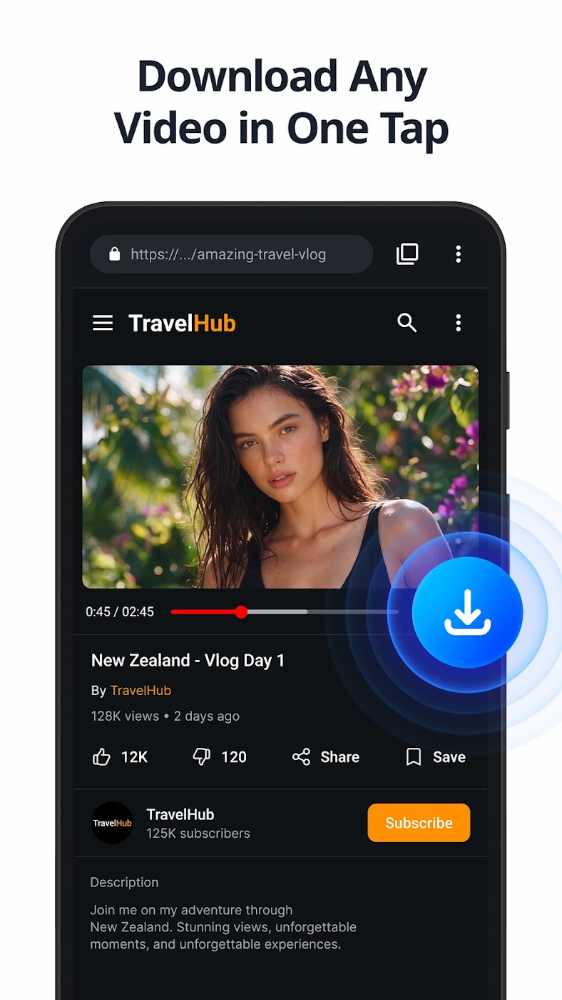

Screenshot 01 · 788 × 1400 · portrait · Download Any Video in One Tap · [Original image on Google Play ↗](https://play-lh.googleusercontent.com/oYsZpI4a3bXy5PbjVvfXCNfa9uvjpRSzMPr6iHvCAs4Fcw8jisHC7JG--wymBT16ilE48aawj91WqS2L5oSiQQ)

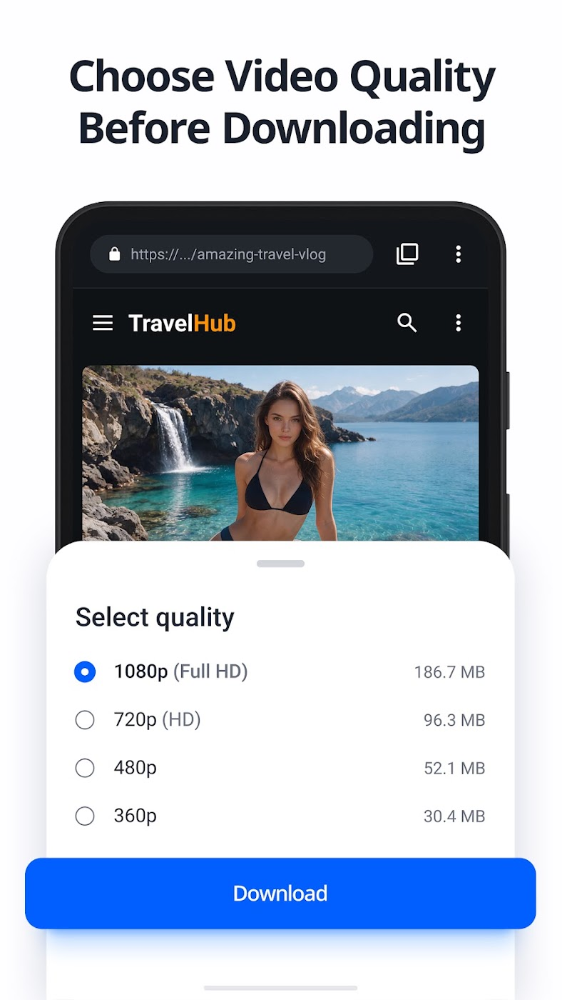

Screenshot 02 · 788 × 1400 · portrait · Choose Video Quality Before Downloading · [Original image on Google Play ↗](https://play-lh.googleusercontent.com/2wyStNfqs-_WeoJN3myADhm2536ljQO1XfJTADIb2fti1C66_Ia8eDkdA36tphFW_oZArzXX1oAorvH9GQcRNQ)

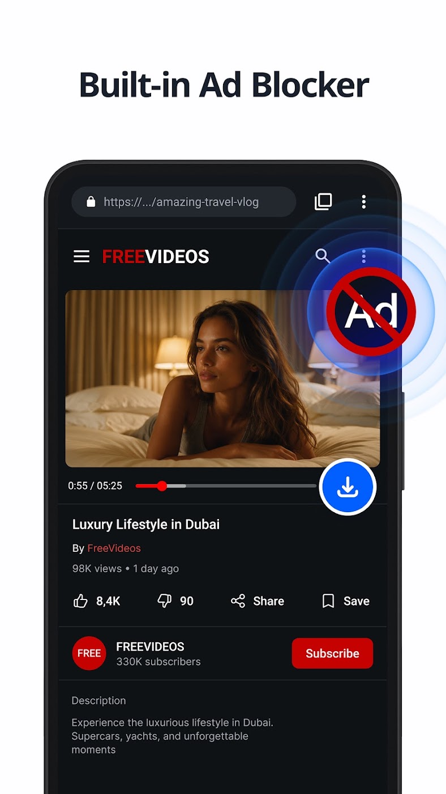

Screenshot 03 · 788 × 1400 · portrait · Built-in Ad Blocker · [Original image on Google Play ↗](https://play-lh.googleusercontent.com/PHM_AsD1T-vmvI1t2QmItglgPnyxKaFJKfqctNHBhql_XxeUo_FMLMy-YC511hwkIiIajvjvXVfZeGYBa4ZdO_M)

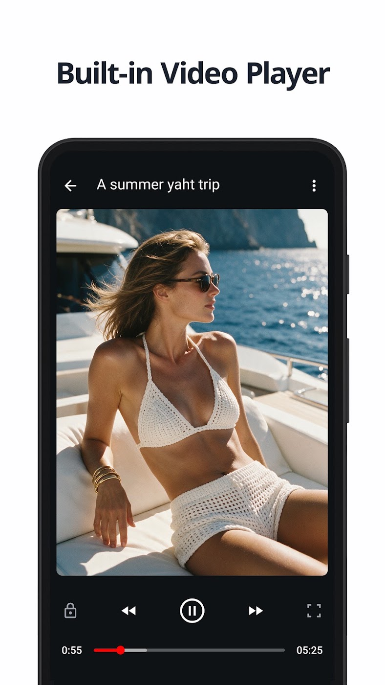

Screenshot 04 · 788 × 1400 · portrait · Built-in Video Player · [Original image on Google Play ↗](https://play-lh.googleusercontent.com/UusxHAzNEV8BuEh3c_-xrvq0w_a_BUGLMdckReTxj0TIAy5PXBhFHjKbaP2Z2EGfgk9qfwztPlQ0nlwsZ7XVIA)

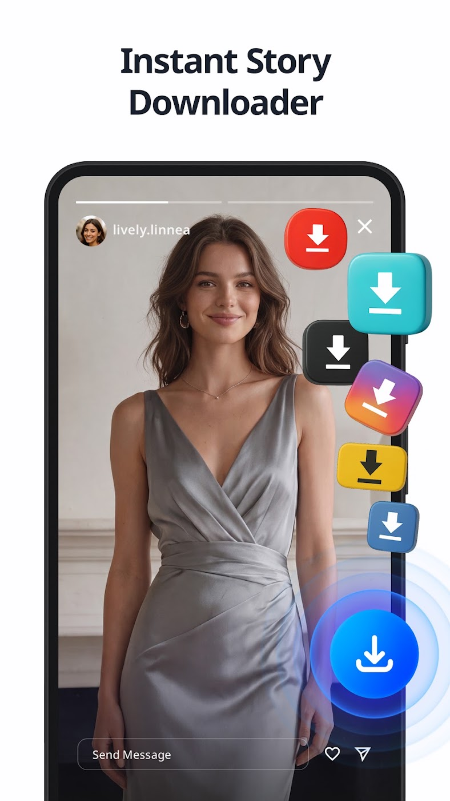

Screenshot 05 · 788 × 1400 · portrait · Instant Story Downloader · [Original image on Google Play ↗](https://play-lh.googleusercontent.com/wwa2IirJgbOfkGQFlC50jSdmi0XG9mgUCpkurSGWJwNh0Smyt2PsXatdcQWqz5_G_DTngVJmERmH4ZD7I7VzRA)

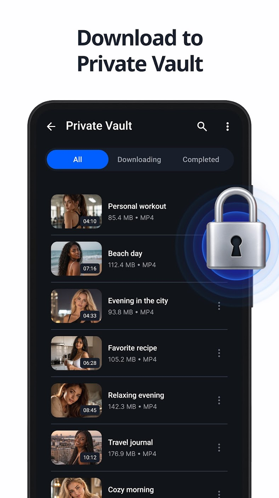

Screenshot 06 · 788 × 1400 · portrait · Download to Private Vault · [Original image on Google Play ↗](https://play-lh.googleusercontent.com/SitItRmkfJlFZ5E1xN3AxV4c4CEPG85ssKC0iNFqT95YEsC2cOnVWvKPviBrekNnksp-nz8gvhAJCTBbqJhTdg)

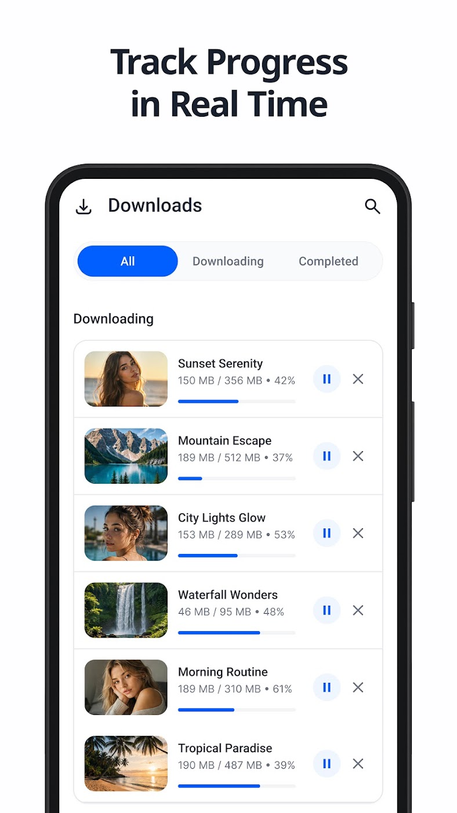

Screenshot 07 · 788 × 1400 · portrait · Track Progress in Real Time · [Original image on Google Play ↗](https://play-lh.googleusercontent.com/nzhAI2kUzKou3srM38WSe2XEEsYPhPqmINP8Mtkb51iNk1E0CkPTPNNHGNF4uoQLg9oiwNwNqz6mszeoURztaQA)

Landscape screenshots: not observed in this snapshot.

05 · QR Code Scanner.

### QR Code Scanner

“All Video Downloader & Player” · 100M+ downloads · rating 4.52 (1.9M) · 8 portrait and 0 landscape screenshots

US keyword board (16 Sep): **26** top-10 · **42** placements on 100 keywords · best #2

Open listing on Google Play ↗

#### Icon

A red-orange gradient square holding a white filmstrip “V” with a download arrow. The first of seven red “V” marks in this library.

#### Feature graphic

An orange grid of media tiles with “ALL Video Downloader” in white italic — the same tile-grid idea as InShot, AppTool and Sky Vision, in a different colour.

#### Screenshot system

Eight frames on white, black two-line headings, dark device shots: All Video Downloader, Download All You See, Built-in Video Player, Block Ads, Best Story Downloader, 3x Faster Download, Download Manager, Share With Friends.

#### Design assessment

Highly legible and well paced, and it uses all the slots the category rewards. It leans on a speed claim (“3x Faster”) we cannot copy, and frame 2 shows a red play button and video UI that reads unmistakably as a specific platform — the exact thing our rules keep us away from.

red V icon · tile-grid banner · 3x speed claim · ad-block frame · recognisable platform UI

Icon and feature graphic

Icon 01 · 512 × 512 · square · Listing icon, original file · [Original image on Google Play ↗](https://play-lh.googleusercontent.com/4v1gAVBRKoO9aUUOhYJLY-aa8FytPXj0LRNJbV8CT743B3sajF54fcEbvQjfE6kuJrS9ddaFkbo7PDcWZ-iQBcI)

Feature Graphic 01 · 1024 × 500 · landscape · Feature graphic, original file · [Original image on Google Play ↗](https://play-lh.googleusercontent.com/NnxBVfBMclFKOfLXSwK39BbujWhkjBAyZrx0-zQ6sLgxWFGivXetTkR1oBBxRDrXylf90EzuLoDG-FegNkG6-Zs)

Portrait screenshots · 8

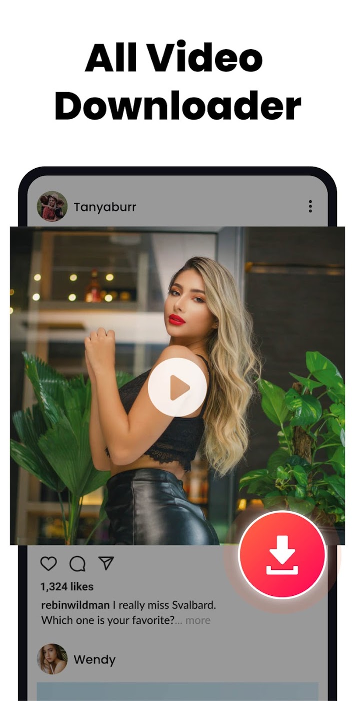

Screenshot 01 · 710 × 1400 · portrait · All Video Downloader · [Original image on Google Play ↗](https://play-lh.googleusercontent.com/aX4xYn_taZd_4YZVsNwfLauu8GCvJYLhyACRLQg_NL-y5wglpBnmbaG5QmUddK08k_2YKjv-mhETraz9kqg6Tw)

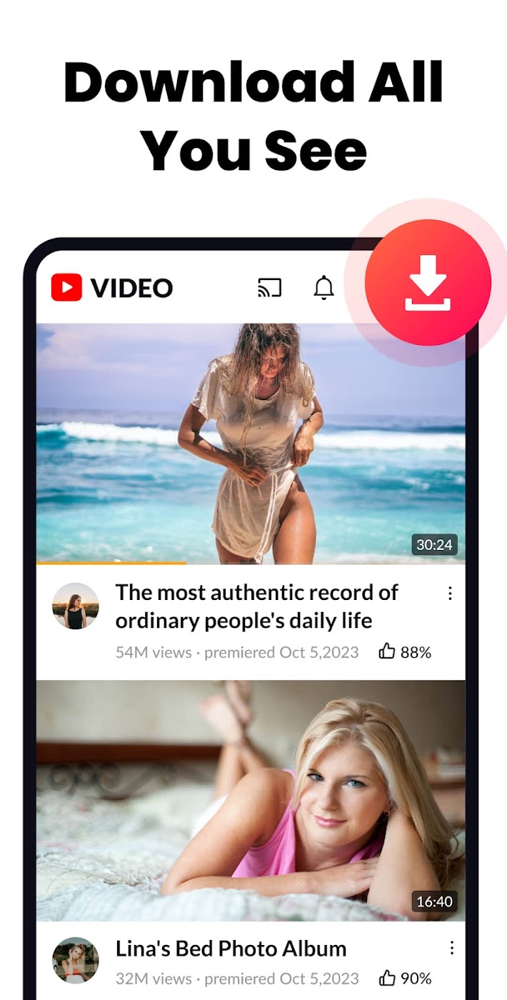

Screenshot 02 · 710 × 1400 · portrait · Download All You See · [Original image on Google Play ↗](https://play-lh.googleusercontent.com/f4SN_7jfp2haU4WQppjFz40nxZlI-ioLEuNXOw88Ez0c0q0D2zr7w5w5rj3NAhFZkdSvXfJRCjoigMEbIOJ7SzE)

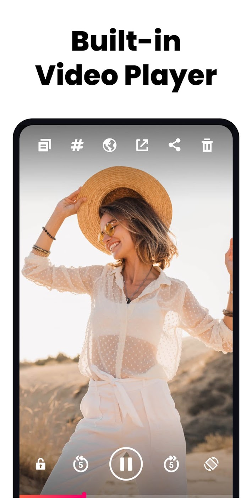

Screenshot 03 · 710 × 1400 · portrait · Built-in Video Player · [Original image on Google Play ↗](https://play-lh.googleusercontent.com/ZeWwBC7stXyThNLVA6jwWJeUeBdLbNfobRp3lcMLxFXLLJd-bRUGloCHHT9E-mOaieqoBj13233uyIJ5fHcdFA)

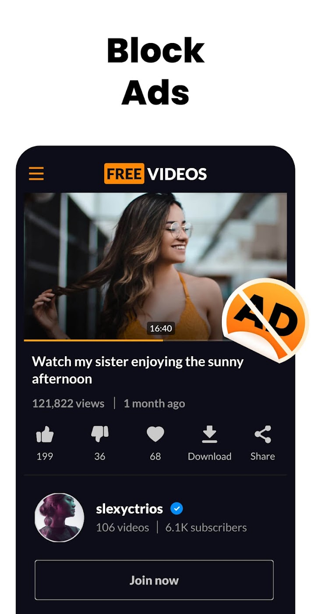

Screenshot 04 · 710 × 1400 · portrait · Block Ads · [Original image on Google Play ↗](https://play-lh.googleusercontent.com/dcMlodih4_w17vIeCyCa8w7CzoUrL_9nvW_cWI_DakHdmCnEOVKJmR9_5ryJktF9f07LLWZn9m0IcH6i-YNEDlI)

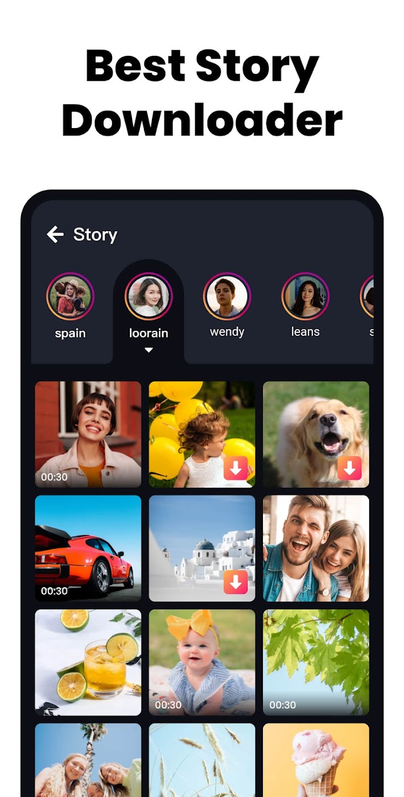

Screenshot 05 · 710 × 1400 · portrait · Best Story Downloader · [Original image on Google Play ↗](https://play-lh.googleusercontent.com/eynwx6KX7Cn9uZeZpR1JLtduygRZwkgvxjpa8dR_kWk9cUK4KOjC4fMISk9UuQYfbyglGibNdVbnczOVMWRKZVs)

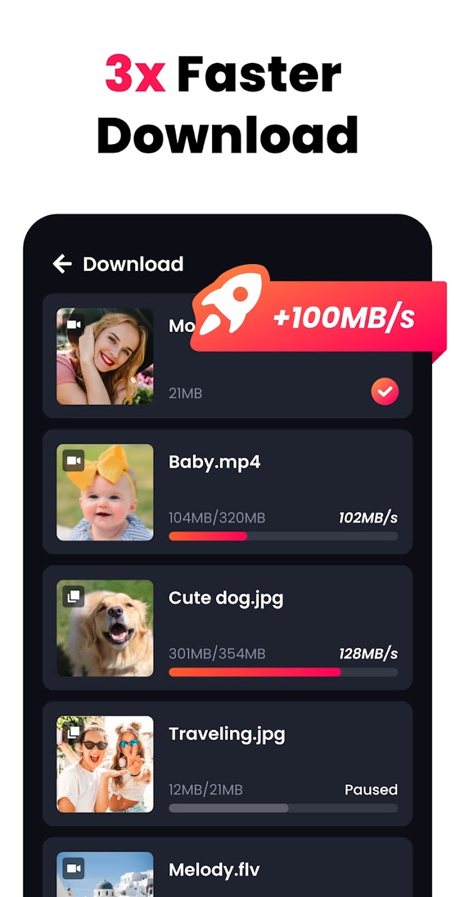

Screenshot 06 · 710 × 1400 · portrait · 3x Faster Download · [Original image on Google Play ↗](https://play-lh.googleusercontent.com/-Y2BOATxlPIwOJNqNqseBsbounIndJzehNDpjGBu9s3RJh5Uh5s5nOhWfskVmMSyjrHtP-ZMiqMMkypoqZ4)

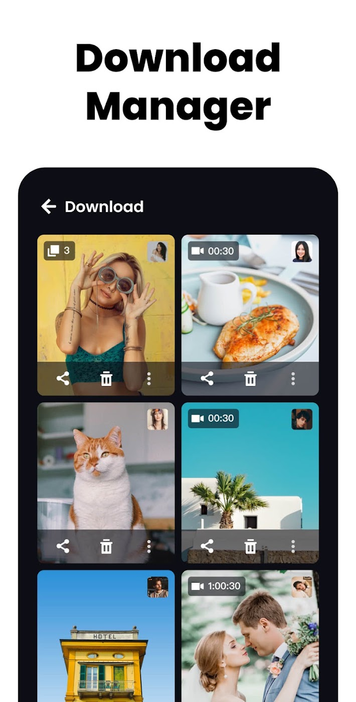

Screenshot 07 · 710 × 1400 · portrait · Download Manager · [Original image on Google Play ↗](https://play-lh.googleusercontent.com/QN-RvL8-G1boEFQDukxqdcRPEvnW2QIoLiybSKVFhLNobtVRYBxbHYaLmdZv9ZdVMYdn4OIgTiv1dRV0xMw_3Q)

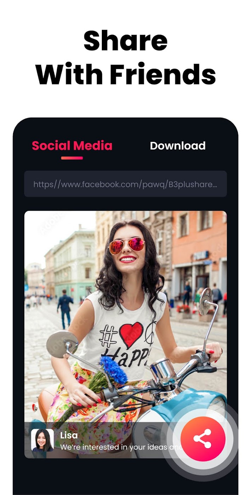

Screenshot 08 · 710 × 1400 · portrait · Share With Friends · [Original image on Google Play ↗](https://play-lh.googleusercontent.com/hedBnHNe5y-8YGVb5SDVFcNYx2V-CjKjeA1RsKUHFt1RPoC-5QIaFs9Y8FMm_GtB6V1C4jb2AX-YoLKzRb0O4Dk)

Landscape screenshots: not observed in this snapshot.

06 · DOSA Apps

### Hub (DOSA)

“Hub Video Downloader” · 10M+ downloads · rating 4.36 (82K) · 5 portrait and 0 landscape screenshots

US keyword board (16 Sep): **26** top-10 · **39** placements on 100 keywords · best #3

Open listing on Google Play ↗

#### Icon

A black square carrying the wordmark “Browser hub”, “hub” reversed out of an orange block. One of only two wordmark icons here, and the only one that names a browser rather than a downloader.

#### Feature graphic

The same wordmark on black, nothing else. Consistent with the icon and completely silent about what the app does.

#### Screenshot system

Five creatives on black with orange-and-white two-tone headings and an orange-outlined device: All Websites Video Downloader, Social Media Video Downloader, Private Browser, Multiple Resolution, 3x Faster Private Downloader.

#### Design assessment

Positions itself as a browser first, which is a real differentiator in a category of paste-link apps. The execution undercuts it: the carousel publishes the same five creatives twice over, the frames show a search engine and four platform logos outright, and the sample content is adult-adjacent. A clear case of a good idea let down by the assets.

wordmark icon · browser-first positioning · duplicate set removed · search engine + platform logos · 3x speed claim

Icon and feature graphic

Icon 01 · 512 × 512 · square · Listing icon, original file · [Original image on Google Play ↗](https://play-lh.googleusercontent.com/KM2DCIFpt8qc_1150CumeH5rXCqgABmFVXFfQwQKC8wh8V5mF05R_8QNoX_wTNIWrytBpWP9ayRJ7_ayLM6jbws)

Feature Graphic 01 · 1024 × 500 · landscape · Feature graphic, original file · [Original image on Google Play ↗](https://play-lh.googleusercontent.com/sSno7wEWk_kU4ec840CSjwmZSj1lMgdecvg86sn3Ne2tUdB1rcBWmVxwpaCN1OFWG28DTTiiROnxq2-LnQCI8NA)

Portrait screenshots · 5

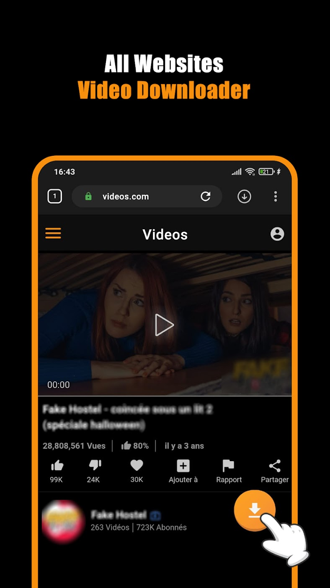

Screenshot 01 · 788 × 1400 · portrait · All Websites Video Downloader · [Original image on Google Play ↗](https://play-lh.googleusercontent.com/afj_Z-9anpIZVKelRKnkQejs3RK4l_1nnzUSfpW48FvnMG_kx0jBVV6DMdVlZxHYjtqoE6VXUCe7uf8kgjR8tz4)

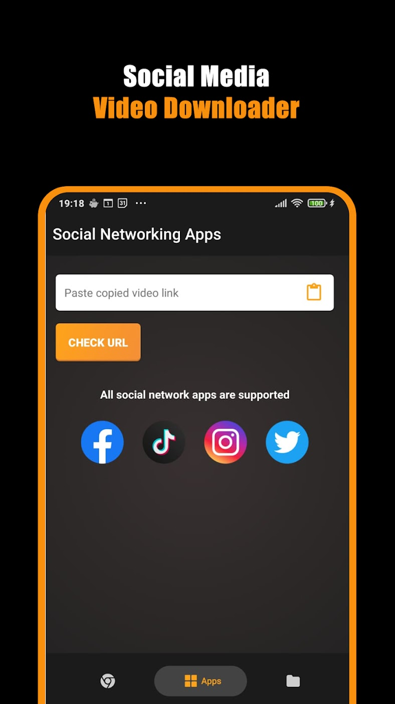

Screenshot 02 · 788 × 1400 · portrait · Social Media Video Downloader · [Original image on Google Play ↗](https://play-lh.googleusercontent.com/VkWpMEmastGGS-Pxks4_6hCXfU9BPCx9K_dWni4WpYITCIDZgUK_32HduUK9EEbFVGPQIISkImueXHNn0zP1ajQ)

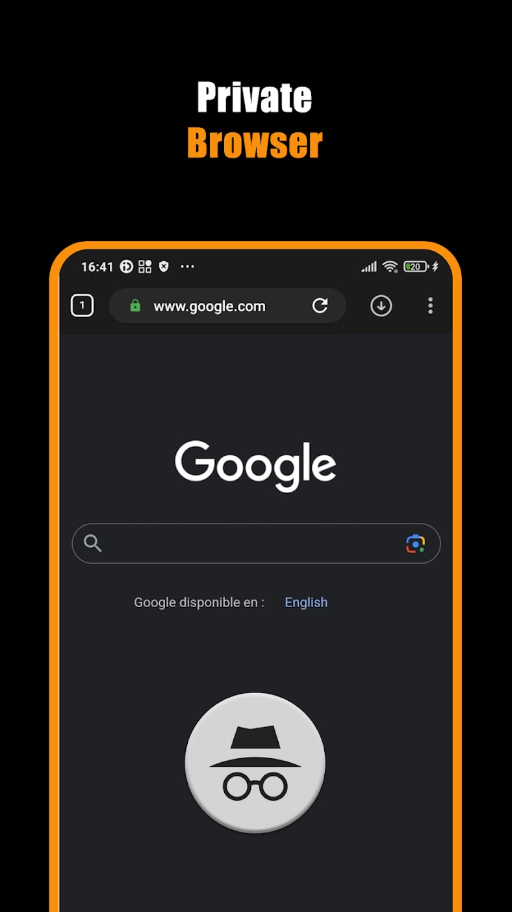

Screenshot 03 · 788 × 1400 · portrait · Private Browser · [Original image on Google Play ↗](https://play-lh.googleusercontent.com/DjdzA6nlXknddQAUfnT3qSLC2mXZkPIUl9Ji25aOGO_m1PrgMgBVX9QVbN4B2Gm5y-6sOfoC6fthsyMyb50R9g)

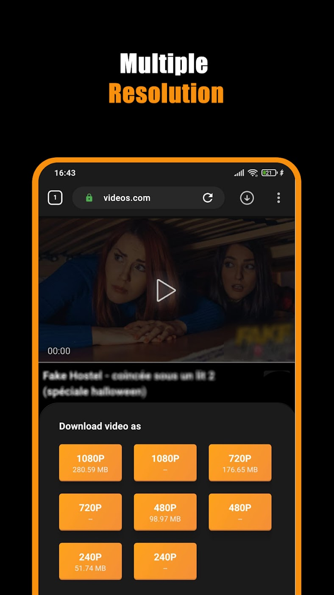

Screenshot 04 · 788 × 1400 · portrait · Multiple Resolution · [Original image on Google Play ↗](https://play-lh.googleusercontent.com/67eOVQpe-Rbi_64OI3Q8Dj0LvVQA8Y3E7e0HtkTIAU59ps-FRJ6yNWDmutySVv2EomkgF6ntfIT3hjE9e06Iiw)

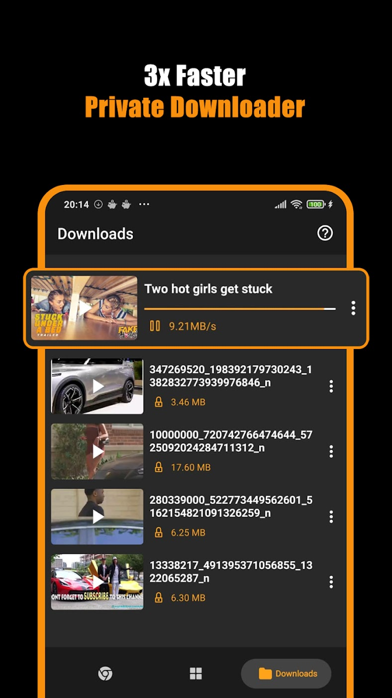

Screenshot 05 · 788 × 1400 · portrait · 3x Faster Private Downloader · [Original image on Google Play ↗](https://play-lh.googleusercontent.com/G7e8fu2fjs8R8wgS6Xexzi-1tnL6j7xRgbGUhxfwGUDmjp2RBioMaD8NYljuWoAo0yn56duJk29zoRNmfDaPGtY)

Landscape screenshots: not observed in this snapshot.

07 · Video Downloader & Fast Saver

### Fast Saver

“Video Downloader & Story Saver” · 10M+ downloads · rating 4.80 (377K) · 5 portrait and 0 landscape screenshots

US keyword board (16 Sep): **22** top-10 · **47** placements on 100 keywords · best #1

Open listing on Google Play ↗

#### Icon

A flat red square with a white ring and a red download arrow. No gradient, no depth — the plainest circle-and-arrow of the three.

#### Feature graphic

White with a red diagonal wedge, the wordmark “Rposty” and a line of small type. The banner brands the app as Rposty while the listing title says Video Downloader & Story Saver — the only name mismatch in the library.

#### Screenshot system

Five frames on flat red with white headings and a dark device: Super Easy Steps, Auto save, Share and Repost, Build-in Player, Dark Theme Mode.

#### Design assessment

The highest-rated app in the library — 4.80★ from 377K ratings — on five screenshots, a name that does not match its banner, and a typo in frame 4 (“Build-in Player”). Together with InShot at the top of search, it is the clearest evidence here that listing craft and user rating are independent.

flat red circle icon · name mismatch (Rposty) · fewest frames · typo: Build-in · highest rated

Icon and feature graphic

Icon 01 · 512 × 512 · square · Listing icon, original file · [Original image on Google Play ↗](https://play-lh.googleusercontent.com/wLtr4WqAcE6CWJkmK7sTpBds7m8rnv3V7lEmpo0IPsknqgSaYWQvk3L8cdmyM37aDIAkGHpemmjBUdu9pPlMjQ)

Feature Graphic 01 · 1024 × 500 · landscape · Feature graphic, original file · [Original image on Google Play ↗](https://play-lh.googleusercontent.com/YnHVhcTPX5dm8XVwrEbqgTISNXdkTNmJsTC42u1ZpQB6E7Zy2VqDfIenSDaKR69q5UJVjgunWY_mwx26F13oGg)

Portrait screenshots · 5

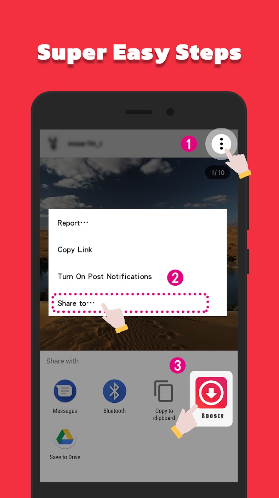

Screenshot 01 · 788 × 1400 · portrait · Super Easy Steps · [Original image on Google Play ↗](https://play-lh.googleusercontent.com/J6pkKwqFaZOljdiVyz4-AkJJ6D9m2qHVrJR2uSicX1DbSOTwKsM-bQlwU_J1p2m9uM6Vh0fmoA6iFsrYay-BBbc)

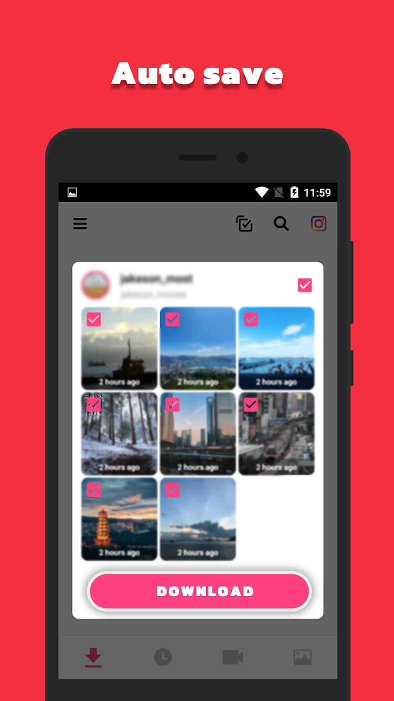

Screenshot 02 · 788 × 1400 · portrait · Auto save · [Original image on Google Play ↗](https://play-lh.googleusercontent.com/cAaZ9N7-yf5_nECpM5RMMlWE0GqubpxAUqLtNkuadd9XK_vGOoCzngfXwq3FHkO1FEYDVPzwoNqjrw-7mSJRUJ8)

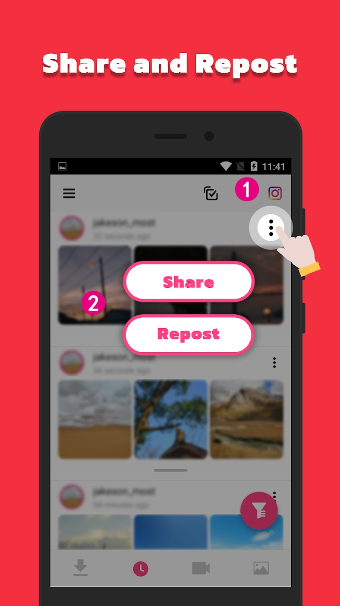

Screenshot 03 · 788 × 1400 · portrait · Share and Repost · [Original image on Google Play ↗](https://play-lh.googleusercontent.com/9cu6wZIYGYKLxLcKHWudlwxYrnLUgnluyWtuxlTLYAoE8DC9vw4ZutHHbL5vGduY6KHu-c5x-4f3pkZHhaUo)

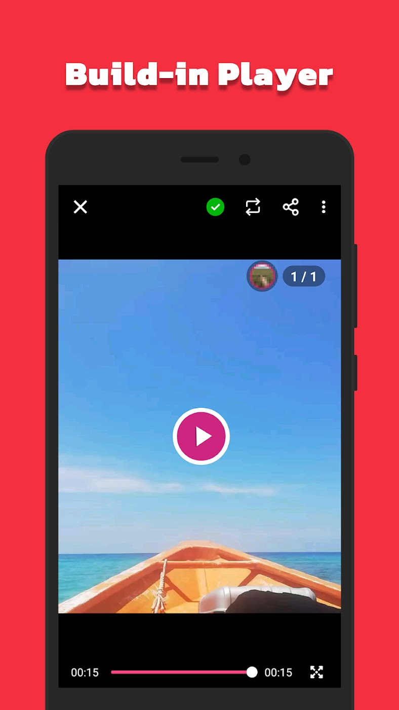

Screenshot 04 · 788 × 1400 · portrait · Build-in Player (typo as published) · [Original image on Google Play ↗](https://play-lh.googleusercontent.com/TE7hWi__T-3ahcuFlL5LNf6jN81Y1U9LEuO2Dz1AkP7BVLiVHSDLf6ZBD2IvBakUiOKgxCgq7jNZnE3FoSyfpig)

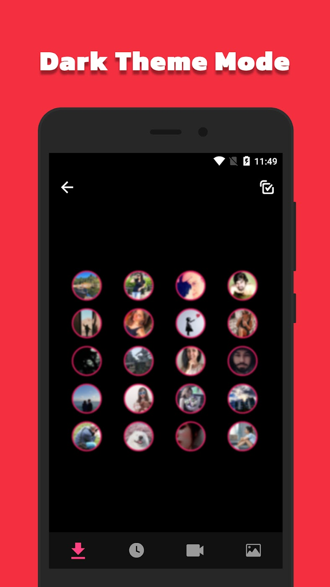

Screenshot 05 · 788 × 1400 · portrait · Dark Theme Mode · [Original image on Google Play ↗](https://play-lh.googleusercontent.com/n-oMAA-YNRQYp2sLL3uy-zpBitcgfg-q7WqdjS8bTcjXJiIhgslQg3tI8rEP2mzB0eTGdlkwik4em_C1nBNI-w)

Landscape screenshots: not observed in this snapshot.

08 · AppTool-Browser-Video

### AppTool

“All Video Downloader & Player” · 10M+ downloads · rating 4.36 (66K) · 6 portrait and 1 landscape screenshots

US keyword board (16 Sep): **17** top-10 · **38** placements on 100 keywords · best #3

Open listing on Google Play ↗

#### Icon

A yellow-amber rounded square with a white download arrow — the third arrow-on-a-square in the library, differing from InShot and Gamma only in ground colour.

#### Feature graphic

A dark maroon grid of media tiles with “Download Videos From All Media” and a “Simple & Fast” chip. Fourth app using the tile-grid construction.

#### Screenshot system

Six portrait frames on white with black-and-orange two-tone headings, plus one landscape frame. Download Any Video In One Tap, Download Video HD & 4K, Auto Detect Videos Online, 3X Faster Download Speed, Keep Your Videos Private, Download From Popular Sites.

#### Design assessment

One of only two listings in the library that publish a landscape frame at all, which matches what the 21 Sep visual review found. The set is tidy but generic, and it carries both a speed claim and a row of platform logos. “Auto Detect Videos Online” is the one heading here that describes a mechanism rather than a category.

yellow arrow icon · tile-grid banner · landscape frame · 3x speed claim · platform logos

Icon and feature graphic

Icon 01 · 512 × 512 · square · Listing icon, original file · [Original image on Google Play ↗](https://play-lh.googleusercontent.com/5O3gW0o1MoJbI-z7ZxbzFkip1a74LSqN6xrL9U61lTg8FVAg6YX50zVbQHis2Bi1SAHX7VJ8hq2B2K_gVo6k-aw)

Feature Graphic 01 · 1024 × 500 · landscape · Feature graphic, original file · [Original image on Google Play ↗](https://play-lh.googleusercontent.com/oBpdy9TOIkDchxD_mO2tgPWcnB_RvXhiYbrTHckeWZZEWWJWPCqnM9rvOO5RJGCi39ISI_VRy3kTQrHy-EF4og)

Portrait screenshots · 6

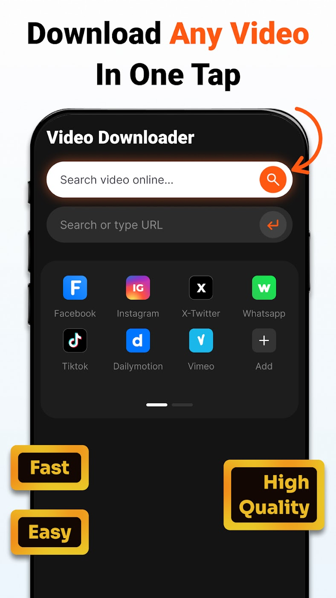

Screenshot 01 · 788 × 1400 · portrait · Download Any Video In One Tap · [Original image on Google Play ↗](https://play-lh.googleusercontent.com/OpcFaGD48-58GHzVcBgimTrDUCrTEmX-bHoDhsAdaR7fpQ8PT9eoz-klcKYMoKWUDA3NsezwvraO_rLhL15um2w)

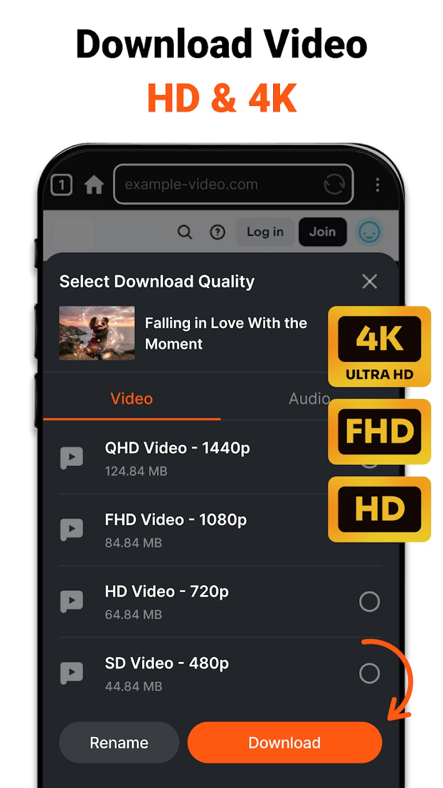

Screenshot 02 · 788 × 1400 · portrait · Download Video HD & 4K · [Original image on Google Play ↗](https://play-lh.googleusercontent.com/RF8OPAx4EWstRwWeO-ZrFe-vI2feAArSuwbDYQb3a8lvPU7z5TyasEzO-v8XJYEsjaGShsgsUvloEf1L0KyuOg)

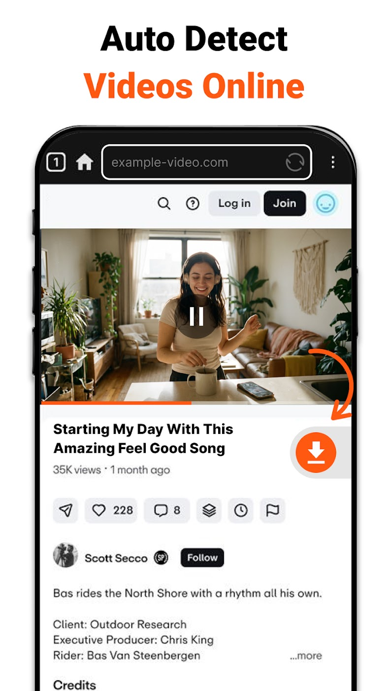

Screenshot 03 · 788 × 1400 · portrait · Auto Detect Videos Online · [Original image on Google Play ↗](https://play-lh.googleusercontent.com/CjhrwLPGN0lPRtNH7JUeeEXOLRvzKv2PG5USudp8xCJe4HGjFZdu6yPSD3An-1tfpnERxiWniQBoHi7dNHfgTg)

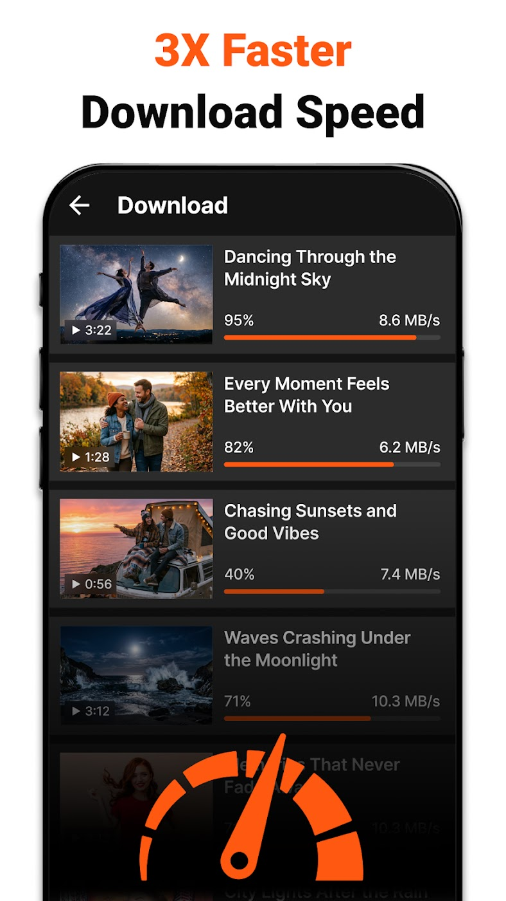

Screenshot 04 · 788 × 1400 · portrait · 3X Faster Download Speed · [Original image on Google Play ↗](https://play-lh.googleusercontent.com/D_HYsn8jMovccoF_JUXtq8UZ4SmKDqS6vLejpJ9AMb5k4X4NOwy3DtjNf2F2XZmMoVgfJVNMxltsiAWp4AzUdg)

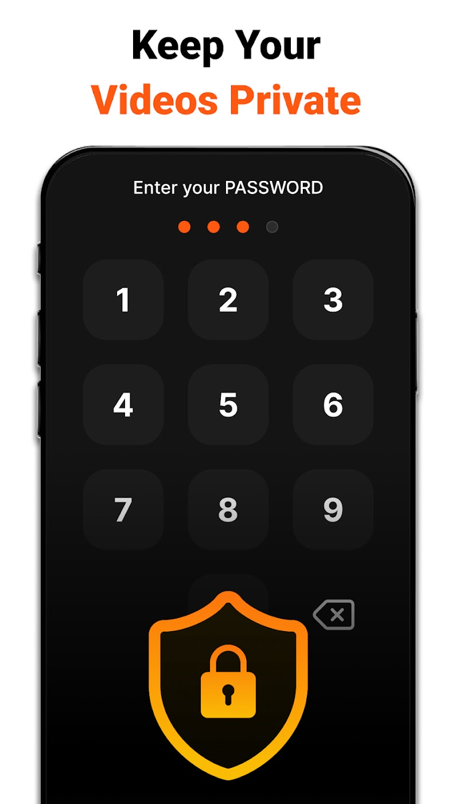

Screenshot 05 · 788 × 1400 · portrait · Keep Your Videos Private · [Original image on Google Play ↗](https://play-lh.googleusercontent.com/n99cFkZHSHKev4n4abr96GxOwXU6Yx-CAOUiDdAyuzC96hm7Jal9M0AJDnERy6vjs79FjaM2qMAhf0l_pQo3P9E)

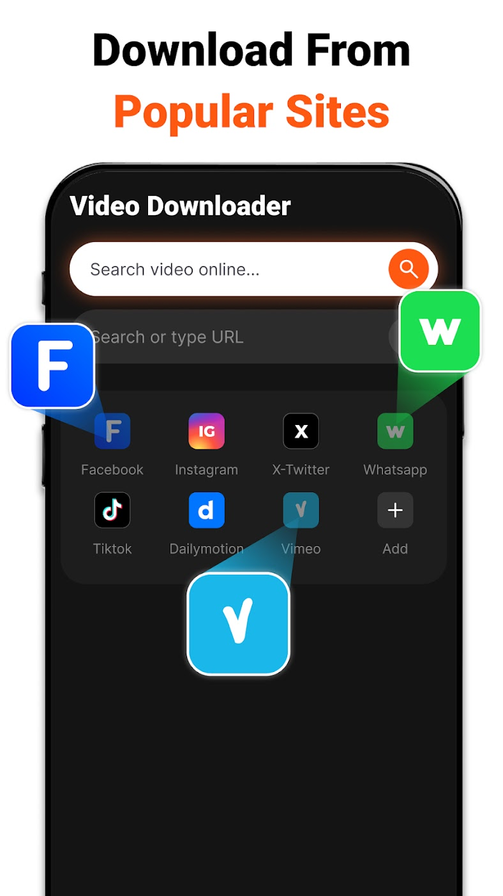

Screenshot 06 · 788 × 1400 · portrait · Download From Popular Sites · [Original image on Google Play ↗](https://play-lh.googleusercontent.com/m_yBshSMLsibiVn6mcr3D-OLcuU_31YM4LWpapNKNbfP5p6BUzna_FjLb8vTzxNhp2eeIgdofBX7iPTk08lWhg)

Landscape screenshots · 1

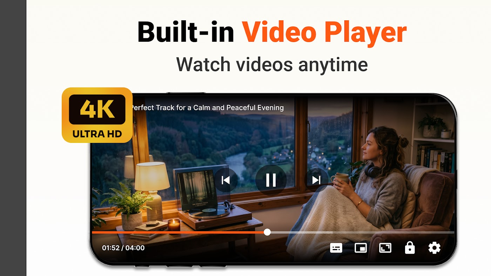

Screenshot 07 · 1400 × 788 · landscape · Built-in Video Player (landscape) · [Original image on Google Play ↗](https://play-lh.googleusercontent.com/QQ_U3Wu00kgZpTmMWQDFgs0KKk2GQQ3M_23rr6sb6iTLi-XSYuSbgo1QxbnG_BqMdazsy8KGpuORrCMrU6C4l0M)

09 · All Video Downloader, Saver & Player Studio

### Saver & Player Studio

“Video Downloader & Video Saver” · 50M+ downloads · rating 4.42 (357K) · 7 portrait and 0 landscape screenshots

US keyword board (16 Sep): **8** top-10 · **26** placements on 100 keywords · best #1

Open listing on Google Play ↗

#### Icon

A black square with “All” in white above “Downloader” reversed out of an orange block — the second wordmark icon, and the only one that spells out the category.

#### Feature graphic

Black with a faint pattern of download arrows, a circular orange badge at the centre and “Video Downloader & File Saver” beneath.

#### Screenshot system

Seven creatives on black with orange chevrons bleeding in from the sides, italic two-tone headings and a device between them: Social Media Downloader, Download Videos with One Tap, Fast & Safe, Built-in Video Player, Share & Repost, Dark Theme Enjoy at Night, 4x Faster Download Speed.

#### Design assessment

The chevron frame is the most recognisable container in the library — you could identify this listing from a thumbnail. Behind it, the same seven creatives are published at four different pixel sizes, so the raw carousel runs to twenty-one entries for seven ideas. Tidy art, careless listing hygiene.

wordmark icon · orange chevrons · strong container · four duplicate size sets · 4x speed claim

Icon and feature graphic

Icon 01 · 512 × 512 · square · Listing icon, original file · [Original image on Google Play ↗](https://play-lh.googleusercontent.com/Ljy0jnX79twImhfJgIS4T2pNk_4by-em_C1r_dldfvTSbTdqqKO4PsxsezJhIZGcLAnc03l1d62QyX9FaBCy)

Feature Graphic 01 · 1024 × 500 · landscape · Feature graphic, original file · [Original image on Google Play ↗](https://play-lh.googleusercontent.com/nqzrNRvz5GxCC5EMcfiv1xQfe0u41JUeXKFbEeHHzf0UIaEimWsqqCTL8iExgJ2XvaY9tzsTwfgdFotO9MIGkw)

Portrait screenshots · 7

Screenshot 01 · 1050 × 1400 · portrait · Social Media Downloader · [Original image on Google Play ↗](https://play-lh.googleusercontent.com/RXJ6uThTRU833VpnqIm7iA7JvkKsrOlyzGB_vRxqe-m0AA8aL4GkuIzZ_2JXO2vYgzVwGa3GWEkHzMM9CuAh)

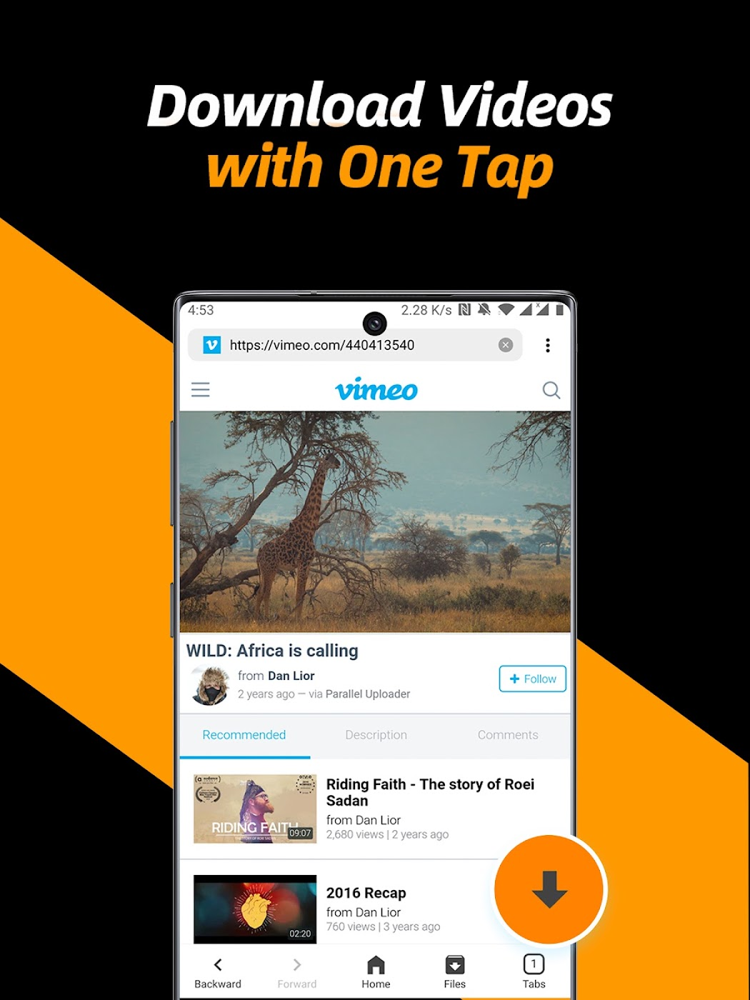

Screenshot 02 · 1050 × 1400 · portrait · Download Videos with One Tap · [Original image on Google Play ↗](https://play-lh.googleusercontent.com/_tKtzsjklEko2W5tN3qInXgCFSF4Cd4kYni3Dl3a-KouWHSZepykMajcTgTaL1d5nAJeUqbjjuz72ZHYWXnYTQ)

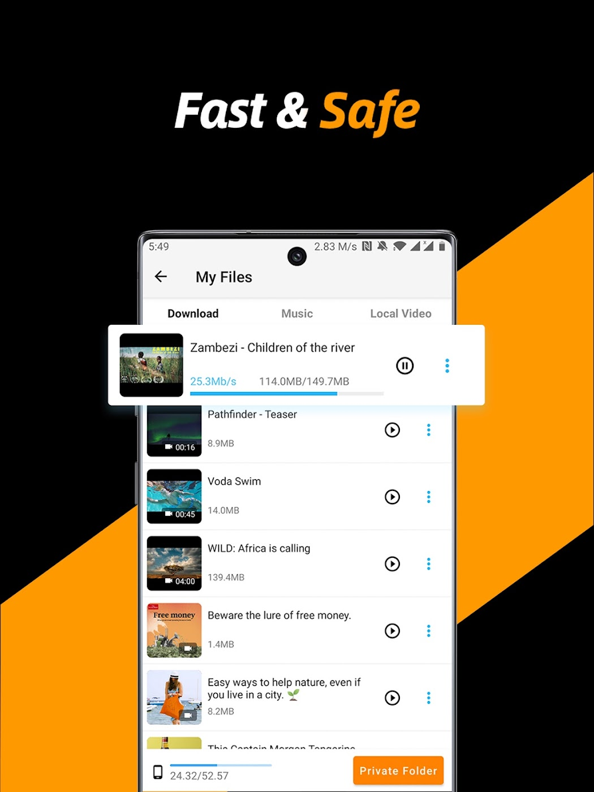

Screenshot 03 · 1050 × 1400 · portrait · Fast & Safe · [Original image on Google Play ↗](https://play-lh.googleusercontent.com/0-T1GJz50-x4vEDs32fq_aICbnRVhCf3UbbTwSCsKf-03QtWMaOHWw5I3XLEmiGxMEOtfG8AdIr8rpL5ZuPo)

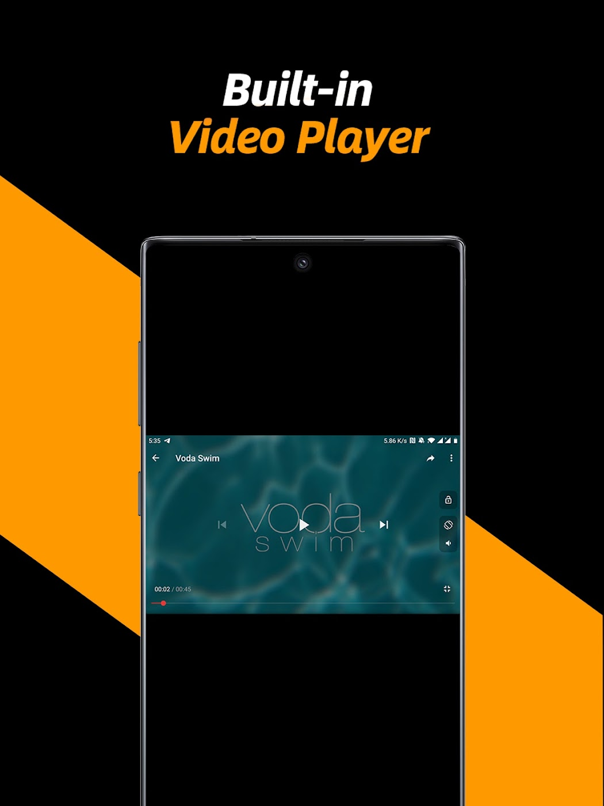

Screenshot 04 · 1050 × 1400 · portrait · Built-in Video Player · [Original image on Google Play ↗](https://play-lh.googleusercontent.com/3_3JkIAM9oPDV40gcw8FpjAa3w4eTQVS-nPmfD8CU1g54_l8z9rv_D8BXfm5IRS-HFNHYjAOxxJqMb_GHglQNg)

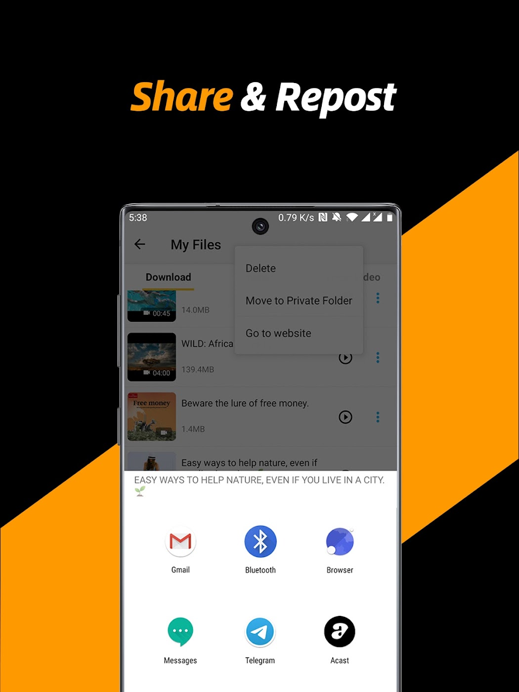

Screenshot 05 · 1050 × 1400 · portrait · Share & Repost · [Original image on Google Play ↗](https://play-lh.googleusercontent.com/2a2yG1B0cAjsgs9SsKiw5bdDszJbfc0v7As7kXwrcWXl5Mt8WYv5AUa3MJaN4StLj1fwBHy0ZGKy0ncmhj6U)

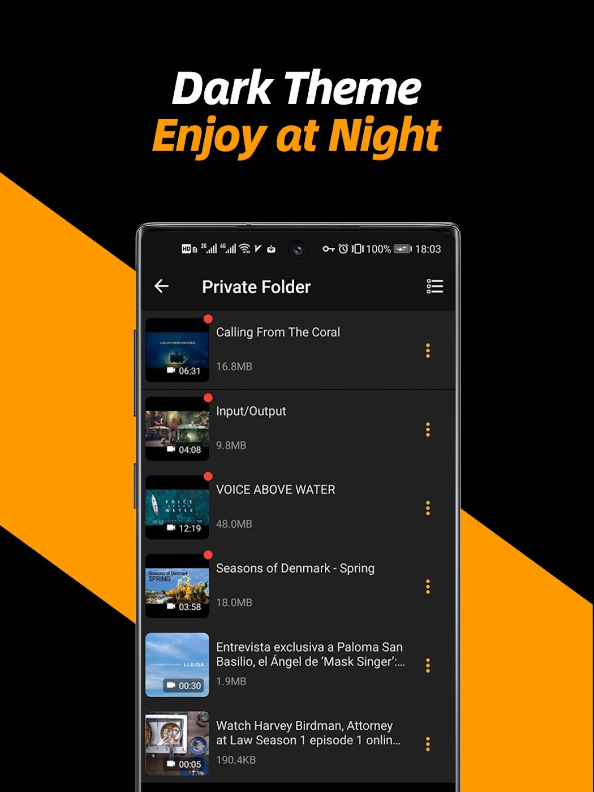

Screenshot 06 · 1050 × 1400 · portrait · Dark Theme — Enjoy at Night · [Original image on Google Play ↗](https://play-lh.googleusercontent.com/QqD9lWPyLRy_x9ROnctPdsp8SfPOnGw3KvdQ2ClO0tcwpxvzTOwfAbBSjIeSumjzkubkqvbgHxETd_wqb8ah)

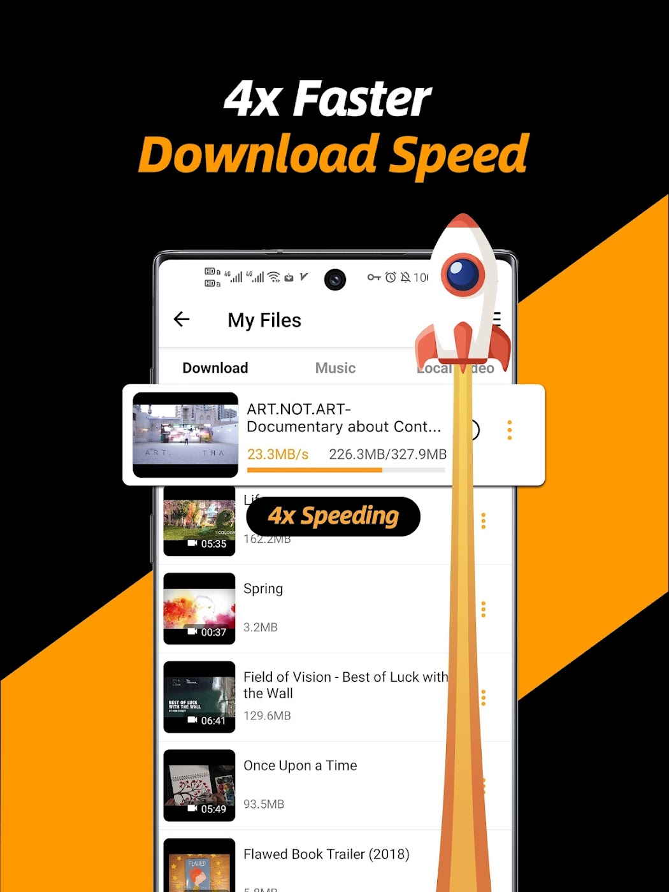

Screenshot 07 · 1050 × 1400 · portrait · 4x Faster Download Speed · [Original image on Google Play ↗](https://play-lh.googleusercontent.com/eHAxgPvzSkXms-X_rPwAzTchKrUHxDwQ8DRCqCRA2HSK2Y1waFXw1EQLhUeRJIiHImqykvCRBpXy2i7IYgWXtw)

Landscape screenshots: not observed in this snapshot.

10 · Fast Video Downloader & Story Saver - DevBay

### DevBay

“All Video Downloader & Browser” · 50M+ downloads · rating 3.89 (649K) · 7 portrait and 0 landscape screenshots

US keyword board (16 Sep): **6** top-10 · **39** placements on 100 keywords · best #6

Open listing on Google Play ↗

#### Icon

A red-to-pink gradient squircle with a white download arrow. Closest of all sixteen competitor icons to our own construction, minus the rainbow.

#### Feature graphic

White, two phone mocks at the left, “All Video Downloader App / Save Photos & Videos” at the right. Clean, quiet, forgettable.

#### Screenshot system

Seven frames with a pale blue-grey top fading to white, pink-and-dark two-tone headings and a device: All Video Downloader, HD Video Downloader App, Fast Video Downloader, Built-In Video Player, Manage All Saved Videos, Download Short Videos, Download In High Quality.

#### Design assessment

The lightest, most modern-looking set in the library, and it belongs to the **lowest-rated** large app here — 3.89★ across 649K ratings. Three of its seven headings are just the app's own name reworded, which wastes slots, and frame 1 lists eight platforms by name as buttons.

gradient arrow icon · pale palette · repetitive headings · lowest rated · platform names as buttons

Icon and feature graphic

Icon 01 · 512 × 512 · square · Listing icon, original file · [Original image on Google Play ↗](https://play-lh.googleusercontent.com/8nlpQOLVFaDrO7HjaY3k09WhRgJCVelbHF3groZbL9zj7ZaM2RRDvOeb_G6ydASZd2UAGtMoux0iZL9zemXq1Q)

Feature Graphic 01 · 1024 × 500 · landscape · Feature graphic, original file · [Original image on Google Play ↗](https://play-lh.googleusercontent.com/dsB1ZAkEauERXsS4EJ9Xs-41JbAo0qaaOtCawqlJCIO2CBGkivNy8bPyT5X5bg1tbcMWkfptjMVxOK_7Z8vNdA)

Portrait screenshots · 7

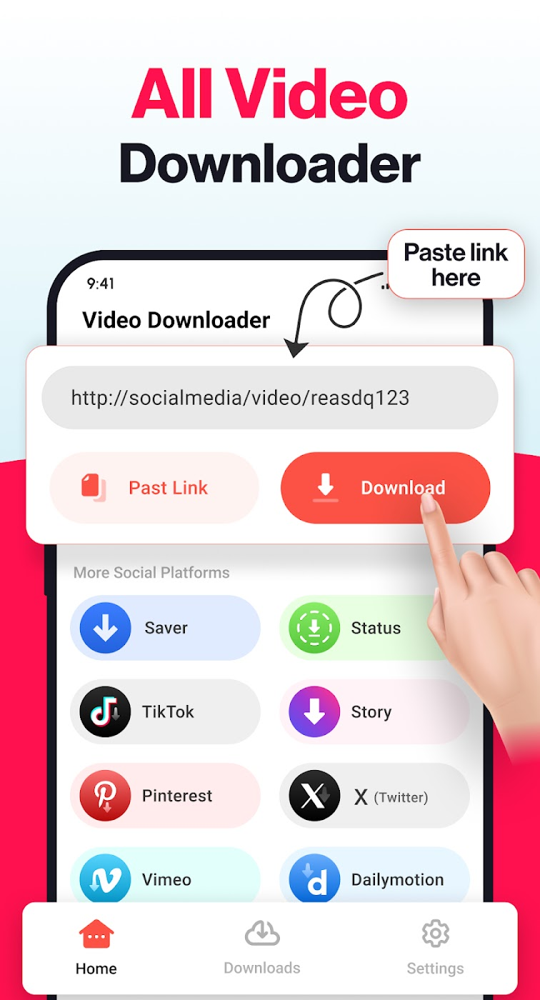

Screenshot 01 · 756 × 1400 · portrait · All Video Downloader · [Original image on Google Play ↗](https://play-lh.googleusercontent.com/fLJClOftqkkO9dqAvudwMP1iBF-NG0jv0DVhPnbG563BLq94xlVwX2FtFj00VsaZcX6Two7xxNQurGgEevW6oA)

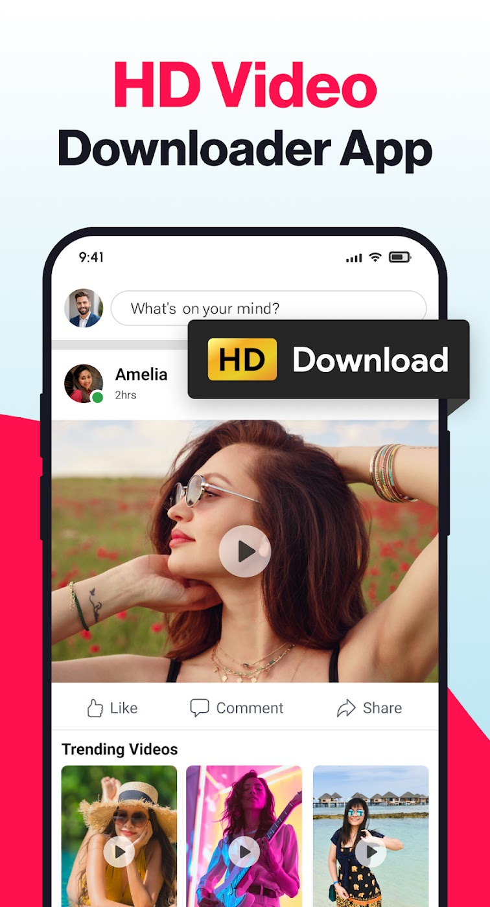

Screenshot 02 · 756 × 1400 · portrait · HD Video Downloader App · [Original image on Google Play ↗](https://play-lh.googleusercontent.com/KB1_2FN5EwzqR34bU5fEsz7cCUgAnhIHtKSMengBToq2aF5zQ-lWY2C3ClSxrhg56cJplqM5GGIXKJRXCHa8xw)

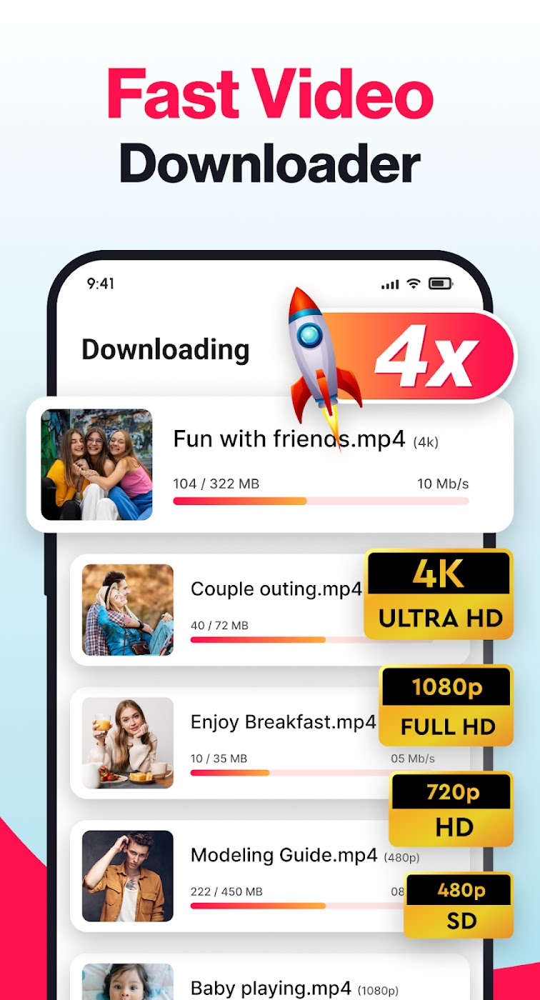

Screenshot 03 · 756 × 1400 · portrait · Fast Video Downloader · [Original image on Google Play ↗](https://play-lh.googleusercontent.com/K_gM9kwcnOpvVVZeBNlJLsq_m-3s1-RApVgpxfSKwJGh8_ASHmvtIzwVfOUf_9RVKgQ5CkGDoSzkR1gzJOSJkA)

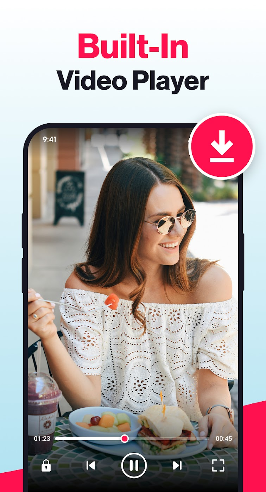

Screenshot 04 · 756 × 1400 · portrait · Built-In Video Player · [Original image on Google Play ↗](https://play-lh.googleusercontent.com/nEe3_iWAEp_gk0TZnB0JohgHPwL_qoQCQrFngw2GmajI5srTGgL0IR0ykqA8u08rAaQ61cIMbsdMIg2aXFYbGQ)

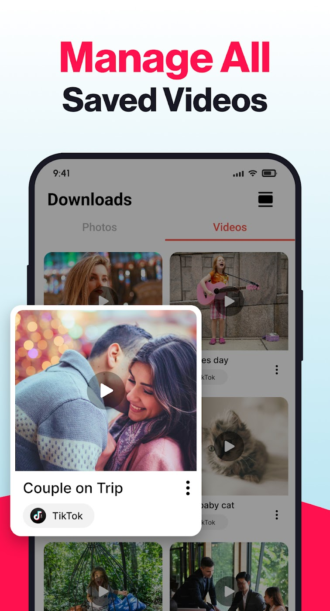

Screenshot 05 · 756 × 1400 · portrait · Manage All Saved Videos · [Original image on Google Play ↗](https://play-lh.googleusercontent.com/hIz0SJIcuegdmkLsFb5hdr3MGSvp8I1JXXKEkctddeuUVphHfiuPJGIo_SUsE-d-47MyxTannIS3f7zqYqWLRQ)

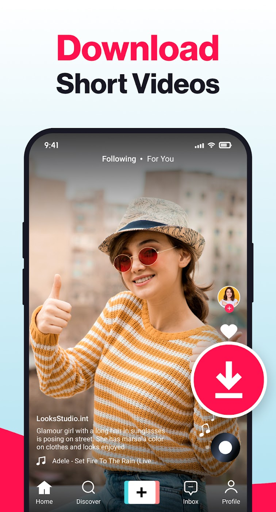

Screenshot 06 · 756 × 1400 · portrait · Download Short Videos · [Original image on Google Play ↗](https://play-lh.googleusercontent.com/V0XSNBa6VyqR0CFMSrBV_MX8N-TdnpC42HJsye7RGsLKc2EHI0ZJApb-IccRlEgqitoyEtdVbrmMuVvhi80n2A)

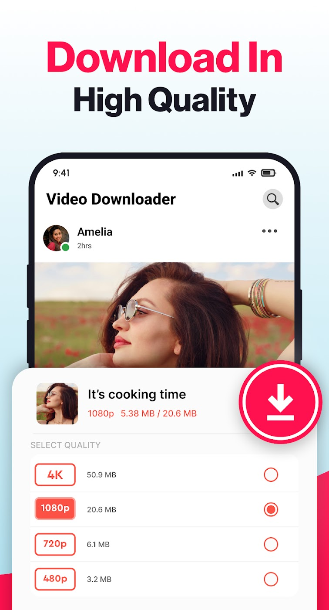

Screenshot 07 · 756 × 1400 · portrait · Download In High Quality · [Original image on Google Play ↗](https://play-lh.googleusercontent.com/8RQjUlpDiAny09Dv768DnvKNedj--xekG67YXhlCC-kc-IwpLFAdBVaBsRHw3463PiFDAEc6xpU_ZR-W6Gbcpw)

Landscape screenshots: not observed in this snapshot.

11 · Sky Vision Apps Lab

### Sky Vision

“All Video Downloader & Saver” · 10M+ downloads · rating 4.09 (24K) · 7 portrait and 0 landscape screenshots

US keyword board (16 Sep): **0** top-10 · **0** placements on 100 keywords · best #—

Open listing on Google Play ↗

#### Icon

A flat red square with a white “V”. Identical in idea to Attractive Apps, Markhoor, Mobile Notepad and Vidow — five listings, one mark.

#### Feature graphic

An orange tile grid with “All Video Downloader” in white. The tile-grid family again.

#### Screenshot system

Seven frames on white with a coral swoosh at the foot and two-tone headings: Paste the Link & Download Now, Fast Video Downloader, Save Video With High Resolution, Watch Trending Videos, Support All Video Format, Easy To Manage & Share, All Video Downloader.

#### Design assessment

**This listing's title is word-for-word our own current title**, on a 10M-install app. That alone is worth more attention than its graphics, which are competent and entirely generic — a red V, a tile grid and seven headings that could belong to any app in this library.

red V icon · same title as ours · tile-grid banner · coral swoosh · generic headings

Icon and feature graphic

Icon 01 · 512 × 512 · square · Listing icon, original file · [Original image on Google Play ↗](https://play-lh.googleusercontent.com/WYDfh31pnGcXOA47UxNqxtpja_wGFI7WoCSaaJ2ds5dP26aem1U0vT0oL6UIUIAeqac26Gb72y4be9VLRDpOfQ)

Feature Graphic 01 · 1024 × 500 · landscape · Feature graphic, original file · [Original image on Google Play ↗](https://play-lh.googleusercontent.com/C2PO4WH7Gv29t-ooMW1PPM9A9-cbIqGvEAG9s6_9d3DMkonhbur9en9_JdkS3tRyHCS_UlJtFSK2EEKWimefVQ)

Portrait screenshots · 7

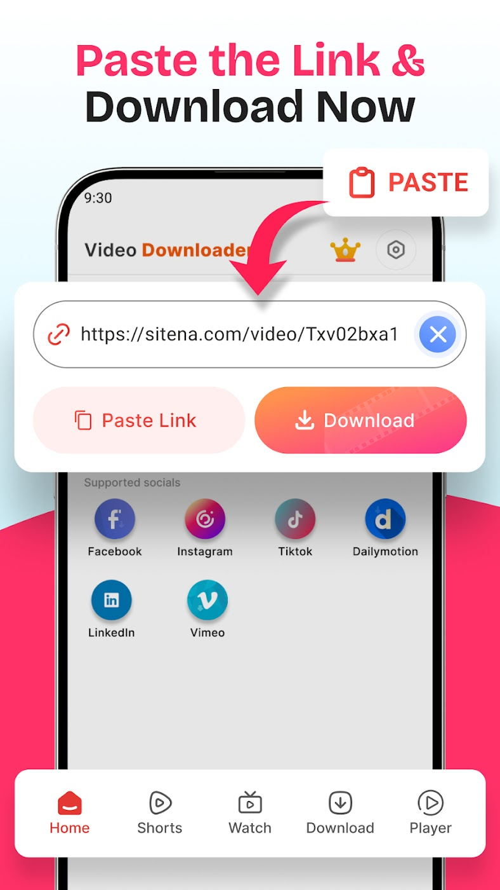

Screenshot 01 · 788 × 1400 · portrait · Paste the Link & Download Now · [Original image on Google Play ↗](https://play-lh.googleusercontent.com/hcyKV8VTN9lfqV1F-8eav-4FeVQrRiFg8K5Nbzi0NxpJHvZWE8OzrnDuLDLYebFjFnJQBQXqwMaQDzgXqb6J)

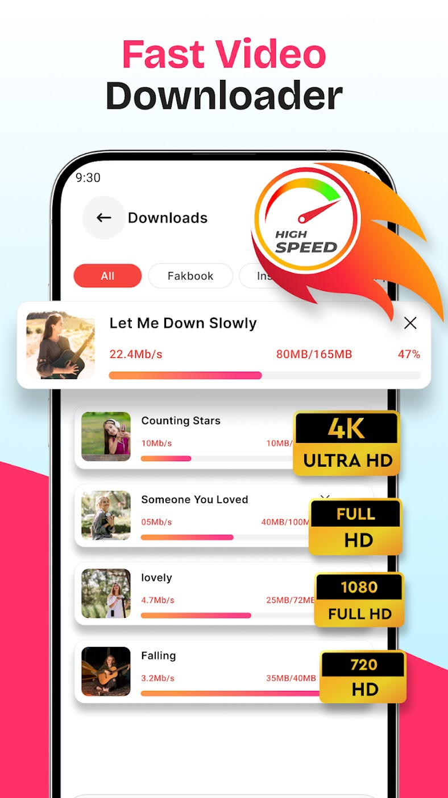

Screenshot 02 · 788 × 1400 · portrait · Fast Video Downloader · [Original image on Google Play ↗](https://play-lh.googleusercontent.com/UUPCqAJrAAajYHdRapIAu5-c4Mfcc5MLYW_c98CSASpvdgdEAh1_3rwpWspFnAs3A9URushu62VocmxIXtZ4)

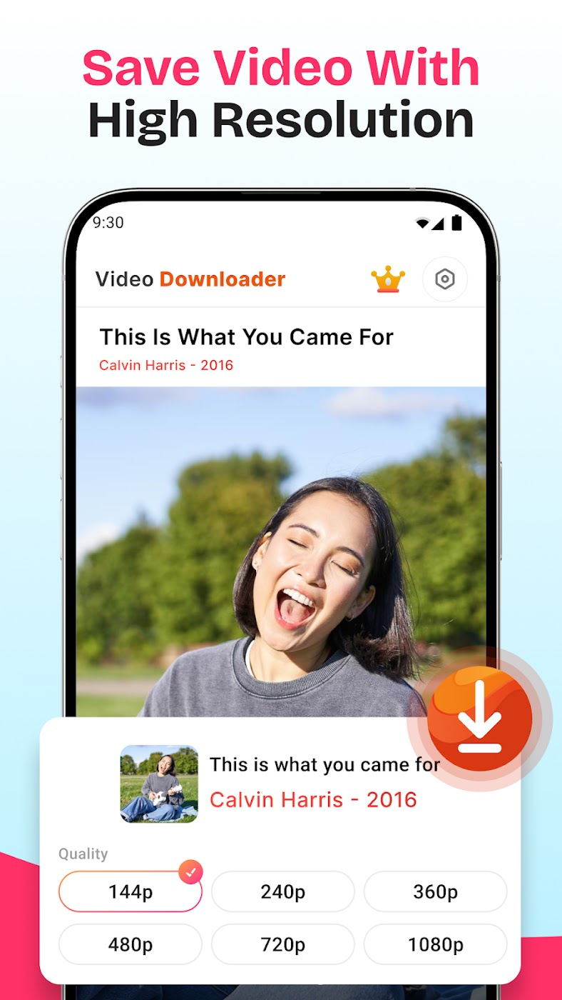

Screenshot 03 · 788 × 1400 · portrait · Save Video With High Resolution · [Original image on Google Play ↗](https://play-lh.googleusercontent.com/DNu3H-FPml2vRXNenl1EJQT7xe8ysQL4X0-FhF-_PzNOKeqsk9ZblE9cG8gVgRDczTsnMJAmQjoCQBn3khtD7w)

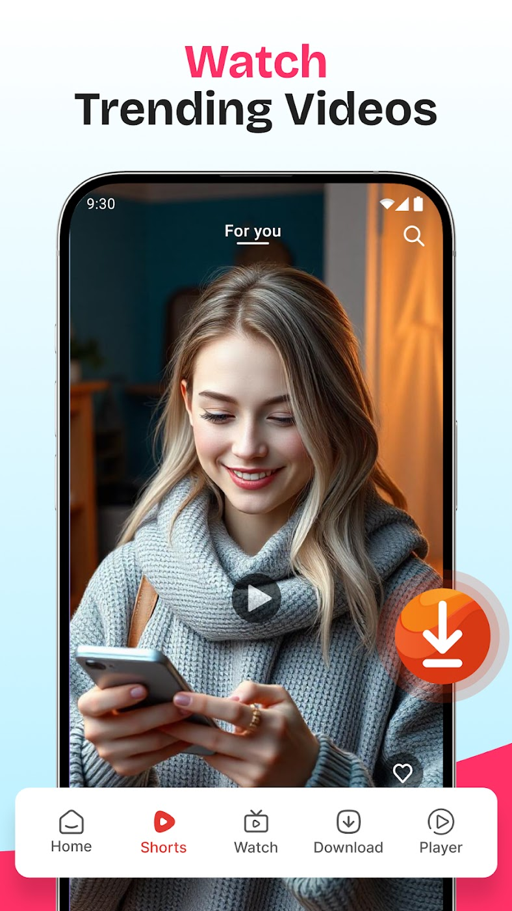

Screenshot 04 · 788 × 1400 · portrait · Watch Trending Videos · [Original image on Google Play ↗](https://play-lh.googleusercontent.com/n0dZrGexmt38O6Tri6Ery8tboaddJdJm63INAyY9J7gNCBHXeLAnsuvkNJ9Sio3kd-1xNU7pZYGxXt0NE4y9aoQ)

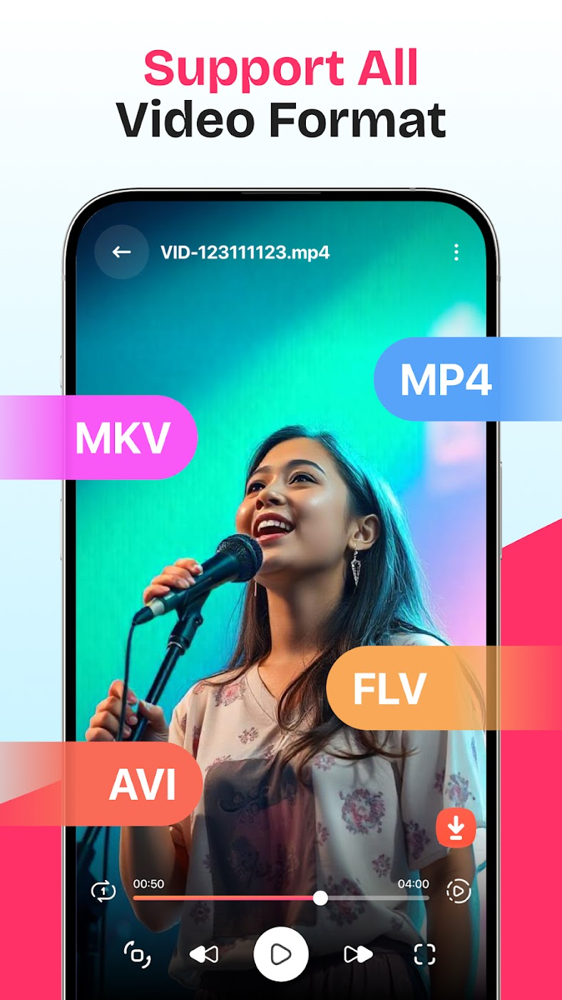

Screenshot 05 · 788 × 1400 · portrait · Support All Video Format · [Original image on Google Play ↗](https://play-lh.googleusercontent.com/UyAnf-fFtQ1wgzLhUvs1fQowweZnopqFRUQedfDI6KcHqZ1Ipn3x6Iqxu9nIUjUnj8GD15_sNsFhXgcKMu38sA)

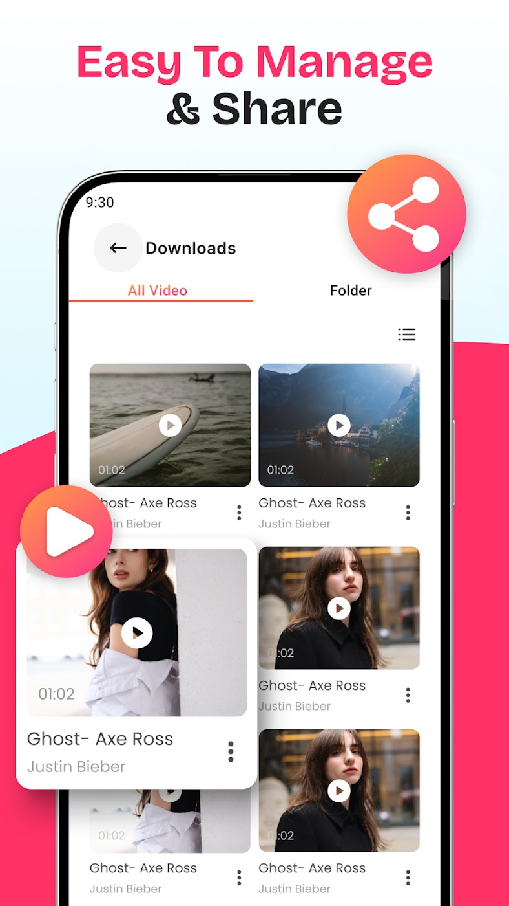

Screenshot 06 · 788 × 1400 · portrait · Easy To Manage & Share · [Original image on Google Play ↗](https://play-lh.googleusercontent.com/ikNKUKyBcSpH4vtNsu8Rbh7H3iZj8HaDkssa0qFpYGanNRT87IHopvnFta-rD0oZ6ahuFHukwKAUthtlXYMH)

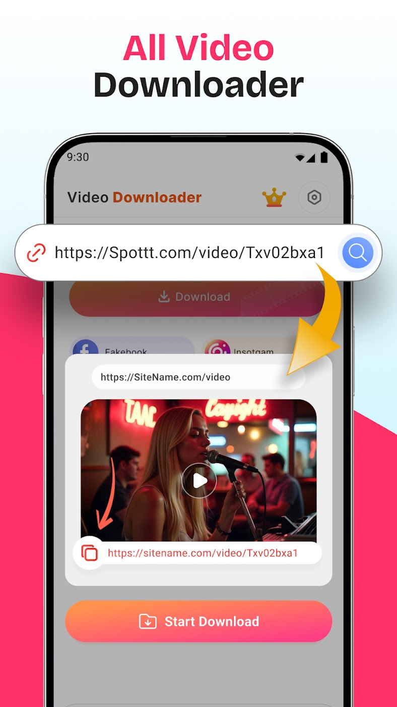

Screenshot 07 · 788 × 1400 · portrait · All Video Downloader · [Original image on Google Play ↗](https://play-lh.googleusercontent.com/RsVRXErJmSD97Vhb_Ab3Kv69ozw_hhDiL2kouwWhCy8N6LRm27-9fPUIgOsowfTCte7cM5I15aXqYEeIeYvh2g)

Landscape screenshots: not observed in this snapshot.

12 · Attractive Apps Valley

### Attractive Apps

“All video downloader and saver” · 10M+ downloads · rating 3.99 (23K) · 6 portrait and 0 landscape screenshots

US keyword board (16 Sep): **0** top-10 · **0** placements on 100 keywords · best #—

Open listing on Google Play ↗

#### Icon

A flat red square with a white “V” — the same mark as Sky Vision, Markhoor, Mobile Notepad and Vidow.

#### Feature graphic

A pink-to-orange gradient with “Video Downloader” and a line of small supporting type beside a phone mock. The brightest banner in the library.

#### Screenshot system

Six frames on solid orange with white two-tone headings and a device: All Video Downloader, Download All You Watch, Built-In Video Player, High Resolution Video Downloader, Secure & Fast Downloader, Social Media Downloader.

#### Design assessment

Warm and consistent, and the orange ground does more to separate it in a result strip than its icon ever will. Two frames show grids of named platform buttons, one of them with a misspelling (“Instgram”), and the headings restate the title four times over.

red V icon · gradient banner · solid orange frames · platform buttons · repetitive headings

Icon and feature graphic

Icon 01 · 512 × 512 · square · Listing icon, original file · [Original image on Google Play ↗](https://play-lh.googleusercontent.com/N77NqpfhamAt-kjsqbI-JkmYQRjUiHUFuyArYqEBGAwPOR_8NMHXgJlrcr5HQSTLilOfWqGt83J_ihpnPWExILI)

Feature Graphic 01 · 1024 × 500 · landscape · Feature graphic, original file · [Original image on Google Play ↗](https://play-lh.googleusercontent.com/5r0E7gFgJq3qBZMhHLZiXfdAWVrfY5uAgDOxzjo748IXGoaOqb6qONlQ1vzWg67i90uSp0jCSt3cPv2oJ7SQgA)

Portrait screenshots · 6

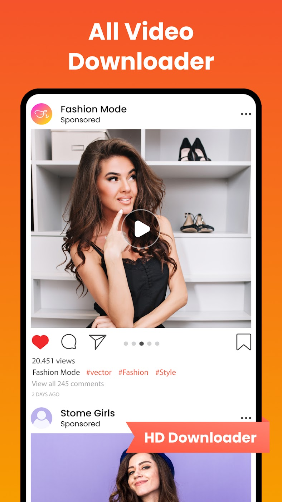

Screenshot 01 · 788 × 1400 · portrait · All Video Downloader · [Original image on Google Play ↗](https://play-lh.googleusercontent.com/uxK7mKZUTzy45V1_Lz-Dg7Ipwf8NzE4jQr_dIedo043xckmst0ism4hXlE1MzF7oKzGe38FxZyKxM2Fepz36)

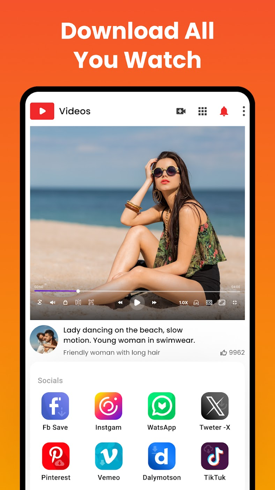

Screenshot 02 · 788 × 1400 · portrait · Download All You Watch · [Original image on Google Play ↗](https://play-lh.googleusercontent.com/U_ZMWxVaNm339SvHpDwBY-dYD0-ONmwU7F32ITsvEO-q9ZasUJhSnJQBGGhbkDNGi8E9AYH1_ySFqTY_V0Wr)

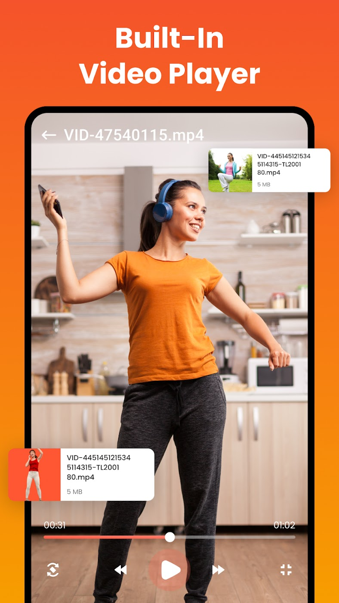

Screenshot 03 · 788 × 1400 · portrait · Built-In Video Player · [Original image on Google Play ↗](https://play-lh.googleusercontent.com/QOfY8a2u8I6sGDfyJS5xxn5LV62PvYbfNtRsFcgGPcsr738FAqpnicENhAGBuOq44x0U9ZmaAWvEpJYfpx59)

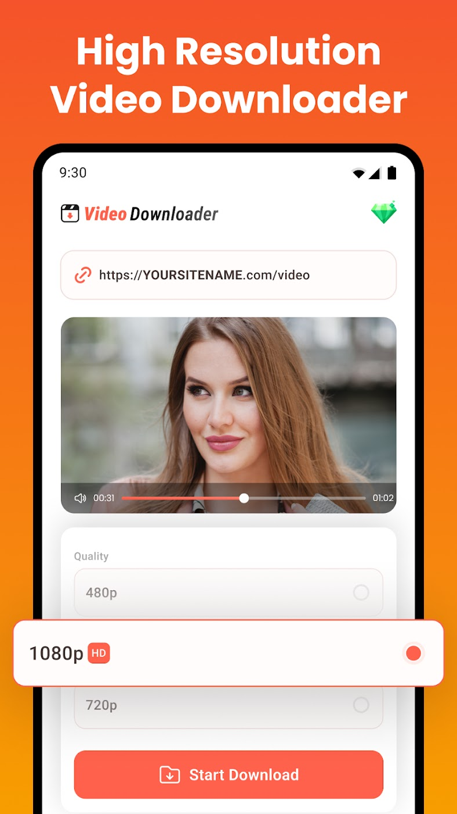

Screenshot 04 · 788 × 1400 · portrait · High Resolution Video Downloader · [Original image on Google Play ↗](https://play-lh.googleusercontent.com/qycURS3fte4w4kXirs7hcdPqV_XCucRfXLNhCibJsiC3a0_-OuoWpb0aH3Rgo_pdJWL4R5I2mRp1xy-GPXoSBw)

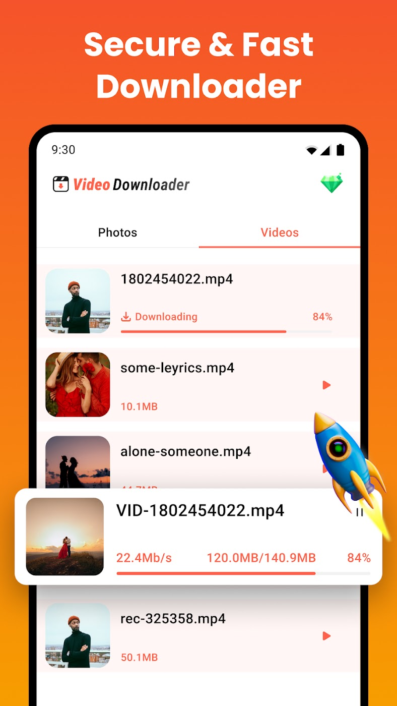

Screenshot 05 · 788 × 1400 · portrait · Secure & Fast Downloader · [Original image on Google Play ↗](https://play-lh.googleusercontent.com/Malrw9bpDCIhpmGMi_JZvM9SrIb5oqkyHUpo5gp6LtcHTzlBWTRR0-xjiZ11ny0bzGGPGeje542hmqMBlgR1Tns)

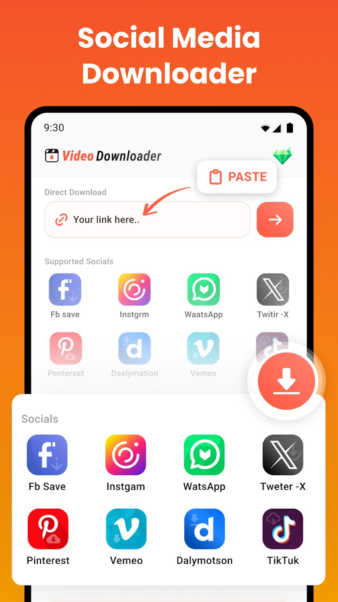

Screenshot 06 · 788 × 1400 · portrait · Social Media Downloader · [Original image on Google Play ↗](https://play-lh.googleusercontent.com/Iu_xtDmhcKvvEcf5_aCUEQLN7ZjwwQMm9kx005iuPrlDdZSRmK6qZtqypnXybKv-4dEkIN1nDy5bHHJ7q6zCE3s)

Landscape screenshots: not observed in this snapshot.

13 · Markhoor Studio

### Markhoor

“Video Downloader & Save Video” · 10M+ downloads · rating 4.00 (9.5K) · 13 portrait and 0 landscape screenshots

US keyword board (16 Sep): **0** top-10 · **0** placements on 100 keywords · best #—

Open listing on Google Play ↗

#### Icon

A flat red square with a white “V” — indistinguishable from Sky Vision's and Mobile Notepad's at any size.

#### Feature graphic

White and orange, “Video Downloader” in red beside a phone mock, with platform marks scattered around it.

#### Screenshot system

**Two different systems in one carousel.** Frames 1-7 sit on white with dark headings; frames 8-13 sit on an orange field with a white swoosh and orange headings. The topics overlap — both sets cover link-pasting, resolution options and browsing.

#### Design assessment

The clearest example in the library of what not to do: a shopper swiping this carousel meets two different apps. Mid-stream redesigns are normal; leaving both live is what causes the damage. It also carries a 4x speed claim and a visible third-party feed in frame 9.

red V icon · two visual systems in one carousel · 4x speed claim · third-party feed · lowest review count

Icon and feature graphic

Icon 01 · 512 × 512 · square · Listing icon, original file · [Original image on Google Play ↗](https://play-lh.googleusercontent.com/PwdmwGsCYAewdUgshkWt8fMbOfYPOszRT-L7k0NunbyBL0UU_iPQsPkxEvgLOMHh1KC1SEjqW4Iys1ib9rQOPNk)

Feature Graphic 01 · 1024 × 500 · landscape · Feature graphic, original file · [Original image on Google Play ↗](https://play-lh.googleusercontent.com/y2Eu9k8uHLfd4kJh9Oeyoz0oVaFA_j1vxz33AeA9e0AU6ojg1TVokD-TaUtSsiyO1a7AnVG6UPf3yYE0d9vL)

Portrait screenshots · 13

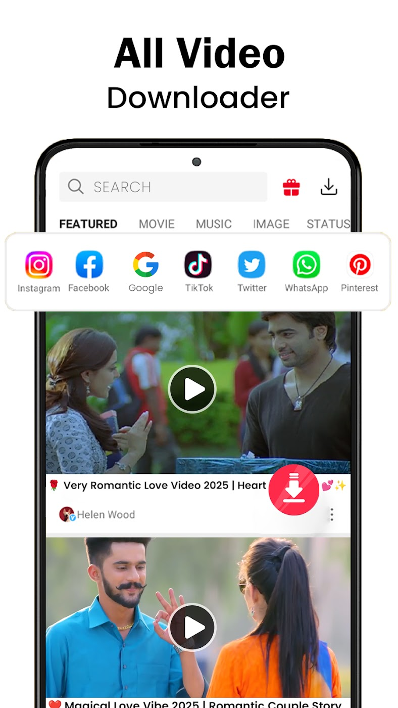

Screenshot 01 · 788 × 1400 · portrait · All Video Downloader · [Original image on Google Play ↗](https://play-lh.googleusercontent.com/WTs1fV9jbtCTuWkWSzeFoH-YDL3FFGy4_Y0JaxClW059YEGFjnZRzkNsGoEXXX73RQPIQoUiCHFSpyGvlUCHYtI)

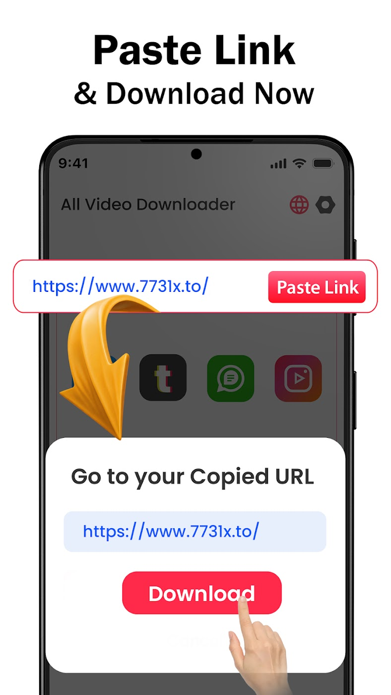

Screenshot 02 · 788 × 1400 · portrait · Paste Link & Download Now · [Original image on Google Play ↗](https://play-lh.googleusercontent.com/mxiKrmMB_C34OwHo6aebNbUIM3gxuaQrd7cKlOATG6so5Fds6DnIYbmTSsgA9zlevRLkC2003XpwIHlW24aW0w)

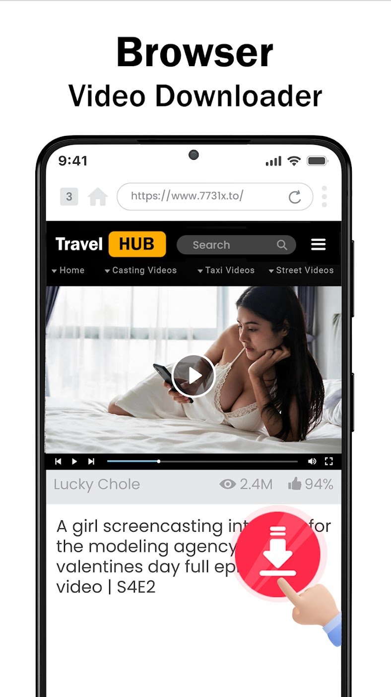

Screenshot 03 · 788 × 1400 · portrait · Browser Video Downloader · [Original image on Google Play ↗](https://play-lh.googleusercontent.com/6CKhIJp4Lf3uqGBXENMI1OsjQL0_7bnUkZ3LXqhjfbIU0MpRrOUVbujO4Zh5a83vLfNw-8SShQYQ1Q022CA0Vg)

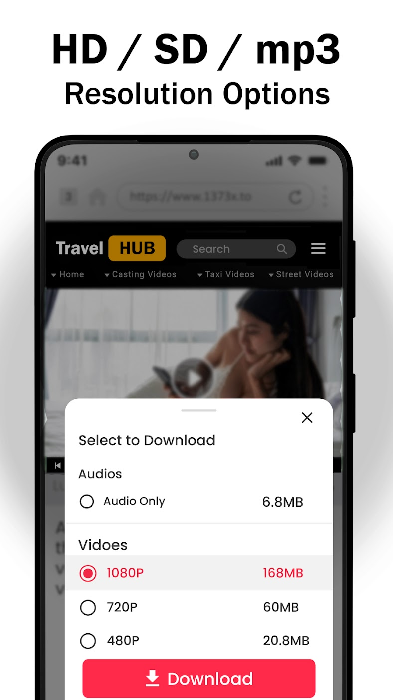

Screenshot 04 · 788 × 1400 · portrait · HD / SD / mp3 Resolution Options · [Original image on Google Play ↗](https://play-lh.googleusercontent.com/ESMs7OfP2yyl_AgRrVItBHTs9wYiorZ9gSlLx5aw7lcfjmKuIQY5xLQuS_LjgZwOjcFRQB3cF10bjsW3vLN-LZQ)

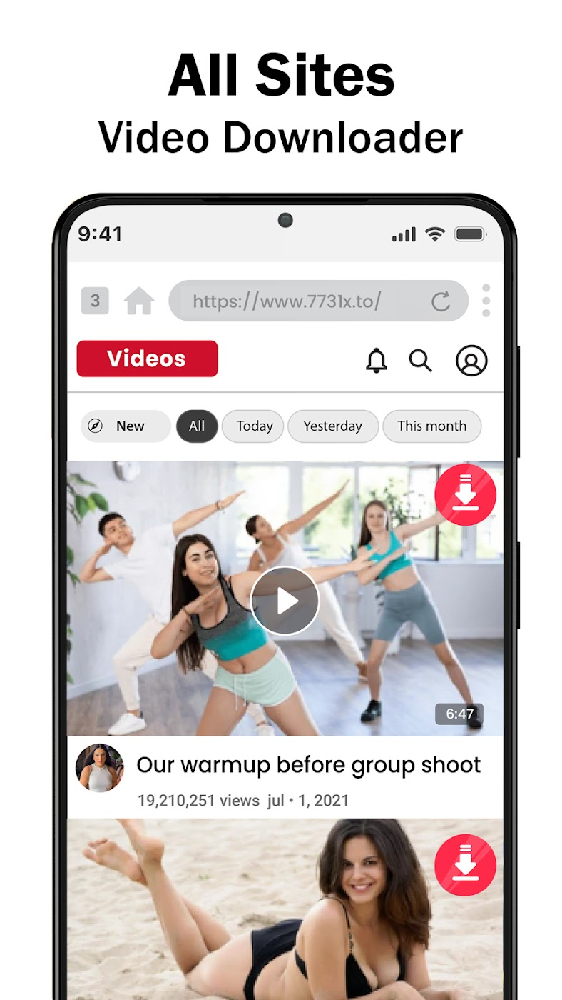

Screenshot 05 · 788 × 1400 · portrait · All Sites Video Downloader · [Original image on Google Play ↗](https://play-lh.googleusercontent.com/o2VfZOqMx8cbB3RhZfTPQmU4S5bcZmRt77fq0NsPC_nRR9L2RZKRp3JImPYygKBB4J1QP-BCCdNPdLbTsWaVCDo)

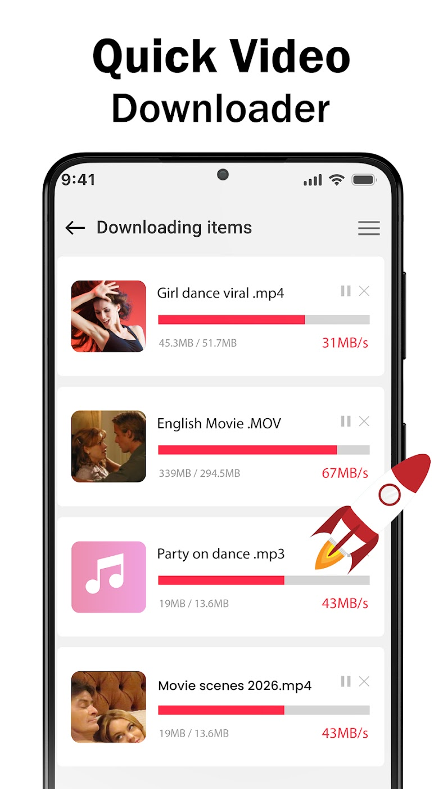

Screenshot 06 · 788 × 1400 · portrait · Quick Video Downloader · [Original image on Google Play ↗](https://play-lh.googleusercontent.com/bwS0Fcn6BdurMEKOS5VT4URGALG1ID-LGSG-D3bNXNUmLLEaXpK8x_vXolUQXWgEWpWNKDQSLzICoIWaaEMBmw)

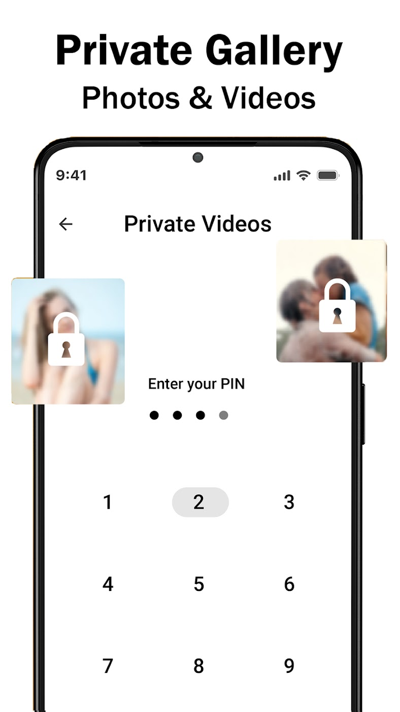

Screenshot 07 · 788 × 1400 · portrait · Private Gallery — Photos & Videos · [Original image on Google Play ↗](https://play-lh.googleusercontent.com/ZyDlMM2JmWg4p9xEKqCZdhQSXb-fjZkr_wp1Pzhozdogtd0iZY5yqse-CpK08l07jUjD5b_t4o9sU-UAY2u3cg)

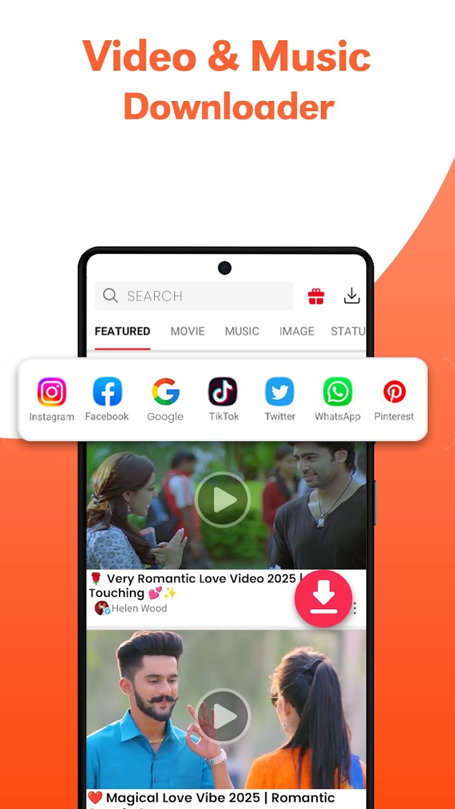

Screenshot 08 · 788 × 1400 · portrait · Video & Music Downloader · [Original image on Google Play ↗](https://play-lh.googleusercontent.com/j9EIWHS2P11EIgIdDUzAuzaiobSuka4G-2GCFKZHbunbMAaRHzueUU7nt-BojNuN_lzLbZEiIQh6iPxFJrG7RA)

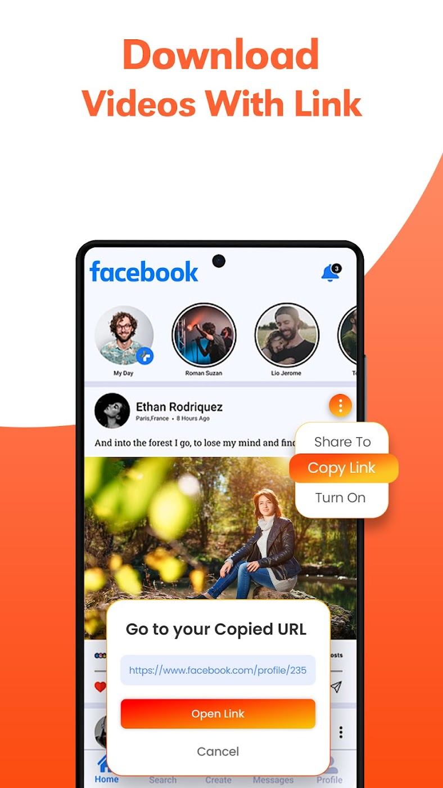

Screenshot 09 · 788 × 1400 · portrait · Download Videos With Link · [Original image on Google Play ↗](https://play-lh.googleusercontent.com/KH62Q_h4TpBCNHMiJKN1UxtP3QBpE1UY-mfibPZcvXlTwsUUsbFT2Rn-mxGlBRbOu5PLbTsG1fxUVPid8bRONUk)

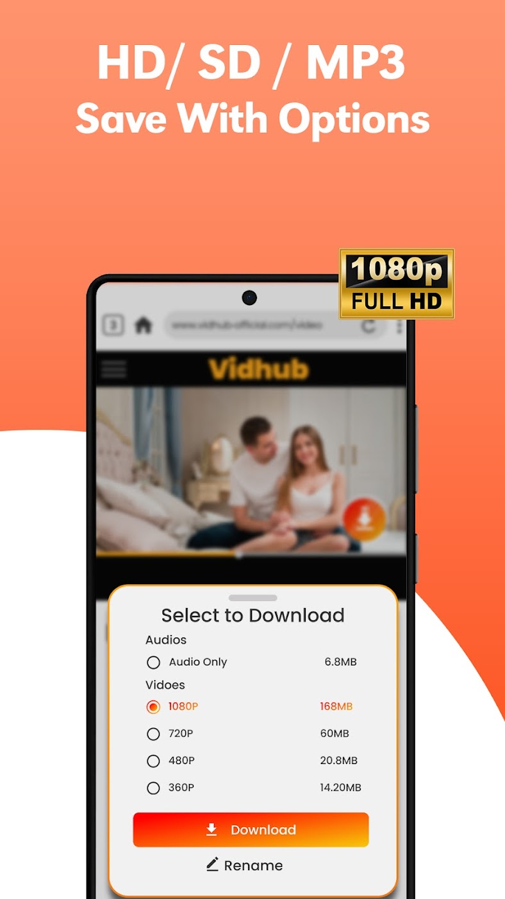

Screenshot 10 · 788 × 1400 · portrait · HD / SD / MP3 — Save With Options · [Original image on Google Play ↗](https://play-lh.googleusercontent.com/Vt8vfWMKKtUTYuuqQsX30AjhrUIwxLP2-8YeyFRDZLtXmfgEf7uOnsqU50mlrbqjGglbzmPqe6yw3819qQ9Z)

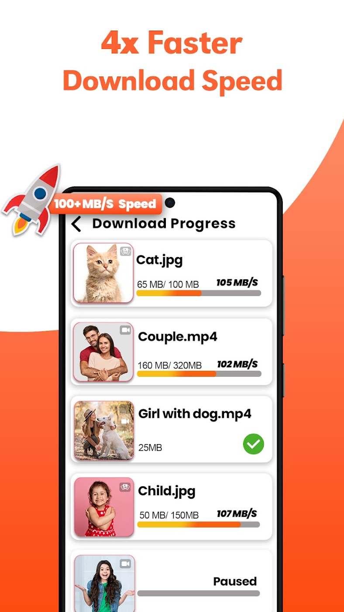

Screenshot 11 · 788 × 1400 · portrait · 4x Faster Download Speed · [Original image on Google Play ↗](https://play-lh.googleusercontent.com/3eME3YM0pcytNqvVjGeXJ2hf7TT73LuSzW4rFf130Dk7ZiLRMxzMwqw1Ocvq4wpAO6rJvKY-cVAy5AFWZIZHTQ)

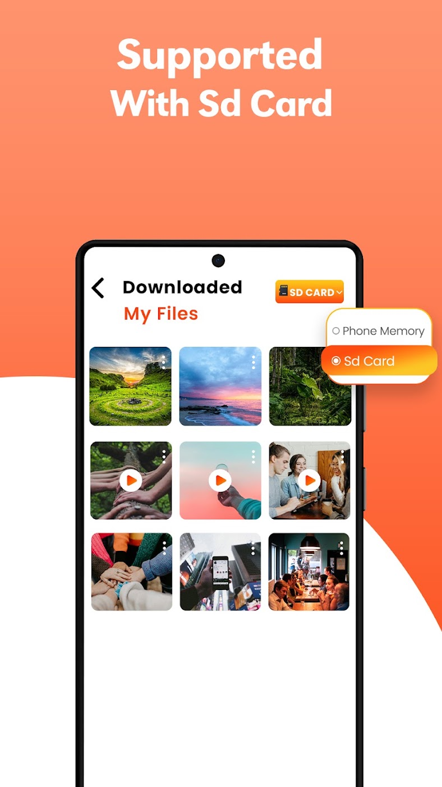

Screenshot 12 · 788 × 1400 · portrait · Supported With Sd Card · [Original image on Google Play ↗](https://play-lh.googleusercontent.com/fNyoFDM0_K3S4Awqzr54JYfFy4rq_El1PSQ9RJ9xHx5rOM1mhCm216bt8of_8YVIm0YNATQWkE_ZJncDYAISsw)

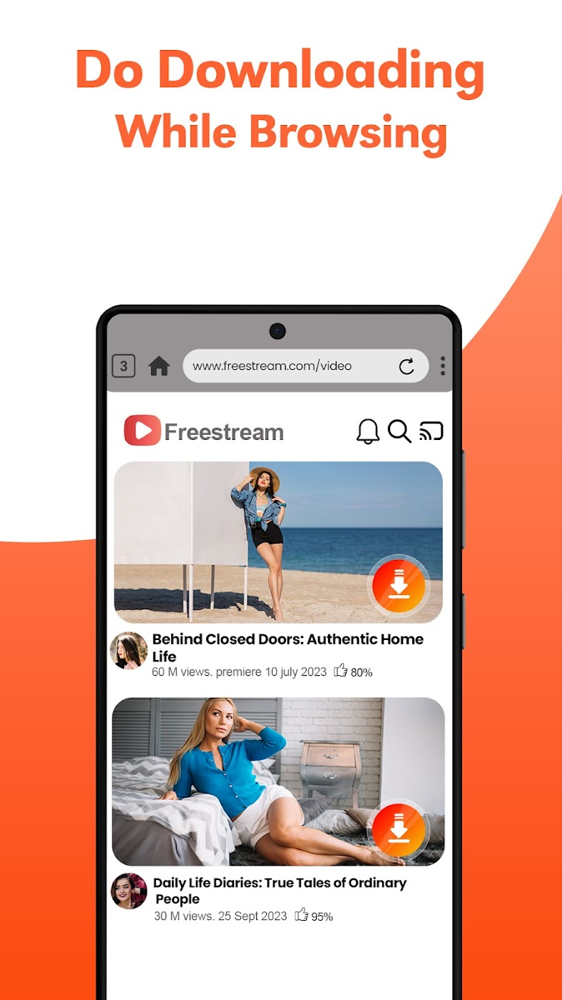

Screenshot 13 · 788 × 1400 · portrait · Do Downloading While Browsing · [Original image on Google Play ↗](https://play-lh.googleusercontent.com/jPJGIcBJdXESB53KgxGft5bVoMhPheURPQ9rxUBcXu69yzGW3IALT9dkOadQD1FYTwyponb2JxD2ATaVSDKmLQ)

Landscape screenshots: not observed in this snapshot.

14 · Mobile Notepad Apps

### Mobile Notepad

“Video Downloader - Player” · 5M+ downloads · rating 3.83 (7.5K) · 16 portrait and 0 landscape screenshots

US keyword board (16 Sep): **0** top-10 · **0** placements on 100 keywords · best #—

Open listing on Google Play ↗

#### Icon

A flat red square with a white “V”, again. Five listings in this library share it.

#### Feature graphic

A dark orange banner with “VIDEO DOWNLOADER / Download All video Easy and Fast” and a pair of phone mocks.

#### Screenshot system

Sixteen frames: two complete eight-frame sets built on the same device art with different headings. Set A uses two-tone colour headings (All Video Downloader, Save HD Videos, Shorts/Reels Downloader, Fast Video Browser, Social Media Downloader, Light/Dark Themes, Protect Your Videos, Save & Share Easily); set B restates them in plain white (Download Videos from Anywhere, Ultra-Fast Video Downloads, Instant Shorts Saver, and so on).

#### Design assessment

The largest carousel here and a genuine copy A/B — same pictures, two different sets of words — which is worth watching, because whichever set survives tells you which phrasing this developer found worked. It is also the lowest-rated app in the library at 3.83★, and it names platforms in both a heading and a button grid.

red V icon · A/B copy test · 16 frames · shorts/reels wording · platform grid · lowest rated

Icon and feature graphic

Icon 01 · 512 × 512 · square · Listing icon, original file · [Original image on Google Play ↗](https://play-lh.googleusercontent.com/gUlLctSBw65S29hN4PVjRgblYBI40x4HYw5hjwGYp75c34jL_d9yUoD1OqrPmsYtvKIfCcbZN_YQMuXxrHNq)

Feature Graphic 01 · 1024 × 500 · landscape · Feature graphic, original file · [Original image on Google Play ↗](https://play-lh.googleusercontent.com/qWfVvWHKmTRQ2vXnnUpzNP9abfuuFfV5onKZB9na02OqXtzX9T_2bGQf3eO_5p-a52OVjhATv-nYfccf_KTVlW4)

Portrait screenshots · 16

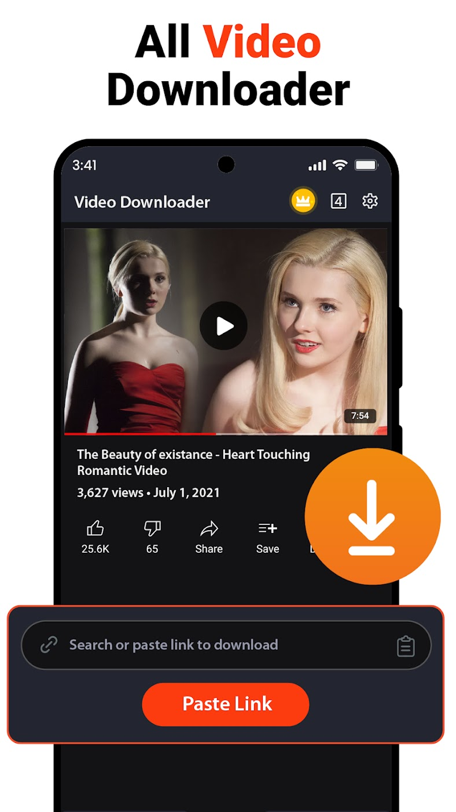

Screenshot 01 · 788 × 1400 · portrait · All Video Downloader · [Original image on Google Play ↗](https://play-lh.googleusercontent.com/7CDQaUcBx-kBNUKxJEYmrYX977DxE77iKvTQDO5siBNkfIVz7wMoZSQXZZnndHA0F7D40bPOrBbeiw1XkeR9)

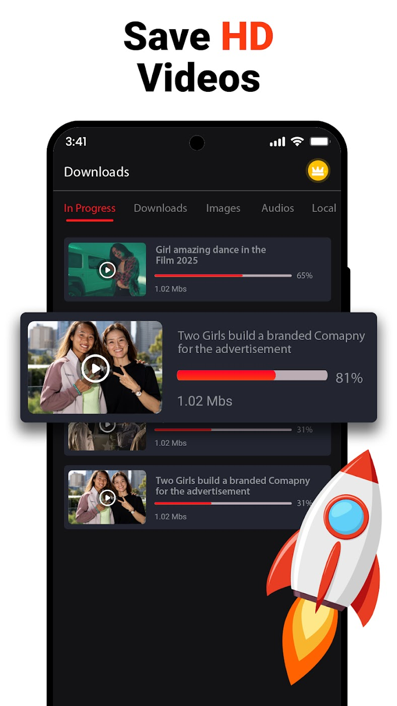

Screenshot 02 · 788 × 1400 · portrait · Save HD Videos · [Original image on Google Play ↗](https://play-lh.googleusercontent.com/bdQutHXHv_72AO7j0ITmUKdv0Fw0Gf-NEwVjQfNW1nTC7cvfNw7m7ScfNTuv7u0Me8egoEOJxVUky4zFkAL0Q3s)

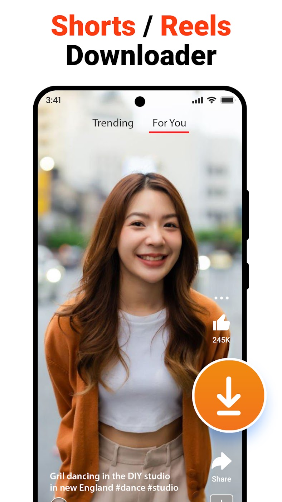

Screenshot 03 · 788 × 1400 · portrait · Shorts / Reels Downloader · [Original image on Google Play ↗](https://play-lh.googleusercontent.com/kYRtECXa0V-IoPNv-Oxa_2VXeKAsyuQw8qwVCz1vinb48DvxHZ8VEgwUichcS7XQ-rnAhGyUxdPbxRAJv8VdA4A)

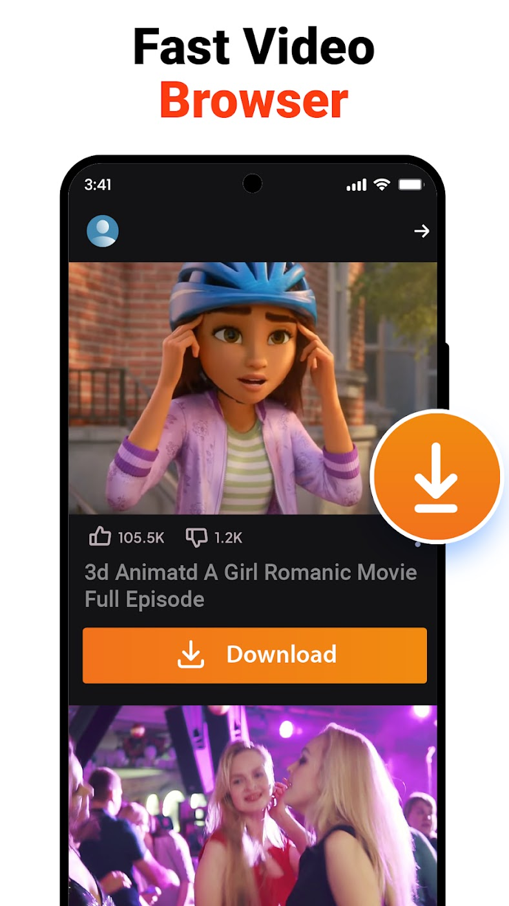

Screenshot 04 · 788 × 1400 · portrait · Fast Video Browser · [Original image on Google Play ↗](https://play-lh.googleusercontent.com/fKHTdH9zNKC6btIBncFXf5O_5F95kdk6zUoy5Pc_80uuOyryR7JNjfNQPupz_GlZKySBybNKGUXpS59Q0MT9lw)

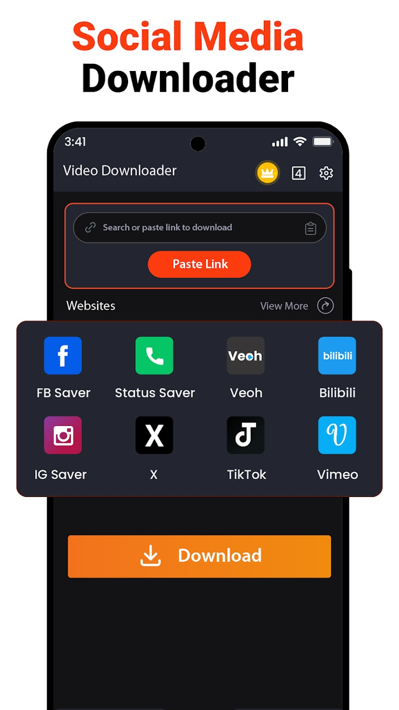

Screenshot 05 · 788 × 1400 · portrait · Social Media Downloader · [Original image on Google Play ↗](https://play-lh.googleusercontent.com/qCaDZQFxmzhc-rJyyCqfMvUh6a4URpQRVfRL8I7qea40G4bMvawqKgRysL0sMdFmwAyMmLIp2axe4w9ErY65Ug)

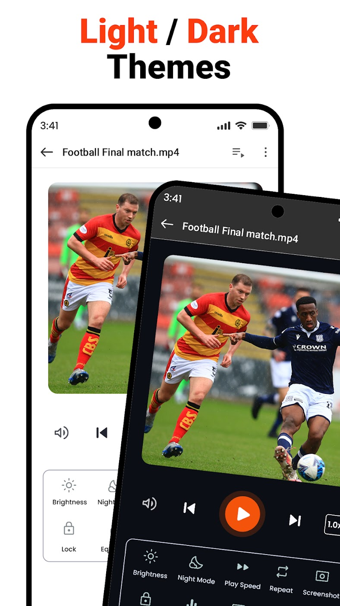

Screenshot 06 · 788 × 1400 · portrait · Light / Dark Themes · [Original image on Google Play ↗](https://play-lh.googleusercontent.com/QL0azP3q03X2ucXdyufN59Mdh2xQxoTuypUoeH4cpvl7ZnCNIkNLagtHkpsNZPPLAe8yPDkOHqCalH2ubFai)

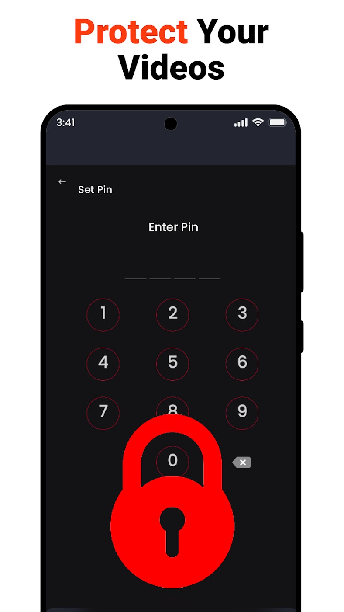

Screenshot 07 · 788 × 1400 · portrait · Protect Your Videos · [Original image on Google Play ↗](https://play-lh.googleusercontent.com/w34Tlfzc2wA5WGvz7jFAhqy0geEcJOC7jT701VQMGL4mLiQEo_ctLU5IYdCb5vZF-ioeVM6eFEH4cfleAFXFyA)

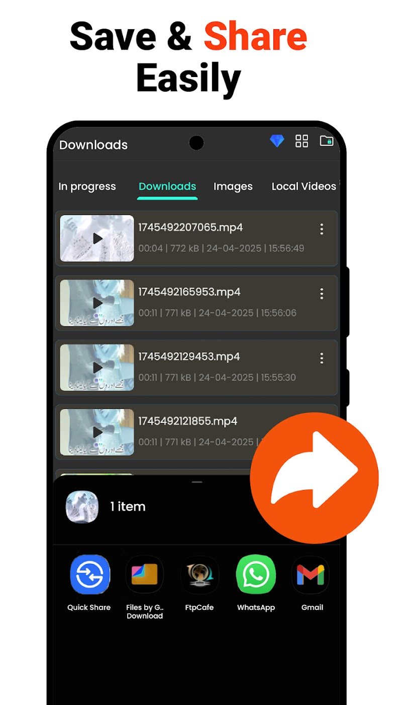

Screenshot 08 · 788 × 1400 · portrait · Save & Share Easily · [Original image on Google Play ↗](https://play-lh.googleusercontent.com/v2CFUFMBuZ0hyLgxNqXPD3NqMrHQj9fYkDaK9fmBWb9w8nAXtANN3ECXEgrFjS_mqR34dwyMyTkDjYv6xCAJLQ)

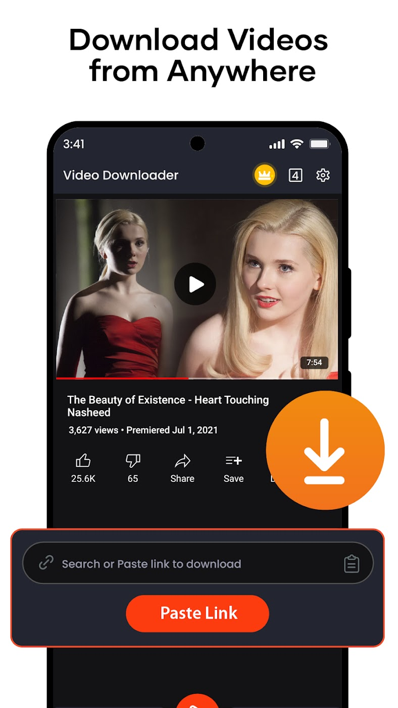

Screenshot 09 · 788 × 1400 · portrait · Download Videos from Anywhere · [Original image on Google Play ↗](https://play-lh.googleusercontent.com/5__BZk1Pon79FPr1FYnp_N8ywI9c7lII5_NaAQy7M3mYDANBjSIS6-UO2dETVQjuJGgf_YhUOLg0fXMsgRJzAg)

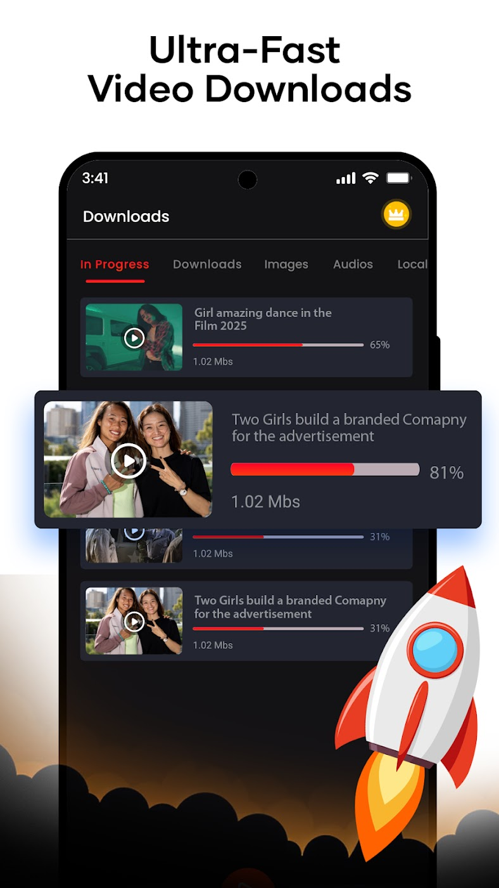

Screenshot 10 · 788 × 1400 · portrait · Ultra-Fast Video Downloads · [Original image on Google Play ↗](https://play-lh.googleusercontent.com/ZaU1B8k2f0cM3zlgVVqChyUTcMuxK79Nd_g2ngtq3mxFTNI_3DcLWeevYuoBeqf_XfbLURhnZT7AVJst0_cA58c)

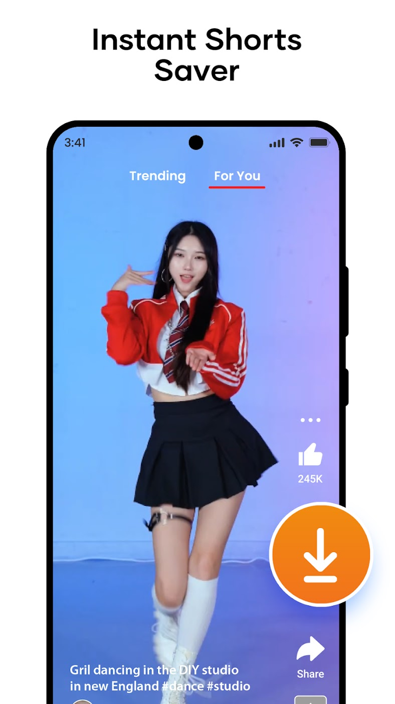

Screenshot 11 · 788 × 1400 · portrait · Instant Shorts Saver · [Original image on Google Play ↗](https://play-lh.googleusercontent.com/2jYD4ZfBwDt4efq1CKUo6dKFMuROfMf9nkhQXnnNWwZAoGw6SL_w4d-k94BJHDGILuzX7SyE0WNfEzMAyrp4eA)

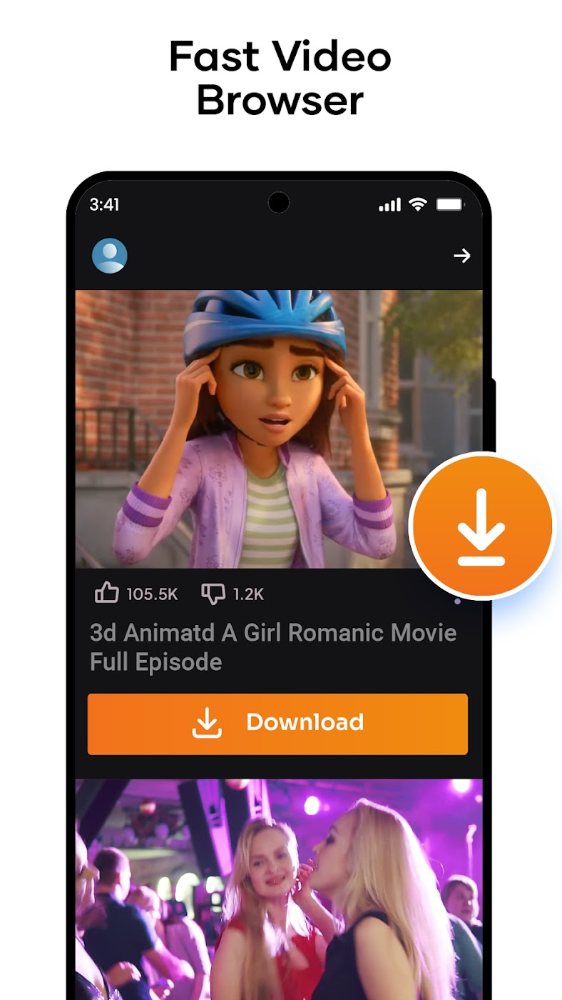

Screenshot 12 · 788 × 1400 · portrait · Fast Video Browser (variant) · [Original image on Google Play ↗](https://play-lh.googleusercontent.com/hBQGK1_PvT9HnSjXaxr--nLP9fAHmu-IpVxZfJiVnO7qXU4A0_GJogkdKJ2FUZaolSXd0_Ik0WvYTx2a7b3tog)

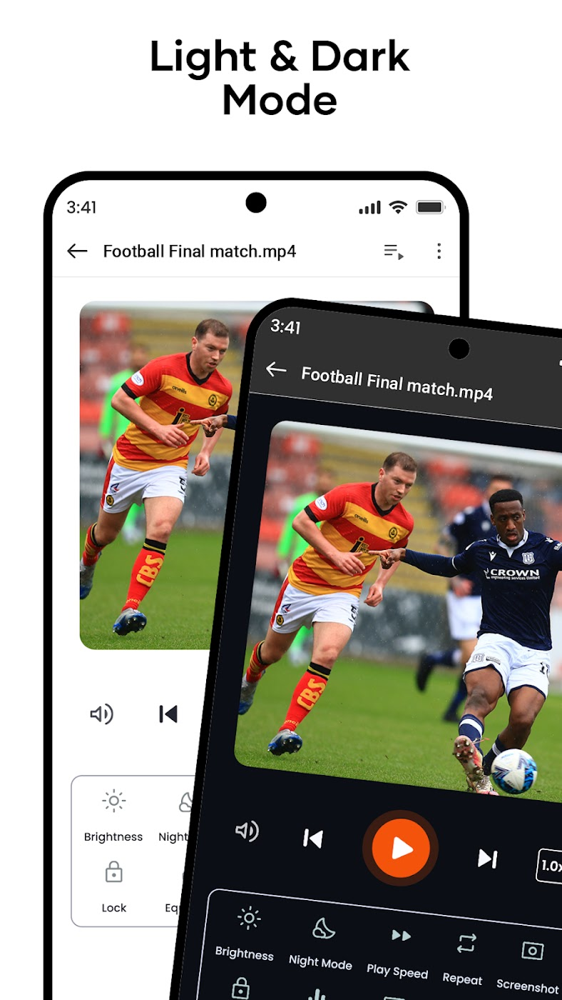

Screenshot 13 · 788 × 1400 · portrait · Light & Dark Mode · [Original image on Google Play ↗](https://play-lh.googleusercontent.com/TMlTj-dqW4frXwN0l845HKcQaa4aZJ7n6xFWfXKmpwKYGuY73yzKT82Gp1R14SnVWRjCqF9NKlxlT6dEhlMe)

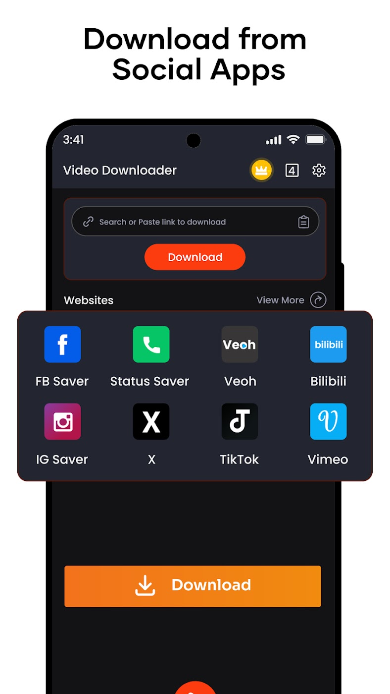

Screenshot 14 · 788 × 1400 · portrait · Download from Social Apps · [Original image on Google Play ↗](https://play-lh.googleusercontent.com/mm__kZlBuunVHJab3DHLZUNg6K-E8fK-3chYjLVUtRXOjXOvVfwxsFfmSXLaw6oZ1dX_ZXNZ01Dw1QH1YxcR3g)

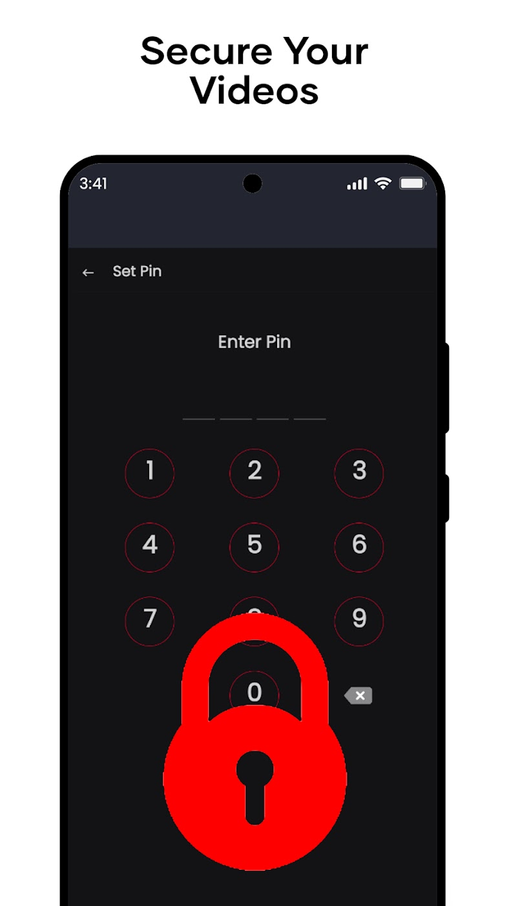

Screenshot 15 · 788 × 1400 · portrait · Secure Your Videos · [Original image on Google Play ↗](https://play-lh.googleusercontent.com/Mj0wzq2aLTdUjri9ECQkJyX_5qEIwY3KBW7Yeico2BfOelL1aMYZT_tidODIWrQ2VwxB2Z9QioaAfu9DlLzToA)

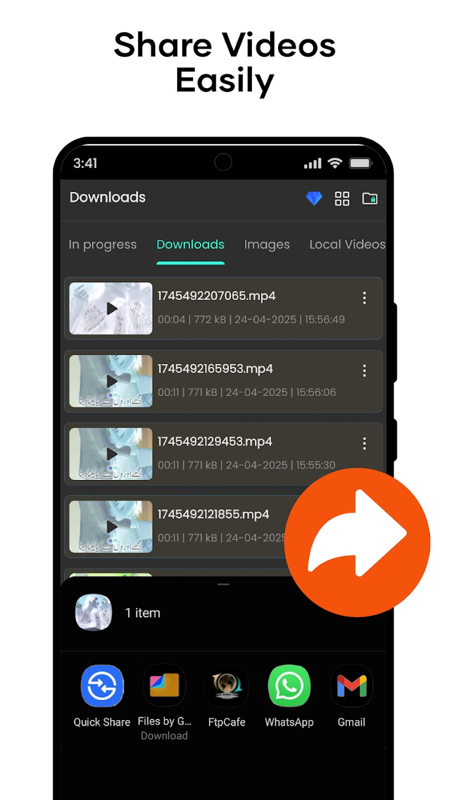

Screenshot 16 · 788 × 1400 · portrait · Share Videos Easily · [Original image on Google Play ↗](https://play-lh.googleusercontent.com/l5-CRTyeR2T9LJw8Mh6MIx8H_tT_ok2R9NtMRdxYo6g_ZZjUT5WfF-o7e_AQt0rfvQ0yL3K9tlDs_-oUnoDjSw)

Landscape screenshots: not observed in this snapshot.

15 · Vidow™

### Vidow

“Video Downloader HD - Vidow” · 100M+ downloads · rating 3.96 (335K) · 6 portrait and 0 landscape screenshots

US keyword board (16 Sep): **0** top-10 · **0** placements on 100 keywords · best #—

Open listing on Google Play ↗

#### Icon

A red square with a white “V” and a small download badge at the corner — the badge is the only thing separating it from the other four red Vs.

#### Feature graphic

Black banner, “Fast Video Downloader” in yellow with “Download All Videos Fast & Without Login” beneath, phone mocks and platform marks at the right.

#### Screenshot system

Six frames on black with a yellow stripe down the left edge and yellow-and-white headings: Easy Video Downloader, Download & Cast Video, Fast & Easy To Use, High Quality Video View, Download In Multiple Quality, Share With Friends.

#### Design assessment

The only listing that gives casting to a TV its own frame, which is a real feature difference rather than a restatement of the title. The black-and-yellow treatment is also one of the few that would survive being shrunk. At 100M installs it carries a 3.96★ rating — the weakest of the three 100M apps here.

red V icon with badge · black & yellow · cast to TV frame · without-login claim · 100M installs

Icon and feature graphic

Icon 01 · 512 × 512 · square · Listing icon, original file · [Original image on Google Play ↗](https://play-lh.googleusercontent.com/uFifs8KnukfNhGtIVf3NVSy2x6_pV3J_wkx5Uo1h5YxooDGn5mrUxaDFrRlbBDvKhv9CisADZ7ksZeH0M9OaHw)

Feature Graphic 01 · 1024 × 500 · landscape · Feature graphic, original file · [Original image on Google Play ↗](https://play-lh.googleusercontent.com/ril_T7cBwEpev8WrRQwHByvNfT9Up3cm4e4enIU9INgTS5Ly4PhchS0ydj8Pu80Dm-xMn4e1-vk1WDHAk47VFA)

Portrait screenshots · 6

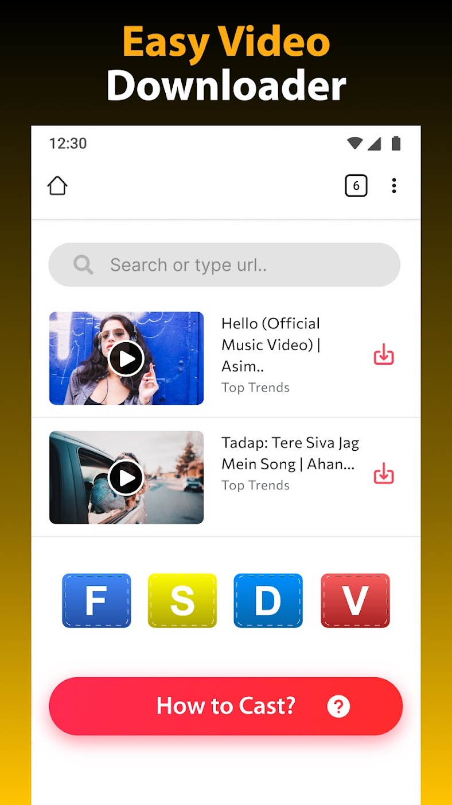

Screenshot 01 · 788 × 1400 · portrait · Easy Video Downloader · [Original image on Google Play ↗](https://play-lh.googleusercontent.com/4Xv2pwHlA0d624K_iI5mt1xV_vicz4-Rw6GoMY-2_GF-wmFlAOuUCjP4FWF9qEbX-pp0kosADqBIQ69DlrxOSw)

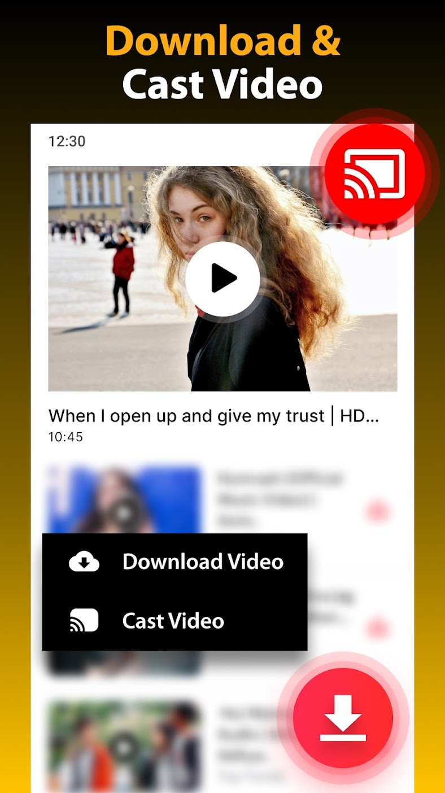

Screenshot 02 · 788 × 1400 · portrait · Download & Cast Video · [Original image on Google Play ↗](https://play-lh.googleusercontent.com/OuwWTU3ash0ZQ7m6Ca8kp5IEpp4HJrJ2N-lLRuWJclj6ik-QvRCWE-rVuV0SjTdOkrV8IH4hlF0SZnderf4b)

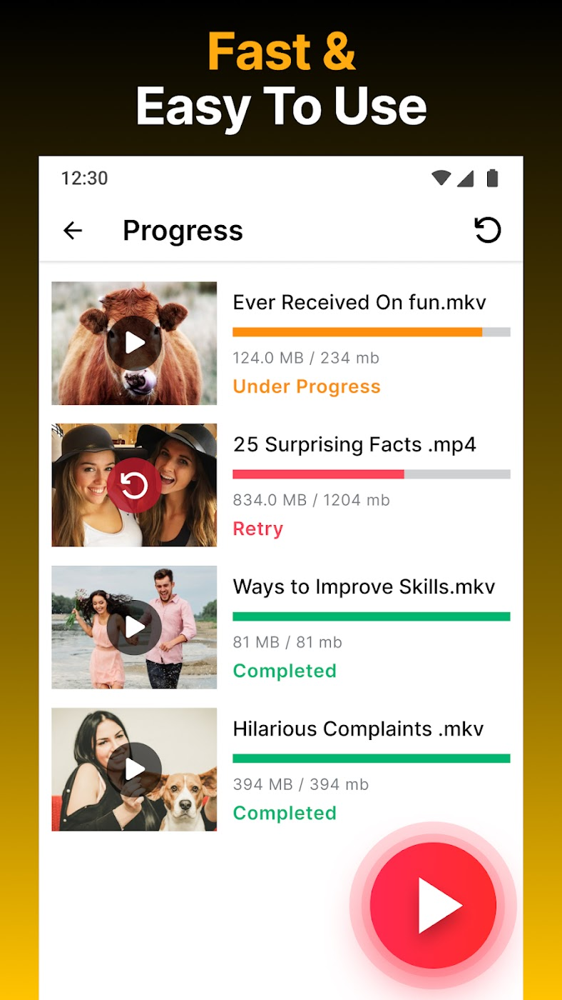

Screenshot 03 · 788 × 1400 · portrait · Fast & Easy To Use · [Original image on Google Play ↗](https://play-lh.googleusercontent.com/PuOBAJh-w1CTXtW359PFIcxTbS247a5SXgHobKHPs4pEGGdMiGm9xj5Cmn4xsFAo6rWgPIHWq3xJeDj91QUo)

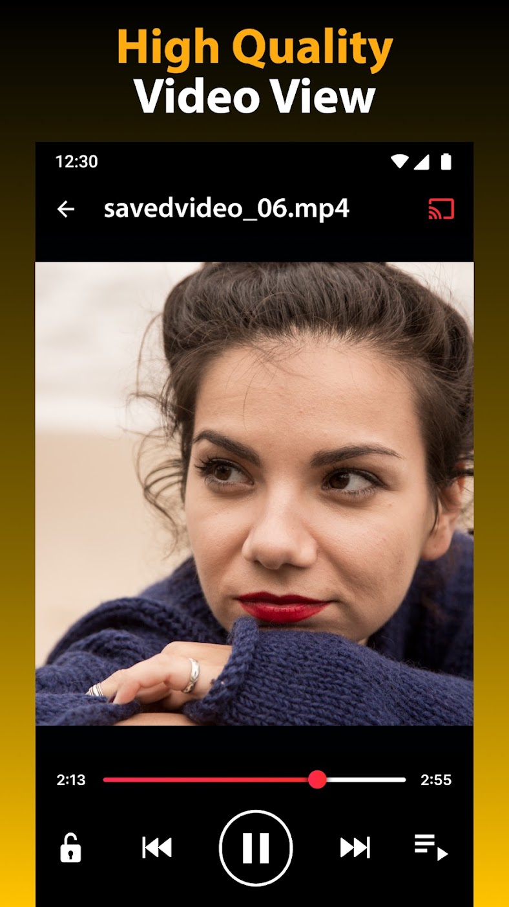

Screenshot 04 · 788 × 1400 · portrait · High Quality Video View · [Original image on Google Play ↗](https://play-lh.googleusercontent.com/LcUomZFpR_QvB4REc8XBaGk9UgsbkJtKuppePVJNjB3E3XI6vp0TfcZ6eTcPk52-vvY0haLWEvYBtUxbV5z022Y)

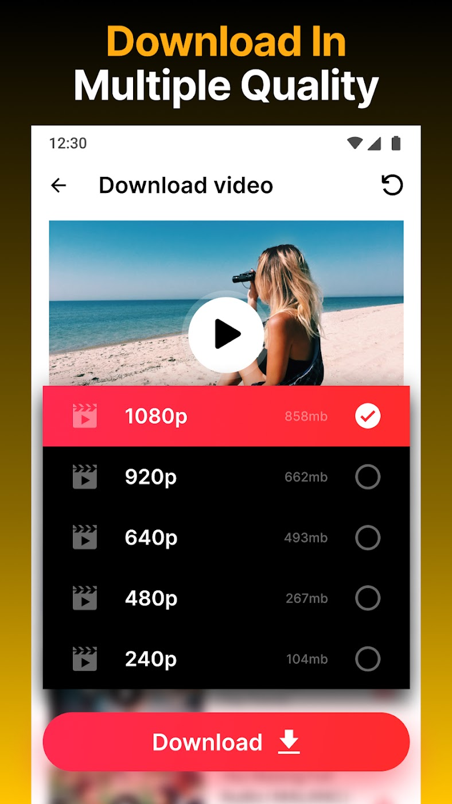

Screenshot 05 · 788 × 1400 · portrait · Download In Multiple Quality · [Original image on Google Play ↗](https://play-lh.googleusercontent.com/23zrJcHN5KDiA74tFKt91--b_VnSQDelemy8g3j8x1Ej7vDjt1ycedTZVoprS515_ZrGp453QREoIrw6Sf5F-Q)

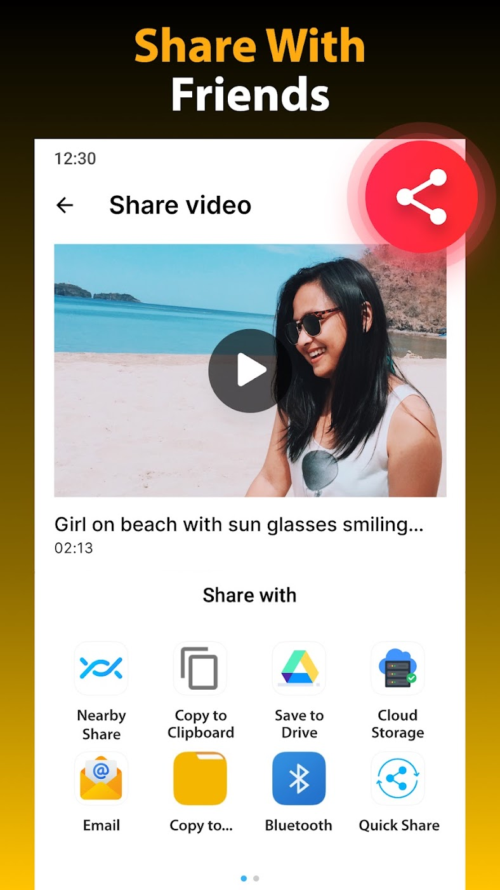

Screenshot 06 · 788 × 1400 · portrait · Share With Friends · [Original image on Google Play ↗](https://play-lh.googleusercontent.com/0Koebc4oYf7fnjJ-ytCOIsm5ev27bj3JcA0s58mlXGrpvb-tThnklztkJtqC0hF1ACv9ewll1MKpXeazWumFI5o)

Landscape screenshots: not observed in this snapshot.

16 · Vidpal Apps Studio

### Vidpal

“Video Downloader and 4k Player” · 50M+ downloads · rating 4.25 (402K) · 7 portrait and 0 landscape screenshots

US keyword board (16 Sep): **0** top-10 · **0** placements on 100 keywords · best #—

Open listing on Google Play ↗

#### Icon

An orange-to-red gradient square with a large white serif “V”. A seventh V in the library, though the gradient and the serif give it more character than the flat red ones.

#### Feature graphic

A dark red banner filled with a grid of platform logos above “Fast and Private / video downloader”. It is the most brand-dense image in the library — close to two dozen third-party marks in one asset.

#### Screenshot system

Seven creatives on a peach-to-cream gradient with red two-tone headings and a floating device: HD Video Downloader, Download Videos Instantly, Watch Movies, Videos in HD Quality, Floating Video Play, Download Management, Built-In Video Player.

#### Design assessment

The softest palette here and the only one that reads as a consumer media app rather than a utility. “Floating Video Play” and “Watch Movies” push it toward entertainment rather than downloading. The same seven creatives are also published as 1080×1080 squares, and the feature graphic's logo wall is the single clearest example of what our own rules forbid.

gradient serif V icon · peach palette · logo-wall banner · floating player · square duplicate set removed

Icon and feature graphic

Icon 01 · 512 × 512 · square · Listing icon, original file · [Original image on Google Play ↗](https://play-lh.googleusercontent.com/-WK5MPf7RSP-MV6t_a5WJw9RGoPPuGOW6U1FVYXLtNPdwESR7Gi6HGKQKtsrhYxw1eHkgRfgBSYqCmPC5UbF)

Feature Graphic 01 · 1024 × 500 · landscape · Feature graphic, original file · [Original image on Google Play ↗](https://play-lh.googleusercontent.com/Ye-23wxIpXrZZEUTOGuDHyQRXVoo5_aQWbe1oQsdXpXmbdony9s9g4tx1flagohZFCfjvAWRkZ_ruu_1vntR)

Portrait screenshots · 7

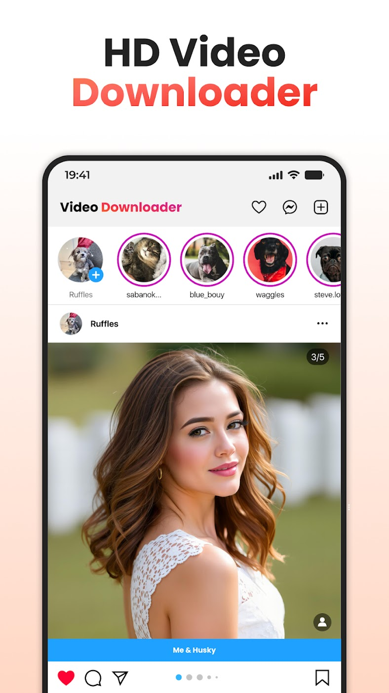

Screenshot 01 · 788 × 1400 · portrait · HD Video Downloader · [Original image on Google Play ↗](https://play-lh.googleusercontent.com/D2Jt5zosr9Xcd8HQ-7fiK7W1r1rKqO_MNEJ4dQPzVF85fw_35gZ3gBGIgGWQPnckm3H1AKXguZ71kA6XGpUK5EM)

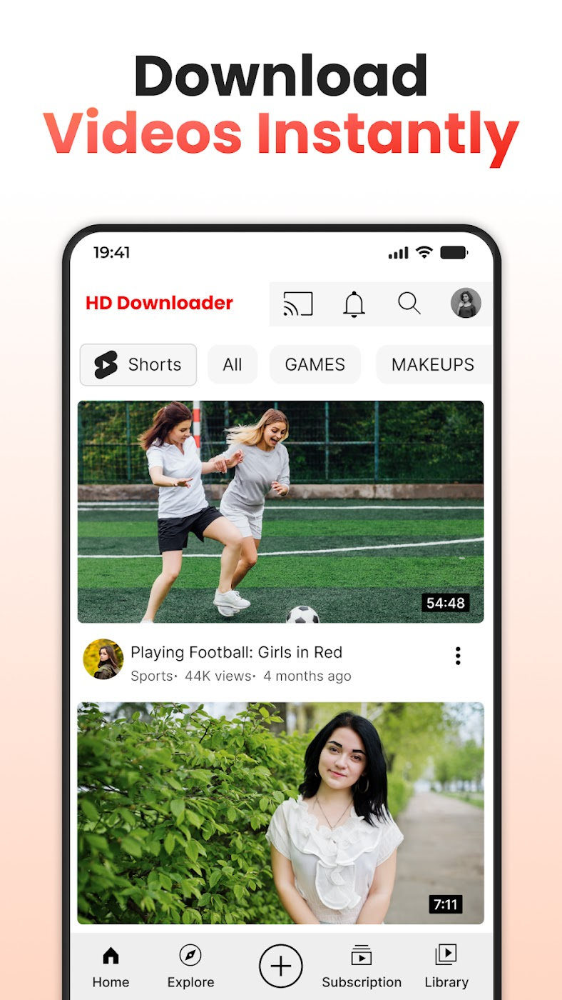

Screenshot 02 · 788 × 1400 · portrait · Download Videos Instantly · [Original image on Google Play ↗](https://play-lh.googleusercontent.com/qZwXsUQpYZklkcCxpOJ9M7BY-0ooKPdvczFE1F0TPWhXlrX04k3ykScXdQuKeskELaiGpb0HdQzdBIAuH5rtbQ)

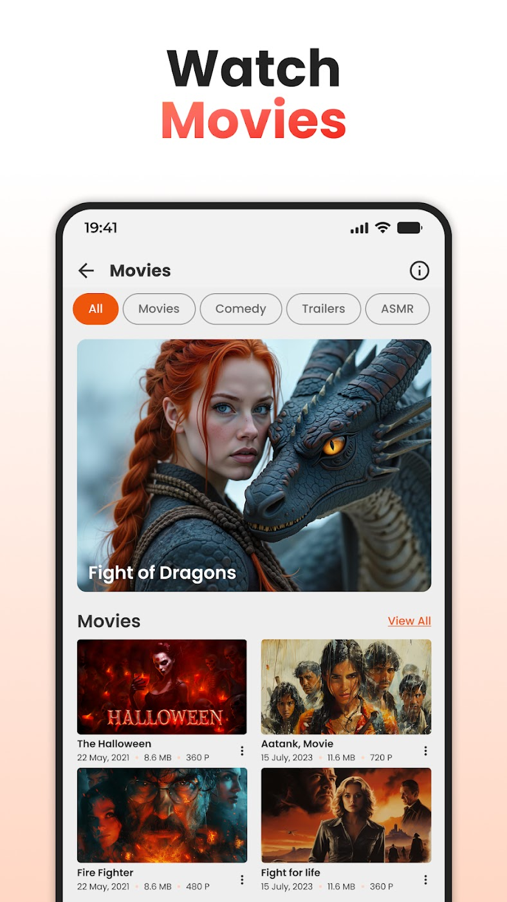

Screenshot 03 · 788 × 1400 · portrait · Watch Movies · [Original image on Google Play ↗](https://play-lh.googleusercontent.com/oABTlUbtumGBwoBKhdBDoM_jmHcV1rJvgPl2hS_LbhwihFJAvc8eVmJvi4QBHPFb0JyLfxj7NddNSJvpaV-kxw)

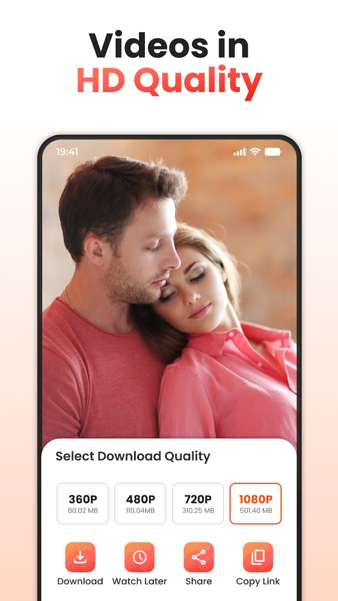

Screenshot 04 · 788 × 1400 · portrait · Videos in HD Quality · [Original image on Google Play ↗](https://play-lh.googleusercontent.com/Ql9XVGkB8vE-LSnuZTFA6lv7stksKOFrjC7PZCjqXkvndH_nAh-9XZ15qvmDJzWXPAz04oECQkvX0Fd0zNaob-4)

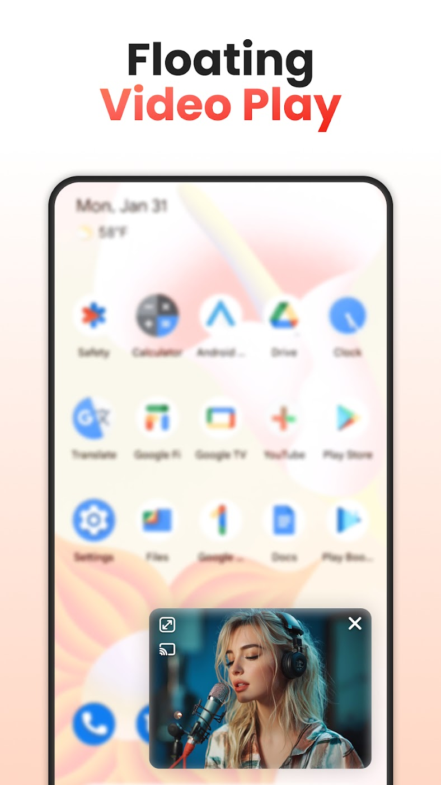

Screenshot 05 · 788 × 1400 · portrait · Floating Video Play · [Original image on Google Play ↗](https://play-lh.googleusercontent.com/31Vs57e4ua4ecChJ0ItE9JrMO6gvyQJpqpdDGASGo_-gw7HpZsjvxGJREAnp4_vGWrWI0DKz-XgiNzkq6KA5)

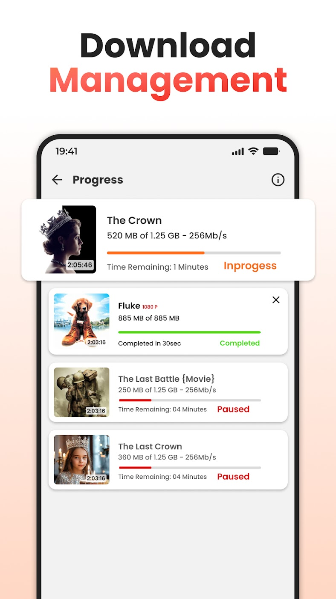

Screenshot 06 · 788 × 1400 · portrait · Download Management · [Original image on Google Play ↗](https://play-lh.googleusercontent.com/61q2wb7lOmClCEZLgQLZNGSvrpAXmKpofQymjU3c0ut0gNUjBUGnjqeg15npkbGWF8nMUrjcmueNjTU01y0KqQ)

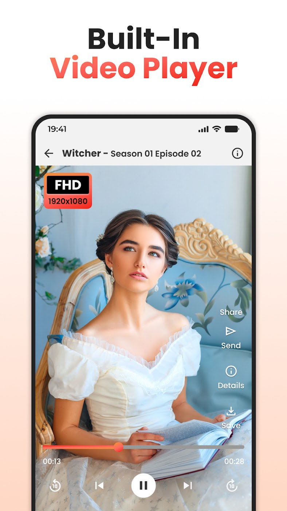

Screenshot 07 · 788 × 1400 · portrait · Built-In Video Player · [Original image on Google Play ↗](https://play-lh.googleusercontent.com/zUKENVTFyxVCRn2HCelx1XTf9j91sT9cXsTuOWEhNtHlKO75hXa5G1WRJvOSi9LV20l7cmpHeA_xIGTgzlClQw)

Landscape screenshots: not observed in this snapshot.

Across all 17 listings

## Cross-app design patterns

Fifteen of seventeen icons sit in three families

Seven are a red “V” (Sky Vision, Attractive Apps, Markhoor, Mobile Notepad and Vidow are nearly interchangeable; QR Code Scanner and Vidpal vary it), five are a download arrow on a flat square — **ours included**, alongside InShot, Gamma Play, AppTool and DevBay — and three are a ring and arrow on a gradient. Only the two wordmark icons, Hub and Saver & Player Studio, stand outside. Our rainbow gradient is what keeps us legible in that crowd; the arrow is not.

Four banners are the same dark tile grid

InShot, QR Code Scanner, AppTool and Sky Vision all use a dark grid of faint media-type tiles with a short line of type over it. Ours is a different construction but the same dark register. Gamma Play's banner carries no words at all, and Hub's carries only a wordmark — at listing size neither says what the app does.

Speed claims are everywhere, and we cannot use them

“3x Faster”, “4x Faster”, “Ultra-Fast” and “100MB/s” appear across QR Code Scanner, Hub, AppTool, Saver & Player Studio, DevBay, Markhoor and Mobile Notepad. Our own rules bar any claim the build cannot back, so this is a whole persuasive register the category uses and we have to replace with something else.

Almost everyone shows platform logos; one app does not

Thirteen of the seventeen listings put recognisable platform marks or third-party app UI inside their screenshots, and Vidpal's feature graphic is close to two dozen logos in one image. **Gamma Play is the exception** — every device frame runs an invented source app, so the flow is shown without borrowing anyone's brand. That is the pattern our own rules point to, and it comes from the smallest app here. **Our own frame 1 currently shows a row of platform marks.**

Headings mostly restate the title

“All Video Downloader”, “HD Video Downloader” and “Fast Video Downloader” appear as screenshot headings again and again — DevBay and Attractive Apps each spend three or four frames restating their own name. The listings that say something specific instead (Gamma Play's “Choose Video Quality Before Downloading”, AppTool's “Auto Detect Videos Online”, Vidow's “Download & Cast Video”) read as far more considered.

Carousel length has nothing to do with rating

The highest-rated app here, Fast Saver at 4.80★ from 377K ratings, ships five screenshots, a typo and a banner branded with a different name. The largest carousel, Mobile Notepad's sixteen frames, belongs to the lowest-rated at 3.83★. InShot leads the category on search with half its carousel unlabelled. Store art is not what moves these numbers.

Landscape is almost unused

Only InShot and AppTool publish a landscape frame at all, which is exactly what the 21 September visual review found and this capture confirms independently. Everything else in the category, ours included, is portrait-only.

For our next graphics set

## Guidance for future graphics

Fill the empty slots before redrawing anything

We use four of eight phone slots; the category median is seven and the leaders run twelve to sixteen. Four more frames is the cheapest gain available, and we already have the material: the nine-tool editor, the PIN/biometric vault, MP3 extraction and background batch downloads are things **no audited competitor ships** and none of them has a frame of its own today.

Take the platform marks out of frame 1

Thirteen competitors show platform logos and our screenshot 1 currently does too. Our own rules forbid brand names in listing copy, and Play treats implied affiliation seriously. Gamma Play shows the way out: invent the source app in the mock-up and the download flow still reads perfectly.

Keep the gradient icon

It is the one asset where we are already the most distinctive listing in the library. Any redraw should keep the rainbow ground and work on the arrow, not the other way round.

Replace speed claims with capability claims

The category sells “3x” and “4x”. We cannot, and we do not need to: a vault, an editor and audio extraction are concrete, demonstrable and unique in this audit. Show the result, not a multiplier.

Say something specific in every heading

Our four headings are already benefit-led, which puts us ahead of most of this list. Hold that line as frames are added — the failure mode visible here is spending a slot restating the app's own name.

Do not run two visual systems at once

Markhoor's carousel switches design halfway through and reads as two different apps. If our graphics are reworked, replace the whole set in one go rather than leaving old and new frames side by side.

Landscape is optional, and differentiating

Only two of sixteen competitors publish a landscape frame. If we add one it needs its own composition rather than a letterboxed phone shot — but filling the portrait slots comes first.

Google Play

## Play Store production requirements

**Icon** — 512 × 512 px, 32-bit PNG with alpha, under 1,024 KB. Google Play applies its own rounding and shadow; promotional text, price or “new” badges are not allowed on the icon.

**Feature graphic** — 1024 × 500 px, JPEG or 24-bit PNG with no alpha, under 15 MB. Required for the listing to be eligible for several Play surfaces.

**Phone screenshots** — between 2 and 8 per device type, JPEG or 24-bit PNG with no alpha, each side between 320 px and 3,840 px, and the long side no more than twice the short side. Our listing currently fills 4 of the 8 phone slots; the dossier's 720 × 1600 device captures are ratio 1:2.22 and must be reframed to 1:2 or tighter before they can be uploaded.

**Every asset in this library was captured from a live listing**, so the dimensions recorded on each figure are what that app actually publishes, not what Play recommends.

How this library was made

## Scope, evidence and limitations

Seventeen listings: our own, plus the sixteen competitors that appear across the Video Downloader dossier, the ASO Playbook and the Features Comparison audit. The three source lists overlap heavily — the ASO Playbook alone repeats several links — and the deduplicated set of sixteen matches the one recorded in research/competitor-visual-memory on 21 September 2026.

Duplicate assets were removed in two passes. First by URL: Google Play serves the same screenshot across several device slots, which collapsed 288 raw references to 156. Then by inspection, which removed 26 more — DOSA publishes the same five creatives twice at identical size, Saver & Player Studio publishes seven creatives at four different pixel sizes, and Vidpal publishes its seven as both portrait and 1080 × 1080 squares.

Two listings genuinely run two sets rather than duplicates, and both are kept: Markhoor mixes two different visual systems in one carousel, and Mobile Notepad runs the same device art under two different sets of headings. InShot's unlabelled device captures are also kept, because they are a different composition rather than a resize.

Our own entry is the four phone screenshots, icon and feature graphic that Google Play serves today — the same assets shown under PlayStore Metadata. The listing uses four of the eight phone slots Play allows.

Screenshots and feature graphics are stored as JPEG at up to 1400 px on the long side so the whole library fits in one page; icons are the original 512 px files. Every caption links to the full-resolution original on Google Play.

Links

## Sources

1. [Our own Google Play listing](https://play.google.com/store/apps/details?id=com.video.downloader.instagram.videosaver&hl=en&gl=US) — the assets also shown under PlayStore Metadata.
2. Google Play listings for all sixteen competitors, English / United States locale — every figure links to its original file.
3. [Video Downloader](../../tabs/01-video-downloader) · [ASO Playbook](../../tabs/02-aso-playbook) · [Features Comparison](../../tabs/04-features-comparison) — the three tabs the competitor list is drawn from.
4. `research/competitor-visual-memory/` — the 21 September 2026 reference pass that first deduplicated these sixteen listings.
5. `research/aso-pipeline/raw.json` — the 16 September 2026 scrape that holds the asset URLs.
